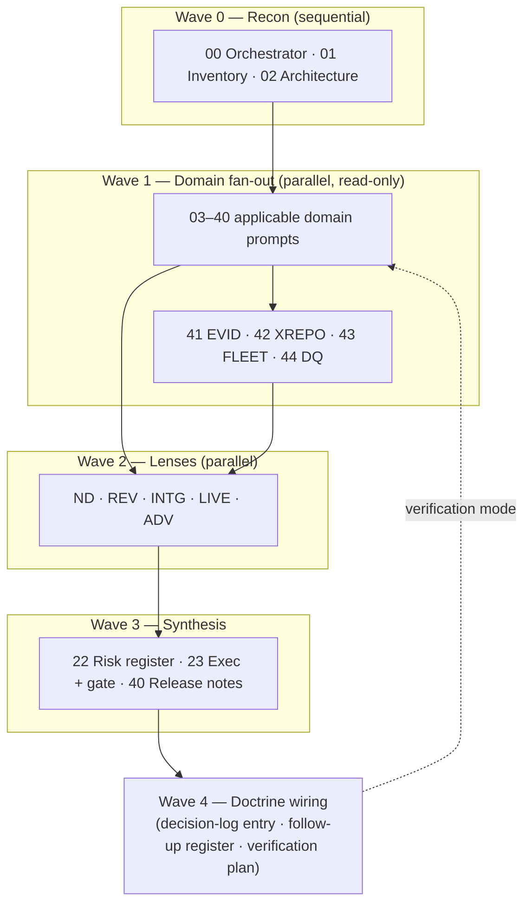

# repo-deep-dive — Full Hardening Audit Pack

**Falcon-lab consolidated edition** — 2026-10-03 · base edition v1.5.0.

A prompt-driven, **evidence-first** repository audit framework **and remediation runner**. It produces
domain reports, findings (P0–P3), a risk register, a roadmap, a patch plan, an executive summary and a
release gate under `docs/audits/{name}/{run}/`, and it turns the resulting patch plan into **reviewed
draft pull requests** — without ever auto-merging or fabricating evidence.

This edition merges the original pack, the falcon-lab layer, LLM-free **deterministic checks**, an
**org-wide runner**, the **remediation runner**, and seven archived audits of the MaineCyberTech org.

## Capabilities

| Capability | Entry point |
|---|---|
| **Prompt-driven audit** (LLM) | `prompts/MASTER_RUNNER_*.md` + domain prompts → `docs/audits/{name}/{run}/` |
| **Deterministic checks** (LLM-free) | `tools/deterministic_checks.py` → findings in the pack vocabulary |
| **Org-wide deterministic run** | `.github/workflows/deep-dive-deterministic.yml` (schedule + dispatch) |
| **Remediation → draft PRs** | `prompts/REMEDIATION_RUNNER.md` + `tools/remediation_plan.py` + `.github/workflows/remediation.yml` |
| **Machine chain** (validate/score/render) | `tools/run_toolchain.py <run> --write --dashboard` |
| **Lab test dispatch** (HTTP, token) | `tools/lab_runner.py` → ci-runner / edge-builder job API (`POST /run`, `POST /sync`, `GET /repos`) |
| **Lab execution via GitHub** | `.github/workflows/lab-tests.yml` (self-hosted lab runners) |
| **Remediation verification** | `.github/workflows/verify-remediation.yml` (machine checks + patch-set commands, on the lab) |
| **Remediation board** | `tools/remediation_report.py` + `.github/workflows/remediation-board.yml` |

## Layout

| Path | Contents |
|---|---|
| `prompts/` | Shared rules, `00` orchestrator, 41 base domain prompts (`01`–`40`, `45`), falcon-lab prompts `41`–`44`, both master runners, and `REMEDIATION_RUNNER.md` |
| `docs/` | `AUTOMATION_GUIDE.md` (portable check recipes), `REMEDIATION_GUIDE.md` (remediation usage) |
| `schemas/` | `findings.schema.json` — JSON Schema for `findings.json` |
| `.github/workflows/` | `deep-dive-deterministic.yml` (org checks), `remediation.yml` (plan / draft-PR scaffold), `lab-tests.yml`, `verify-remediation.yml`, `remediation-board.yml` |
| `ci/` | `audit.yml` — pack CI example: lint, validate, score, P0 gate, artifacts |
| `lenses/` | Cross-cutting overlays: `new_developer`, `independent_reviewer`, `integration`, `live_operations`, `security_adversary` |
| `profiles/` | `falcon-lab.md` (+ `.manifest.json`) and `remediation.md` (remediation policy) |
| `templates/` | Report/manifest templates, plus `remediation_pr.md` and `review_report.md` |
| `examples/` | Base + falcon-lab run manifest examples |
| `runbooks/` | Quickstarts + `OPERATOR_TROUBLESHOOTING.md` |
| `runs/` | Archived runs (9) + `INDEX.md` |
| `wiring/` | `REPO_WIRING.md` + `SUGGESTED_TOOLING.md` |
| `tools/` | `check_run.sh`, `lint_pack.sh`, `pack_digest.sh`, `new_run.py`, `repo_inventory.py`, `collect_findings.py`, `risk_score.py`, `render_dashboard.py`, `diff_runs.py`, `findings_to_csv.py`, `run_toolchain.py`, `live_snapshot.sh`, **`deterministic_checks.py`** (supports `--deep`), **`aggregate_findings.py`**, **`remediation_plan.py`**, **`remediation_status.py`**, **`remediation_report.py`**, **`normalize_register.py`**, **`lab_runner.py`** (run/sync/repos), `lib_findings.py`, `self_test.sh` |
| `REFERENCE_CARD.md` | One-page scales and vocabularies |
| `AGENTS.md` | Rules for AI agents working in this repo |
| `CONTRIBUTING.md` | How to extend the pack |
| `PACK_DIGEST.txt` | Generated file inventory with sha256 (regenerate after changes) |

## Which path to use

- **Generic single-repo audit:** `runbooks/OPERATOR_QUICKSTART.md` + `prompts/MASTER_RUNNER_FULL_HARDENING.md`.
- **Falcon lab (central + edge + shared host):** `profiles/falcon-lab.md` + `runbooks/OPERATOR_QUICKSTART_FALCON_LAB.md` + `prompts/MASTER_RUNNER_FALCON_LAB.md` + `wiring/REPO_WIRING.md`.
- **Deterministic baseline (no LLM):** `tools/deterministic_checks.py <repo>` (or the `deep-dive-deterministic` workflow).
- **Remediation:** `prompts/REMEDIATION_RUNNER.md` + `profiles/remediation.md` (see `docs/REMEDIATION_GUIDE.md`).
- **Reach the Proxmox lab (agents/devs):** `docs/LAB_VPN.md` + `tools/lab-vpn/` — dedicated
  WireGuard overlay (`wgaudit0`, UDP `51900`) via `mct-portal-dev`; separate from the falcon `wg0`
  telemetry VPN. Self-service via the **Lab agent onboarding / offboarding / health** GitHub
  workflows (scoped non-root identity); connect with
  `bash tools/lab-vpn/lab-audit-connect.sh lab-audit-<name>.conf`.

## How an audit run flows

Machine steps: scaffold with `tools/new_run.py --run {run}`, work the prompts via the runner, then
`tools/run_toolchain.py <run> --write --dashboard` (check → collect → score → dashboard → diff → CSV).

## Deterministic checks (LLM-free)

`tools/deterministic_checks.py <repo> -o <out>` emits `deterministic-findings.json` +
`lens_deterministic.md` using the normal `AREA-Px-NNN` vocabulary. Checks:

- **PORT** — committed CRLF (index), tracked `*.sh` without the exec bit, missing/loose `.gitattributes`.
- **SEC** — `gitleaks` (rule-based severity) + tracked `.env`/private-key files.
- **CI** — `actionlint`, missing workflows.
- **DEP** — `package.json` without a lockfile, no Dependabot.
- **SUPPLY** — unpinned GitHub Action refs, container images without a digest pin.
- **GIT/DOC** — no LICENSE, large tracked files, no README.

`tools/aggregate_findings.py <out> -o ORG_SUMMARY.md` rolls the per-repo results up into an org
report. The `.github/workflows/deep-dive-deterministic.yml` workflow runs this across the org on a
**weekly schedule** and **on demand** (`workflow_dispatch`: `org`, `repos`, `exclude`); private repos
need the `ORG_READ_TOKEN` secret.

## Remediation runner (plan → tested draft PRs)

`tools/remediation_plan.py <run>` compiles a run's `patch_plan.md` into `remediation_plan.json`
(patch sets → findings → files → dependencies → effort → verification, plus a branch name).
`prompts/REMEDIATION_RUNNER.md` then, per patch set: branch → minimal fix → **test in the lab** →
`gitleaks` gate → commit → push → **draft PR** → advisory review → reconcile.

```mermaid
flowchart LR
    P["prompt: patch_plan.md"] --> RP["remediation_plan.py → remediation_plan.json"]
    RP --> B["branch per patch set"]
    B --> I["minimal fix (finding IDs)"]
    I --> T["verify in ci-runner / edge-builder"]
    T --> G["gitleaks gate"]
    G --> C["commit + push"]
    C --> PR["draft PR (templates/remediation_pr.md)"]
    PR --> R["advisory review (templates/review_report.md)"]
    R --> S["remediation_status.py → follow_up_register.md"]
```

**Guardrails (non-negotiable):** draft PRs only; the implementer never auto-merges or self-approves; a
finding becomes `verified-fixed` only with a commit as evidence; minimal scope; no secrets in diffs.
See `docs/REMEDIATION_GUIDE.md` and `profiles/remediation.md`.

## Org runner (on this workstation)

The companion scripts that drive the pack across the org's repos (Proxmox lab) live outside the pack
at `C:\temp\proxmox-vm\scripts\`: `deepdive-org.ps1` (inventory + scaffold a run per repo),
`run-all-ci.sh` / `ci.ps1` (one-shot CI), `validate-run.ps1` (pack toolchain for a run),
`deliver-audits.ps1` (run reports → audited repos as draft PRs), `open-draft-pr.ps1`.

## Archived runs (9)

| Run | Repo(s) | Findings | Gate |
|---|---|---|---|
| `20260930-0320-falcon-794ba31_edge-2b5bc8b` | falcon / falcon-edge (lens) | P0 ×6 · P1 ×22 · P2 ×35 · P3 ×27 | GO WITH CONDITIONS |
| `20260930-0701-falcon-8282d3f_edge-45dfed0` | falcon / falcon-edge (full-domain) | P0 ×13 · P1 ×80 · P2 ×131 · P3 ×40 | GO WITH CONDITIONS |
| `buddy-20261003-0018-master-99abf29` | buddy | P0 ×0 · P1 ×11 · P2 ×24 · P3 ×5 | GO WITH CONDITIONS |
| `chat-20261003-0018-develop-a72b8cc` | chat | P0 ×1 · P1 ×24 · P2 ×31 · P3 ×7 | GO WITH CONDITIONS |
| `falcon-20261003-0018-fix-backup-abort-markers-20b5e57` | falcon | P0 ×4 · P1 ×20 · P2 ×18 · P3 ×4 | NO-GO (production) |
| `falcon-edge-20261003-0018-fix-trust-root-87532ec` | falcon-edge | P0 ×0 · P1 ×3 · P2 ×27 · P3 ×12 | GO WITH CONDITIONS |
| `mainecybertech-20261003-0018-fix-p2-batch-31-2295958d` | mainecybertech | P0 ×1 · P1 ×3 · P2 ×26 · P3 ×14 | NO-GO |
| `repo-deep-dive-20261003-0018-main-7bac320` | repo-deep-dive (self-audit) | P0 ×0 · P1 ×9 · P2 ×20 · P3 ×12 | GO WITH CONDITIONS |
| `snowride-20261003-0018-main-59e12b9` | snowride | P0 ×0 · P1 ×6 · P2 ×25 · P3 ×15 | GO WITH CONDITIONS |

Start at `runs/INDEX.md`; machine-readable findings live in each run's `findings.json`.

## Non-negotiables (all editions)

- **Audit-only during an audit**: no application code changes; artifacts only under the run folder.
- **Evidence or `Unknown`**: every finding cites repository evidence; never invent functionality.
- **No secrets**: reference path + secret type only; redact secret-like values.
- **Severities**: P0–P3. Finding IDs: `AREA-SEVERITY-NNN`.
- Treat exports, logs, `.env` files, and generated outputs as sensitive.
- An audit is **not** the independent review and **not** the owner adoption; remediation **never**
  auto-merges or self-approves.

## Change control

- `CHANGELOG.md` records every change; `AGENTS.md` covers agent rules; `CONTRIBUTING.md` is the extension recipe.
- `tools/pack_digest.sh` regenerates `PACK_DIGEST.txt`; `tools/lint_pack.sh` validates the pack itself; `tools/self_test.sh` exercises the toolchain.
- `tools/check_run.sh <run-folder>` must print `PASS` before a run is treated as complete.
- Record the pack version + digest in run manifests when vendoring or when running a released pack.
