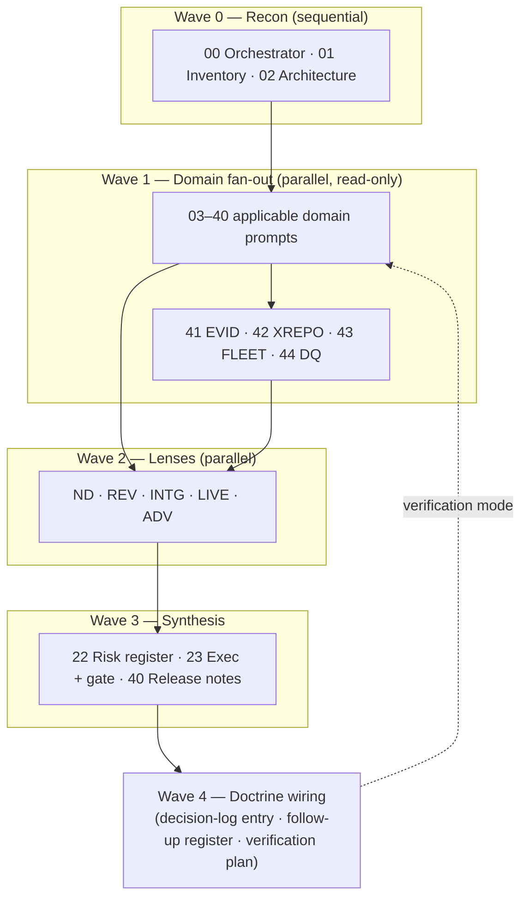

# repo-deep-dive — Full Hardening Audit Pack

**Falcon-lab consolidated edition** — 2026-10-02 · base edition v1.4.1.

A prompt-driven, evidence-first repository audit framework. It produces domain reports, findings (P0–P3), a risk register, a roadmap, a patch plan, an executive summary, and a release gate under `docs/audits/{name}/{run}/`.

This edition merges three things into one portable tree:

1. **The original pack** (v1.2.1): 41 base prompts, shared rules (with verification discipline and scales), master runner (with verification mode), templates, examples, quickstart — extended with per-prompt verification checks and tooling.
2. **The falcon-lab layer** (profile v1.0.0): environment profile, five cross-cutting lenses, four additional domain prompts (`41`–`44`), a wave-based master runner, quickstart, report template, and manifest example — built for the falcon monitoring lab (two repos + one shared live host).
3. **The first archived run**: `runs/20260930-0320-falcon-794ba31_edge-2b5bc8b/` — the six 2026-09-30 audits converted into lens reports (90 findings with stable `AREA-Px-NNN` IDs) plus the run finals, `findings.json`, and source reports.

## Layout

| Path | Contents |
|---|---|
| `prompts/` | 49 files: shared rules, 00 orchestrator, 41 base domain prompts (01–40 plus 45), falcon-lab prompts `41`–`44`, and both master runners |
| `docs/` | `AUTOMATION_GUIDE.md` — portable grep/glob/read check recipes for any repo |
| `schemas/` | `findings.schema.json` — JSON Schema for `findings.json` |
| `ci/` | `audit.yml` — GitHub Actions example: lint, validate, score, P0 gate, artifacts |
| `lenses/` | Cross-cutting overlays: `new_developer` (ND), `independent_reviewer` (REV), `integration` (INTG), `live_operations` (LIVE), `security_adversary` (ADV) |
| `profiles/` | `falcon-lab.md` (scope, doctrine, boundaries, applicability matrix, cadence) + machine-readable `.manifest.json` |
| `templates/` | Base + falcon report templates, plus workflow templates: claim sample, verification log, decision-log entry, owner decisions, follow-up register, lens report |
| `examples/` | Base + falcon-lab run manifest examples |
| `runbooks/` | Base quickstart + `OPERATOR_QUICKSTART_FALCON_LAB.md` |
| `runs/` | Archived runs + `INDEX.md`; first run included |
| `wiring/` | `REPO_WIRING.md` (falcon/edge wiring) + `SUGGESTED_TOOLING.md` |
| `tools/` | `check_run.sh`, `lint_pack.sh`, `pack_digest.sh`, `collect_findings.py`, `diff_runs.py`, `findings_to_csv.py`, `live_snapshot.sh`, `repo_inventory.py`, `risk_score.py`, `render_dashboard.py`, `new_run.py`, `run_toolchain.py` |
| `REFERENCE_CARD.md` | One-page scales and vocabularies |
| `CONTRIBUTING.md` | How to extend the pack |
| `PACK_DIGEST.txt` | Generated file inventory with sha256 (regenerate after changes) |

## Which path to use

- **Generic single-repo audit:** `runbooks/OPERATOR_QUICKSTART.md` + `prompts/MASTER_RUNNER_FULL_HARDENING.md`.
- **Falcon lab (central + edge + shared host):** `profiles/falcon-lab.md` + `runbooks/OPERATOR_QUICKSTART_FALCON_LAB.md` + `prompts/MASTER_RUNNER_FALCON_LAB.md` + `wiring/REPO_WIRING.md`.

## How a run flows

Machine steps around the waves: scaffold with `tools/new_run.py --run {run}`, work the prompts via the runner, then `tools/run_toolchain.py <run> --write --dashboard` (check → collect → score → dashboard → diff → CSV).

## The archived run

`runs/20260930-0320-falcon-794ba31_edge-2b5bc8b/` — lens-focused run over `falcon-build @ 794ba31` and `falcon-edge-build @ 2b5bc8b`:

- 90 findings: P0 ×6, P1 ×22, P2 ×35, P3 ×27 (areas: ND 34, REV 25, INTG 15, LIVE 16)
- Gate opinion: **GO WITH CONDITIONS** (10 conditions; reconciles with the program's existing APPROVED verdict — it does not revoke it)
- Start at `INDEX.md`; machine-readable findings in `findings.json`; the full narrative lives in `source_reports/`.

## Non-negotiables (all editions)

- **Audit-only**: no application code changes; artifacts only under the run folder(s).
- **Evidence or `Unknown`**: every finding cites repository evidence; never invent functionality.
- **No secrets**: reference path + secret type only; redact secret-like values.
- **Severities**: P0–P3. Finding IDs: `AREA-SEVERITY-NNN`.
- Treat exports, logs, `.env` files, and generated outputs as sensitive.
- An audit is **not** the independent review and **not** the owner adoption.

## Change control

- `CHANGELOG.md` records every change; `CONTRIBUTING.md` is the extension recipe.
- `tools/pack_digest.sh` regenerates `PACK_DIGEST.txt`; `tools/lint_pack.sh` validates the pack itself; `tools/self_test.sh` exercises the toolchain end-to-end.
- `tools/check_run.sh <run-folder>` must print `PASS` before a run is treated as complete.
- Record the pack version + digest in run manifests when vendoring or when running a released pack.
