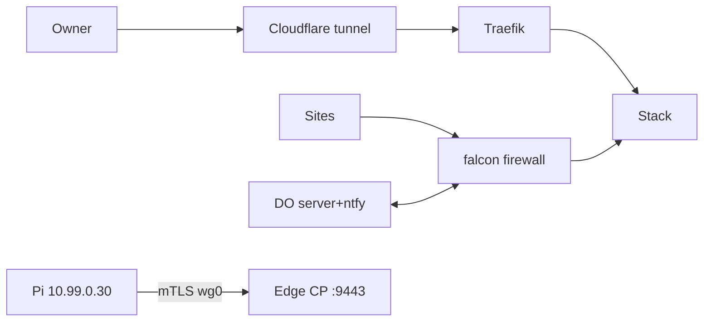
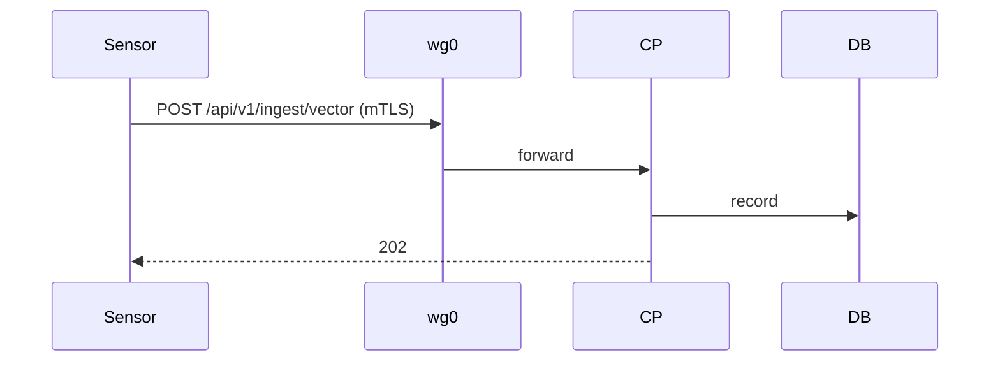
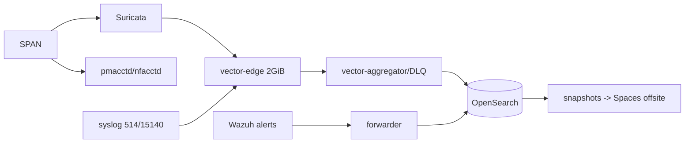

# Architecture and Runtime Topology Audit

## Audit Metadata

- Audit name: repo-deep-dive (falcon-lab) · Run: 20260930-0701-falcon-8282d3f_edge-45dfed0
- Repos: central `/home/user/falcon-build` @ `8282d3fd866d91df5aa3fce8ee526fd6c5d0c54c`; edge `/home/user/falcon-edge-build` @ `45dfed050fba9c25d7f8f8b5c64526887379ce84` (dirty) · Branch `main`
- Generated 2026-09-30T08:15Z · Auditor: subagent, read-only · Area code: ARCH
- Output: `docs/audits/repo-deep-dive/20260930-0701-falcon-8282d3f_edge-45dfed0/02_architecture_runtime_topology.md`
- Limits: no root/docker/WireGuard; nft enforcement and GitHub settings unverified; edge tree dirty.

## Scope

Reviewed: structure, UI/service/worker boundaries, auth/session flows, zone/tenant boundaries, request lifecycle, data flow, background jobs, queues, webhooks, realtime, notifications, external integrations, deployment topology, env parity, error handling, runtime validation. Not in depth: prompts 06/08/12/13/14/30/36/42; container internals; secret contents.

## Evidence Reviewed

| Evidence | Type | Why relevant | Notes |
|---|---|---|---|
| `docs/architecture/{TARGET_ARCHITECTURE,PORT_PROTOCOL_MATRIX,TRUST_BOUNDARIES,DATA_FLOW,IDENTITY_AND_SECRETS,STORAGE_CAPACITY_MODEL}.md` | Design | Documented topology/trust | Baseline docs partly stale (ARCH-P2-002 finding area) |
| `compose/{central,probe,mct}`, `automation/wazuh/multi-node/*` | Compose | Services/networks/ports | Wazuh images tag-only (report 01) |
| `deploy/edge-control-plane.{lab.json,service}`, `src/falcon_control/*`, `src/falcon_agent/*` | Edge | mTLS CP/DB/PKI + agent | CP binds 0.0.0.0:9443 |
| `bootstrap/95-wireguard.sh`, `config/wireguard/wg0.conf.tpl`, `wg_peer_preservation_check.sh`, `bootstrap/80-offsite-backup.sh` | VPN/backup | Peer persistence + offsite coverage | Template lacks edge peer; edge PKI local-only |
| `ntfy_relay.py`, `90-alerting.sh`, `ALERT_CATALOGUE.yaml`, `service_probe.sh`, `export_monitor_metrics.sh` | Monitoring | Alert/metric coverage | 31 rules; none `falcon_edge` |
| `config/nftables/falcon.nft`, `bootstrap/32-inbound-mode.sh` | Firewall | Enforcement | Effective rules unverified |
| `live_snapshot.txt` + probes (`systemctl`, `ss`, `df/free`, `curl`, `/proc`, textfile metrics) | Live | As-built | 07:01-07:20Z |
| Prior run `lens_integration.md`/`findings.json` | Prior audit | Topology findings | Statuses below |

## Verification Performed

| Evidence | Type | Why relevant | Notes |
|---|---|---|---|
| `systemctl list-units/list-timers/status` | Live | Service/job topology | 8 active falcon timers; CP+Wazuh+IRIS+canary running; backup success 03:34:01Z |
| `ss -tuln` | Live | Port topology | 0.0.0.0: 21,23,80,443,514,1433,1514-1518,3306,8008,8791,9100,9443; 10.99.0.1:15140/15141; 127.0.0.1:9200/5601/55000/8443/2586 |
| Unauth HTTP probes | Live | Reachability | enrollment `:2586/v1/health` 200; CP `:9443` 404; `:9200` refused; `:5601`/`:55000` 401; IRIS `:8443` 302 |
| `/proc/899424` + `ps` | Live | Deployed-code provenance | CP runs `-m falcon_control` from dirty `/home/user/falcon-edge-build` |
| `falcon_edge_metrics.prom` | Live | Edge telemetry | 9 sensors (1 ACTIVE/5 RETIRED/3 REVOKED); active heartbeat 35 s; queue depth/dropped 0 |
| `falcon_metrics.prom` | Live | Pipeline/backup | `wg_peers_total 6`, handshake 5 s; OpenSearch 56,652,795 docs/~27.2 GB; EVE age 2 s; backup 03:34:01Z |
| `free/df/uptime` | Live | Saturation | 9.9/11 GiB used, 310 MiB free, swap 5.2 GiB; `/` 82%; load 3.2 |
| `journalctl` | Live | Data path | Sensor POSTs `10.99.0.30 → :9443 /api/v1/ingest/vector → 202` ~5 s |
| Port/matrix comparison | Repo vs live | Boundary accuracy | Live binds undocumented (ARCH-P1-003) |

## Executive Summary

One KVM host runs the monitoring stack, a 3-indexer Wazuh SIEM, IRIS, deception, the edge control plane, and backups, reached via WireGuard and Cloudflare. Data paths are live: edge ingest every ~5 s, 6 WG peers, fresh EVE/flow metrics, nightly backup success. Documented topology mostly matches, but several bound ports are missing from the trust-boundary matrix (9100, canary 21/23/3306/1433/8008, Wazuh proxies 1516-1518, 8791, 9443), and enforcement is unverified without root. Dominant risks: single-host SPOF under memory pressure (90% used, 5.2 GiB swap); live code from dirty working trees; four-way version skew (pin 61 behind, live lab5 vs lab8); edge telemetry exported without alert rules. Queueing is buffer-based (Vector 2 GiB + agent queue) with residual host-outage loss accepted (R-27). Zero HA. Fix deployment/ports/rules first; plan a second node.

## Inventory

| Item | Path / symbol | Purpose | Current state | Risk | Notes |
|---|---|---|---|---|---|
| Host | `falcon` KVM guest | Runs everything | 82% root; memory pressure | High | Single point of failure |
| Networks | `ens18` mgmt 192.168.222.228/24; `ens19` SPAN; `wg0` 10.99.0.1/24 (UDP 5182) | Access/capture/VPN | Live; 6 peers, handshake 5 s | Medium | Runtime-only peers merged |
| Docker zones | `falcon-central_{backend,frontend}`, probe, `multi-node_default`, `mct-security` | Isolation | Live | Medium | Many services one host |
| Central stack | `compose/central` | Traefik, OS+Dashboards, Prometheus, Grafana, ntfy, ntopng, redis, vector, exporters | Live (11 containers) | Medium | Digest-pinned |
| Probe stack | `compose/probe` | Suricata (host net) + vector-edge | Live (2) | Medium | UDP 514/15140 buffered |
| Wazuh stack | `automation/wazuh/multi-node` | Master/worker, 3 indexers, dashboard/nginx/cloudflared | Live (7) | High | Tag-only images; memory heavy |
| IRIS/canary | `compose/mct/*` | Case mgmt + deception | Live (5+1) | Medium | Honeypot ports all interfaces |
| Edge CP | `edge-control-plane.service` | mTLS API/DB/PKI | Live from repo tree | High | 0.0.0.0:9443 |
| Edge agent | `src/falcon_agent` | Collect/queue/upload | Live (Pi lab5) | Medium | Bounded queue |
| Notifications | Grafana → `:9099` relay → ntfy pair | Alert delivery | Live; both ntfy probes up | Medium | Retry x2 then drop (R-24 mitigated) |
| Backups | 03:30 falcon-backup + Spaces; 01:13 edge secrets | RPO/restore | Local success; offsite unverified | High | Edge PKI outside offsite |
| Edge metrics | `falcon-edge-metrics.timer` | `falcon_edge_*` textfile | Live every 5 min | Medium | No consuming rules |

## Domain Scorecard

| Category | Score | Evidence | Gap | Recommended action |
|---|---:|---|---|---|
| Monorepo structure | 4 | Two repos + delivery; validators pass | Bindings authoritative nowhere | Binding CI (report 01) |
| FE/BE/worker boundaries | 3 | UIs via Traefik/CF; services zoned; 8 timers | Live code from working trees | Pinned deploy |
| Auth/session flow | 3 | Traefik auth, CF Access, OS roles, mTLS, tokens | No central IdP; SSH password EX-01; cert custody local | Document/owner risk |
| Authorization/tenant boundaries | 3 | Internal nets; allowlists | Matrix omits live binds; nft unverified | Reconcile + negative tests |
| Request lifecycle | 4 | Live ingest/metrics prove paths | Edge retries not alerted | Add edge rules |
| Data flow | 4 | DATA_FLOW doc + live indices/metrics | Stale doc sections | Refresh docs |
| Background jobs | 4 | 8 timers; backup success | Offsite result not surfaced | Offsite metric |
| Queues | 3 | Vector 2 GiB buffer + agent queue | No broker; host outage loses UDP | Accept/document |
| Webhooks | 3 | Grafana→relay→ntfy | Drop after retries | Persistent retry if needed |
| Realtime | 2 | None by design; UIs poll | Undocumented | Document |
| Notifications | 3 | ntfy pair + dead-man timer | Heartbeat on monitored host | External heartbeat |
| External integrations | 3 | Cloudflare, Spaces, DO, level.io, enrollment, Wazuh | Custody/provenance split | Integration register |

## Detailed Review

### Item: Zones, trust boundaries, auth/session
- Evidence: `PORT_PROTOCOL_MATRIX.md` N-01..N-21; live `ss`/`curl`; `live_snapshot.txt` 72-143; `IDENTITY_AND_SECRETS.md`; Traefik config; CF Access for IRIS/SOC.
- What/how: one host serves mgmt, capture, VPN, container zones, public tunnel; default-deny nft + DOCKER-USER allowlists (open-inbound closed 2026-09-22); per-service logins; OS least-privilege roles; single owner/tenant.
- Controls/missing: zone networks, TLS, allowlists, mTLS, tokens; live-bind reconciliation, undocumented canary/proxy/CP ports, nft verification, SSO/MFA (production delta) missing.
- Improve/tests/docs: auto-diff live binds vs matrix; negative tests per port; document re-enrollment recovery + offsite CA backup.

### Item: Request lifecycle — telemetry and edge control plane
- Evidence: live journal `POST /api/v1/ingest/vector 202`; `edge-control-plane.lab.json`; `export_monitor_metrics.sh`; `falcon_edge_*` textfile.
- What/how: mTLS over `wg0`; CP stores sensors/directives; fleet metrics every 5 min.
- Controls/missing: mTLS + tokens; no CP-liveness or exporter-freshness alert; CP binds all interfaces.
- Improve: edge heartbeat/exporter/cert rules + CP probe; bind CP to wg0/loopback.

### Item: Data flow, queues, notifications, integrations
- Evidence: `DATA_FLOW_AND_CLASSIFICATION.md`; vector configs; R-27 updated (514/15140 moved to edge buffer, 469/4241 events recovered in drill); `ntfy_relay.py`; live ntfy probes.
- What/how: buffered pipeline to OpenSearch; Grafana → `:9099` relay → ntfy; no broker, no realtime (UIs poll); dead-man heartbeat runs on the monitored host (prototype).
- Controls/missing: 2 GiB edge buffer, retries x2, dual ntfy; full-host outage loses UDP (accepted); offsite/CP health not surfaced.
- Improve: external dead-man; offsite metric; keep gap accounting.

### Item: Background jobs and deployment topology
- Evidence: `systemctl list-timers` (8); `config/systemd/*` (15 units); backup 03:34:01Z; disk guard 15 min; probe 2 min; metrics 1 min; edge cert/secrets daily; single KVM + `PRODUCTION_CHANGE_PLAN.md`; EX-22 as-is.
- What/how: nightly snapshot+config+offsite; reclaim; health exports; no HA; cold restore RTO ≤4 h (measured).
- Controls/missing: timers + evidence + runbooks; offsite success not exported; no second node; working-tree deploys.
- Improve: offsite metric/alert; record accepted single-node risk; plan second node for SIEM.

## Topology Companion Artifacts (Mermaid)

System context: browser/owner via Cloudflare tunnel → Traefik; sites → firewall; DO server+ntfy ↔ firewall; edge sensor mTLS over wg0 → CP:9443; firewall → monitoring/SOC stack.

Container diagram: central zone (traefik, opensearch, dashboards, prometheus, grafana, ntfy, ntopng, vector-agg, redis), probe (suricata + vector-edge), wazuh zone (master/worker/3 indexers/dashboard/nginx/cloudflared), mct zone (IRIS x5 + opencanary), edge-control-plane.
Request sequence (sensor telemetry): `Sensor → wg0 → CP:9443 POST /api/v1/ingest/vector (mTLS) → control-plane.db → 202`; fleet metrics sampled every 5 min.

Auth sequence (web): `Browser → Cloudflare (Access for iris/soc) → Traefik :443 → Grafana/Dashboards/ntfy/ntopng (+basic auth; internal CA for *.falcon.lab)`.
Data flow: `SPAN→ens19 → Suricata/pmacctd → vector-edge (2 GiB) → vector-aggregator (DLQ) → OpenSearch → Dashboards`; Wazuh alerts via forwarder; snapshots → `/srv/falcon` → Spaces offsite.

Worker/job flow: backup 03:30 (snapshot+config+offsite+new-services); disk-guard 15 m; metrics 1 m; service-probe 2 m; edge-metrics 5 m; heartbeat daily; edge cert/secrets daily.
Deployment topology: Proxmox host → falcon VM (4 vCPU, 11 GiB, 171 G root + 122 G data) → Docker+systemd hosting central/probe/wazuh/iris/canary/edge CP; Pi sensor over wg0 UDP 5182; Spaces offsite via rclone; Cloudflare tunnel ingress.
Tenant boundary map: single owner/tenant MCT; zones mgmt 192.168.222.0/24, admin 192.168.111.0/24, VPN 10.99.0.0/24, sites 10.11.12.0/24 + Sebago CGNAT + DO host; VPN → enrollment 15140/15141 + CP 9443; sites → 514/15140/2055 + Wazuh 1514/1515.

## Scenario / Control Matrix

| ID | Scenario or control | Evidence | Current control | Gap | Severity | Recommendation |
|---|---|---|---|---|---|---|
| ARCH-001 | Monorepo structure | Two repos + delivery | Doctrine + validators | Cross-repo bindings | P1 | Binding check |
| ARCH-002 | FE/BE/worker boundaries | Zones, timers | Docker nets + systemd | Live from trees | P1 | Pinned deploy |
| ARCH-003 | Auth/session flow | Traefik/CF/mTLS | Per-service auth | No IdP/MFA; cert custody | P2 | Document/accept |
| ARCH-004 | Authorization/tenant boundaries | Matrix, nft | Allowlists | Single tenant; nft unverified | P2 | Reconcile + tests |
| ARCH-005 | Request lifecycle | Live ingest 202 | mTLS + buffer | No CP heartbeat alert | P1 | Add rules |
| ARCH-006 | Data flow | Metrics/indices | Buffered pipeline | Host-outage loss accepted | P2 | Document/accept |
| ARCH-007 | Background jobs | Timers/status | Timers + evidence | Offsite not surfaced | P2 | Offsite metric |
| ARCH-008 | Queues | Vector 2 GiB, agent queue | Disk buffers | No broker | P3 | Keep |
| ARCH-009 | Webhooks | Grafana→relay | Token + retry x2 | Drop after retries | P3 | Persistent retry |
| ARCH-010 | Realtime | UIs poll | n/a | Undocumented | P3 | Document |
| ARCH-011 | Notifications | ntfy pair, dead-man | Dual instances | Heartbeat on monitored host | P2 | External heartbeat |
| ARCH-012 | External integrations | CF, Spaces, DO, level.io, UniFi | Allowlist/token/keys | Custody split | P2 | Integration register |

## Prior-Run Topology Findings Checked

| Prior ID | Status now | Current evidence |
|---|---|---|
| INTG-P0-001 (pin/digest) | still-open | pin/sidecar/manifest mismatch (report 01) |
| INTG-P0-002 (peer persistence) | partially-fixed | merge + regression check; template lacks edge peer (ARCH-P2-002) |
| INTG-P1-001 (no edge alert) | still-open | 31 rules, zero `falcon_edge`; metrics exist |
| INTG-P1-002 (live = working tree) | still-open | `/proc/899424` from dirty tree (ARCH-P1-002) |
| INTG-P1-003 (edge PKI backup local) | still-open | backups → delivery dir only (ARCH-P2-002) |
| INTG-P1-004 (version skew) | still-open | pin 61 behind; manifest commit 4 behind; live lab5 vs lab8 (ARCH-P1-002) |
| INTG-P2-005 / P3-004 | open | 9.9/11 GiB + swap 5.2 GiB; CP 0.0.0.0:9443 (ARCH-P1-001/-P2-001) |

## Findings
### Finding ID: ARCH-P1-001 - Single-host topology is a shared point of failure under live memory/disk pressure

- Severity: P1 · Confidence: High · Area: ARCH (deployment topology)
- Evidence: live `free -h` (9.9/11 GiB used, 310 MiB free, 5.2 GiB swap), `/` 82%, load 3.2; 27 containers incl. 3 Wazuh indexer JVMs (768 M heap) + central OpenSearch (2 GiB) + edge CP; `live_snapshot.txt` 8-15; EX-22 as-is target.
- What is happening: monitoring, SIEM, IRIS, deception, edge CP, and backups share one VM near memory exhaustion.
- Why it matters: OOM/disk/host loss degrades monitoring AND the edge trust path together; cold restore ≤4 h.
- User / business impact: blind during failures; fleet data gaps.
- Security / privacy / reliability impact: availability SPOF; one host exposes all zones.
- Recommended fix: move indexers/IRIS to a second node or right-size limits/heaps; cgroup OOM protection; keep EX-22 explicit.
- Suggested validation: 24 h soak with OOM/disk alerts; verify no swap stalls and alerts still deliver.
- Owner suggestion: owner + falcon ops · Effort: M/L · Dependencies: capacity/owner decision
- Status: open (prior INTG-P2-005 related)
### Finding ID: ARCH-P1-002 - Live services execute code from dirty working trees, and "what is deployed" is ambiguous

- Severity: P1 · Confidence: High · Area: ARCH (deployment boundary)
- Evidence: `/proc/899424/cmdline` (`python3 -m falcon_control --config /home/user/falcon-edge-build/deploy/…`) from a dirty tree (4 modified + 2 untracked); `ps` shows `ntfy_relay.py` under `/home/user/falcon-build`; pin `35f0793` is 61 commits behind edge HEAD `45dfed0`; manifest commit `155f2446` 4 behind; live device lab5 (`AGENTS.md` line 43) vs README "current lab8"; sidecar+pin stale.
- What is happening: edits/checkouts change live behavior with no deploy review or recorded digest; pin/manifest/repo/live/release all differ.
- Why it matters: unreviewed code is live; verification/rollback cannot target a known state.
- User / business impact: silent behavior change; wrong-tree verification.
- Security / privacy / reliability impact: no supply-chain gate between repo and runtime; patch uncertainty.
- Recommended fix: run from a pinned export/release; record deployed digest in a status file + metric; freeze/re-pin one release.
- Suggested validation: edit tree without deploying → behavior/digest unchanged; pin == manifest == deployed digest == remote commit.
- Owner suggestion: both maintainers · Effort: M · Dependencies: report 01 INV-P0-001 binding
- Status: still-open (merges prior INTG-P1-002 + INTG-P1-004)
### Finding ID: ARCH-P1-003 - Trust-boundary matrix does not match live port binds

- Severity: P1 · Confidence: High (binds) / unverified (enforcement) · Area: ARCH
- Evidence: `PORT_PROTOCOL_MATRIX.md` N-07 "NOT PUBLISHED" and no rows for canary ports/1516-1518/8791/9443; live `ss`: `0.0.0.0:9100`, `0.0.0.0:21,23,3306,1433,8008`, `0.0.0.0:1516,1517,1518`, `0.0.0.0:8791`, `0.0.0.0:9443`; `config/nftables/falcon.nft` covers 8791/15140/1514-1515; effective ruleset unreadable.
- What is happening: the boundary model omits live listeners; enforcement unverifiable in the audit role.
- Why it matters: matrix + negative tests are production-acceptance evidence.
- User / business impact: unknown exposure outcomes; mis-scoped incident response.
- Security / privacy / reliability impact: wrong allowlists could expose SIEM/proxy/CP ports.
- Recommended fix: reconcile matrix with live binds; document enforcement per port; re-run negative tests; periodic auto-diff.
- Suggested validation: non-allowlisted probes refused for each bound port, captured as evidence.
- Owner suggestion: falcon ops · Effort: S/M · Dependencies: root for nft
- Status: open
### Finding ID: ARCH-P2-001 - Edge control plane binds all interfaces; every VPN peer can reach it

- Severity: P2 · Confidence: High · Area: ARCH (authorization boundary)
- Evidence: `deploy/edge-control-plane.lab.json` (`bind=0.0.0.0`, `port=9443`); live `ss 0.0.0.0:9443`; config comment says nft accepts `iifname wg0`.
- What is happening: mTLS is the only application gate; socket reachable by any peer (LAN if the rule is wrong).
- Why it matters: revoked/compromised peer keys retain a reachable listener.
- User / business impact: low in lab; grows with fleet.
- Security / privacy / reliability impact: reduced defense-in-depth.
- Recommended fix: bind wg0/loopback or nft-restrict 9443; document the trusted peer set.
- Suggested validation: probes from LAN/non-peer contexts refused.
- Owner suggestion: edge maintainer · Effort: S · Dependencies: none
- Status: open (prior INTG-P3-004)
### Finding ID: ARCH-P2-002 - Edge trust state (PKI/DB/peers) is single-host and not fully config-managed

- Severity: P2 · Confidence: High · Area: ARCH (DR/coupling)
- Evidence: edge secrets backup → `/home/user/falcon-edge-delivery` only; falcon offsite uploads snapshots + config + `falcon-new-services-*` only (`80-offsite-backup.sh`); `/home/user/falcon-edge-secrets` 0700 (DB 0644 inside); `95-wireguard.sh` lines 43-64 merge runtime peers; `wg0.conf.tpl` lacks the edge peer while `EDGE_RELEASE_PIN.md` lines 24-25 claim template persistence.
- What is happening: fleet PKI/seed/DB live on the shared host with no offsite copy; non-template peers exist only as live config merged on rerun.
- Why it matters: host loss forces fleet-wide re-enrollment; a rebuilt host has no declared peer set.
- User / business impact: hours-days recovery; misleading pin for reviewers.
- Security / privacy / reliability impact: trust-anchor loss; secret custody single-node.
- Recommended fix: offsite the encrypted edge secrets; declare peer metadata; correct pin wording; DB 0600; keep the regression check scheduled.
- Suggested validation: offsite restore rehearsal reproduces CA/DB; rebuild dry-run reproduces the full peer set.
- Owner suggestion: both maintainers · Effort: S/M · Dependencies: secret doctrine
- Status: partially-fixed (prior INTG-P0-002/-P1-003)

## Risks

| Risk | Severity | Likelihood | Impact | Evidence | Mitigation |
|---|---|---|---|---|---|
| Host loss/OOM stalls monitoring + edge | P1 | Medium | High | 9.9/11 GiB, swap 5.2 GiB | Second node/limits; soak |
| Unreviewed live code / skewed release state | P1 | Medium | High | working-tree processes; 61-commit pin gap | Pinned deploy + freeze |
| Boundary matrix drift | P1 | High | Medium | live binds vs docs | Reconcile + tests |
| Edge outage unseen (no rules on exported metrics) | P2 | Medium | Medium | ALERT_CATALOGUE vs falcon_edge_* | Deploy rules |
| Trust-state loss | P2 | Low | High | local-only backups | Offsite + peer manifest |
| CP reachable by all peers | P2 | Low | Medium | 0.0.0.0:9443 | Bind/restrict |

## Recommendations

### Immediate / Release Blocking
1. Freeze a release, re-pin, and record the deployed digest (ARCH-P1-002; pairs with report 01 P0s).
2. Reconcile the port/boundary matrix and re-run negative tests (ARCH-P1-003).

### This Week
3. Pin live service code to a released artifact (ARCH-P1-002).
4. Add edge heartbeat/exporter/cert rules + CP probe (supporting prior INTG-P1-001).
5. Bind or nft-restrict 9443 (ARCH-P2-001).

### This Month
6. Offsite edge secrets; DB 0600; restore rehearsal (ARCH-P2-002).
7. Declare peer metadata; correct pin (ARCH-P2-002).
8. Offsite-result metric/alert; move dead-man heartbeat outside the stack.

### Later / Platform Evolution
9. Split SIEM/indexers onto a second node; two-node recovery plan; auto-generate the topology matrix from live state.

## Quick Wins

| Quick win | Why it helps | Files likely involved | Validation |
|---|---|---|---|
| Bind CP to wg0/loopback | Removes VPN-wide surface | `edge-control-plane.lab.json`, unit | `ss` shows 10.99.0.1:9443 |
| Add edge alert rules | Closes silent-edge gap | Grafana provisioning/`ALERT_CATALOGUE.yaml` | Simulated stop fires |
| `chmod 600 control-plane.db` | Defense in depth | `/home/user/falcon-edge-secrets` | `ls -l` |
| Correct pin/peer wording | Stops misleading records | `EDGE_RELEASE_PIN.md` | grep/digest resolution |

## Hardening Backlog

| Backlog item | Priority | Owner | Effort | Dependency |
|---|---|---|---|---|
| Deployed-digest metric/status | P1 | both | M | Release artifact |
| Live-state drift capture (ports/services/digests) | P1 | falcon ops | M | root tooling |
| Peer manifest + rebuild dry-run | P2 | falcon | S/M | secret custody |
| Offsite edge secrets + restore drill | P2 | both | S/M | encryption policy |
| Second node for SIEM/IRIS | P2 | owner | L | hardware |

## Suggested Tests

- Integration: stop edge metrics/heartbeat; assert alert fires and resolves.
- E2E: probe every 0.0.0.0-bound port from a non-allowlisted host; expect refusal; capture evidence.
- DR: restore edge CA/DB offsite on a clean host; re-enroll a scratch sensor.
- Regression: `wg_peer_preservation_check.sh` after bootstrap changes.
- CI/security: binding check (pin/sidecar/manifest/verdict) + scheduled WG peer inventory diff.

## Suggested Documentation Updates

- Regenerate `PORT_PROTOCOL_MATRIX.md` from live binds + nft (add canary, 1516-1518, 8791, 9443).
- Add historical banners to Phase-0 architecture docs (`TARGET_ARCHITECTURE`, `DATA_FLOW`).
- Add `docs/runbooks/DEPLOYED_STATE.md` (per-service versions/digests).
- Document the accepted single-node risk + OOM/disk interplay (`DISK_PRESSURE.md`, `INCIDENT_RESPONSE.md`).

## Open Questions

| Question | Why it matters | Evidence needed |
|---|---|---|
| Is a second node planned/funded? | Mitigates P1 host risk | Owner roadmap |
| Is 9443 firewalled to wg0 today? | Actual exposure | `nft list` (root) |
| Are canary ports intentionally all-interface? | Honeypot vs exposure | Owner/nft statement |
| Which release will be frozen/re-pinned? | Unblocks deployed-state fix | Release decision |
| Is the daily heartbeat an independent failure domain? | Alerting validity | Operator statement |

## Appendix

- Live inputs: RUN DIR `live_snapshot.txt` (07:01:55Z) + probes 07:17-07:20Z; `/srv/falcon/textfile/*.prom` read 07:20Z (reproducible by operator).
- Ports: documented matrix vs live `ss`; enforcement `unverified` without root. Container inventory from `falcon_container_*{name=…}` series (docker CLI denied).
- No secret values reproduced; paths/types only.
