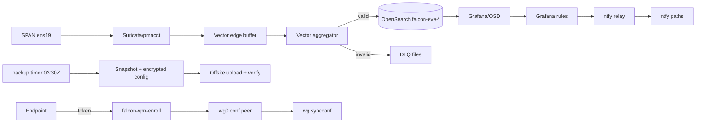

# Feature Implementation and Gap Map

## Audit Metadata

- Audit name: repo-deep-dive · Profile: falcon-lab v1.0.0 (pack v1.2.1)
- Run: `20260930-0701-falcon-8282d3f_edge-45dfed0` · Repos: `/home/user/falcon-build` @ `8282d3f` (clean) · `/home/user/falcon-edge-build` @ `45dfed0` (dirty — in-flight CI)
- Generated at: 2026-09-30 (UTC) · Auditor: repo-deep-dive subagent (prompt 03) · Area code: FEAT
- Output path: `docs/audits/repo-deep-dive/20260930-0701-falcon-8282d3f_edge-45dfed0/03_feature_implementation_map.md` · Scope limitations: read-only account (no root/docker/wg); live view = `live_snapshot.txt` (07:01:55Z). Per `profiles/falcon-lab.md` §4 this prompt is **ADAPTED**: the unit is the lab's **capabilities** (feeds, alerts, backups, VPN, enrollment, snapshots, SOC stack), not end-user product features.

## Scope

Reviewed: capability implementation and claimed status across both repos and the shared live host — feeds, alerting, backup/snapshot/restore, VPN, enrollment, SOC stack, edge agent/control plane, permissions, ledgers, tests, docs. Not reviewed: upstream internals; commits after the recorded SHAs; live root-level state. Runtime-mutating scripts were read, never executed.

## Evidence Reviewed

| Evidence | Type | Why relevant | Notes |
|---|---|---|---|
| `README.md`, `REPOSITORY.md`, `AGENTS.md`; `ledgers/{gate_ledger,phase9_gate_ledger}.csv` (102/14 gates) | docs/records | Overview, conventions, claimed-status source of truth | 101 PASS/1 N/A; 13 PASS/1 N/A; README dated 2026-09-24 |
| `PACKAGE_DIGEST.txt`; `docs/phase9/review/{PRODUCTION_VERDICT,REVIEW_REPORT_2026-09-29,OWNER_ADOPTION}.md` | artifacts/records | Digest and verdict bindings | Digest APPROVED; verdict binds `c312ab7`, 1,168-entry package |
| `compose/central/docker-compose.yml`, `config/vector/{edge,aggregator}.yaml`, `config/suricata/*`, `config/pmacct/*` | config | Feed/capture pipeline | `falcon-eve-*` sink; edge buffer; DLQ |
| `bootstrap/90-alerting.sh`, `docs/phase9/ALERT_CATALOGUE.yaml`, `automation/alerting/ntfy_relay.py`, `config/ntfy/server.yml` | code/config | Alert catalogue/delivery | 31 rules from repo; ntfy `deny-all` |
| `bootstrap/{85-backup-job,80-offsite-backup}.sh`, `automation/validation/{backup_new_services,restore_rehearsal,disk_guard,phase6_backup_restore}.sh`, `config/wireguard/wg0.conf.tpl`, `automation/vpn/*`, `docs/runbooks/VPN.md` | code/docs | Backup/snapshot/restore; VPN/enrollment | Offsite SHA-256 round-trip; R2 cold tier; peer preservation + `wg syncconf` |
| `automation/wazuh/*`, `compose/mct/*`, `docs/runbooks/{WAZUH_INTEGRATION,MCT_CONSOLIDATION}.md`, `mct/README.md`; edge OpenAPI/code/closeout; `live_snapshot.txt`; prior run archive | code/docs/live | SOC stack; edge program; unit state; prior findings | Local Wazuh manager; IRIS; OpenCanary; edge review CONDITIONAL_PASS (lab); prior IDs cross-checked |

## Verification Performed

| Check | Type | Why relevant | Notes |
|---|---|---|---|
| Gate aggregates recounted from CSVs; `bootstrap/90-alerting.sh` vs `ALERT_CATALOGUE.yaml` rule IDs; `secret_scan.py` over `review-package/`; package/digest/verdict binding cross-check | reproduce | Verify status, drift, hygiene, coherence | 101+1 / 13+1; 31/31 match; package `NO_FINDINGS`; digest `3ac6cd4`/2,067 vs verdict `c312ab7`/1,168 |
| Prior findings (ND/REV/LIVE) status review; `live_snapshot.txt` read | records/live | Extended verification; configured vs exercised | ND-P1-002, REV-P1-001/003, REV-P2-001 still open; LIVE-P0-001 partially-fixed; backup ran 03:30Z |

## Executive Summary

Core capabilities are implemented and well evidenced: 31 alert rules provisioned from repo code and reconciled to a generated catalogue; ntfy delivery with independent-path drills; daily backups with AES-encrypted config and SHA-256-verified offsite copies; an R2 searchable-snapshot cold tier; WireGuard enrollment with peer-preservation hardening; and an edge sensor with mTLS enrollment, signed updates, and 163 tests (`CONDITIONAL_PASS`, lab scope). The main gaps are **status/claim coherence**, not functionality: README/AGENTS describe gates closed on 2026-09-29, the published verdict and current digest bind different artifacts, offsite failures are not alerted on, and imported MCT docs overstate deployed scope. Next: refresh status from ledgers, re-issue the verdict binding, add offsite alerting, scope MCT docs.

## Inventory

| Item | Path / symbol | Purpose | Current state | Risk | Notes |
|---|---|---|---|---|---|
| Capture/flow feeds | `config/suricata/*`, `update_suricata_rules.sh`, `config/pmacct/*`, `config/vector/edge.yaml:17-25` | IDS + flow telemetry | Implemented | Low | ~46k rules; 14.6k flow records/5 min |
| Syslog/Wazuh feeds | `config/vector/edge.yaml` (514/15140/TLS), `config/rsyslog/49-falcon-tls.conf`, `automation/wazuh/lab-manager-proxy.sh` | Device + Wazuh-alert ingest; VPN-only proxies 15140/15141 | Implemented, live | Medium | UniFi fleet + DO host; 14d ISM via `falcon-eve-*` |
| Alert rules/delivery | `bootstrap/90-alerting.sh`, `ALERT_CATALOGUE.yaml`, `ntfy_relay.py`, `config/ntfy/server.yml`, `falcon-alert-relay.service` | 31 Grafana rules → ntfy FIRING/RESOLVED | Implemented, drilled | Medium | 31/31 IDs match repo; storm limits documented |
| Dead-man | `falcon-heartbeat.{service,timer}`, `heartbeat.sh` | External sign-of-life | Partial (prototype) | High | Unit says production moves outside stack |
| Backups/snapshots | `85-backup-job.sh`, `80-offsite-backup.sh`, `backup_new_services.sh`, `restore_rehearsal.sh`, `phase6_backup_restore.sh` | Daily snapshot + encrypted config + offsite + R2 cold tier | Implemented; offsite best-effort | Medium | No offsite alert (FEAT-P2-001); restore exercised 7 s/720k docs |
| VPN + enrollment | `wg0.conf.tpl`, `95-wireguard.sh`, `automation/vpn/*`, `VPN.md` | Tunnel + self-service peers (10.99.0.20-99) | Implemented, live | Medium | Peer-preservation fix + syncconf; single shared enroll token |
| SOC stack | `MCT_CONSOLIDATION.md`, `compose/mct/*`, `automation/wazuh/multi-node/*` | Wazuh, IRIS, OpenCanary | Partial consolidation | Medium | `mct/README.md` overstates (FEAT-P2-002) |
| Edge agent/CP + release | `src/falcon_agent/*`, `src/falcon_control/*`, edge OpenAPI, `image/*`, `bake-image.yml` | Enrollment, heartbeat, updates; signed image/SBOM/manifest | Implemented (lab), verified | Medium | 16 paths; mTLS; quarantine on mismatch; 45-check verifier |

## Domain Scorecard

| Category | Score | Evidence | Gap | Recommended action |
|---|---:|---|---|---|
| Operator surfaces (adapted Pages/routes) | 3 | 3 Grafana dashboards; OSD triage | No status page; README stale | Generate capability/status page |
| Services/components | 4 | systemd/compose/edge units | Some live state host-only | Keep committing configs (Wazuh done) |
| APIs/integrations | 4 | OpenSearch/Wazuh local; enroll HTTP; edge 16 paths | Central API surface untested | Add contract checks |
| Workers/jobs | 4 | 10 central timers; edge units | Offsite result has no metric | Offsite metric + alert |
| Data entities | 4 | OpenSearch, edge SQLite, IRIS DB | Retention covers only `falcon-eve-*` | Per-class retention (see 18) |
| Permissions | 4 | Least-privilege users; mTLS; ntfy `deny-all` | No SSO; shared token | Per-device revoke plan |
| Audit logs | 3 | OS audit REST; ledgers; Wazuh alerts | No unified retention/ownership | Define policy |
| Tests/docs | 3 | 462 central executions; 163 edge tests; rich runbooks | Central automation thin; stale status claims | Scheduled regression; refresh from ledgers |
| Workflow/failure states | 4 | Edge lifecycle/update/quarantine; DLQ, disk guard, restore drills | Central states implicit; offsite + dead-man gaps | Document states; drill + external heartbeat |
| UI without backend / backend without UI | 3 | Repo-sourced rules; live-derived catalogue | Repo alone cannot prove live drift | Offline catalogue comparison job |

## Detailed Review

### Item: Backup/restore and snapshot cold tier

- Evidence: `85-backup-job.sh`, `80-offsite-backup.sh`, `restore_rehearsal.sh`, decision log 2026-09-27, verdict RPO/RTO.
- What it does: daily local snapshot + AES-256 config archive + new-services state; offsite sample-verified copy (keep 7); R2 cold tier.
- Current controls / missing: freshness feeds `falcon-backup-stale`; disk guard prunes; restore rehearsed. Missing: offsite outcome not monitored (cold-tier silence — expose offsite freshness separately).
- Tests/docs: offsite failure drill; semantics in `RESTORE.md`.

### Item: Alerting pipeline and edge sensor capability set

- Evidence: `90-alerting.sh` (31 `write_rule`), `ALERT_CATALOGUE.yaml`, `ntfy_relay.py`; edge OpenAPI (16 paths), `service.py` (RBAC/quarantine), `REVIEW-2026-09-30.md`.
- What it does: Grafana evaluates rules; relay formats FIRING/RESOLVED into two ntfy paths + heartbeat; edge provides CSR/token enrollment, heartbeat/inventory/events, signed A/B updates, quarantine/revoke.
- Current controls / missing: 31/31 ID match; storm/silence drills; ntfy deny-all; mTLS roles, idempotency, 163 tests. Missing: offsite metric/rule; external heartbeat; edge production crypto/SBOM decisions and clean-host replication.
- Risks/recommended: silent offsite failure (FEAT-P2-001); close edge review conditions. Tests/docs: forced offsite alert; clean-host replication; refresh edge `FINAL_RESPONSE.json` (folded into FEAT-P1-001 evidence).

## Workflow Maps

## Scenario / Control Matrix

| ID | Scenario or control | Evidence | Current control | Gap | Severity | Recommendation |
|---|---|---|---|---|---|---|
| FEAT-001 | Operator surfaces | Dashboards; runbooks | Panels + deep links | README stale | P2 | Regenerate status page |
| FEAT-002 | Components/services | systemd/compose/edge | Repo-generated units | Live state host-only | P2 | Keep committing configs |
| FEAT-003 | APIs | OpenAPI 16 paths; OpenSearch/Wazuh | Contract + CI lint | Central surface untested | P2 | Add contract checks |
| FEAT-004 | Workers/jobs | timers, relay, disk guard | Drilled | Offsite silent | P2 | Offsite metric + alert |
| FEAT-005 | Data entities | OpenSearch/SQLite/IRIS | ISM for eve | Other classes uncovered | P2 | Per-class retention |
| FEAT-006 | Permissions | mTLS roles; OS users; ntfy | Least privilege | No SSO; shared token | P2 | Per-device revoke |
| FEAT-007 | Audit logs | OS audit REST; ledgers | Enabled | No unified retention | P2 | Audit policy |
| FEAT-008 | Tests/docs | 462 central; 163 edge; runbooks | Drills + suites | Central automation thin; claims drifting | P3 | Scheduled regression; refresh docs |
| FEAT-009 | Docs/status claims | Runbooks/doctrine/ledgers | Deep but drifting | Stale status claims | P1 | Refresh from ledgers |
| FEAT-010 | Workflow/failure states | Edge lifecycle; DLQ/disk/restore | Explicit on edge; most drills | Central implicit; offsite + dead-man | P2 | Document states; drill + external watcher |
| FEAT-011 | UI/backend drift | Rules vs catalogue | 31/31 match | Live-only generation | P3 | Offline comparison job |

## Findings

### Finding ID: FEAT-P1-001 - Status claims in README, AGENTS.md and edge FINAL_RESPONSE.json contradict the ledgers and published digest

- Severity: P1
- Confidence: High
- Area: FEAT
- Evidence:
  - `README.md` (2026-09-24 block: "100 PASS…P8-G10 and P9 gates remain open"; "25 alert rules"); `AGENTS.md` (Open gates: P8-G10; P9-G02/G10 IE; P9-G11/12/14 BLOCKED); edge `closeout/FINAL_RESPONSE.json` (`commit: d6147ef`, note "phases 5-6 in progress")
  - `ledgers/gate_ledger.csv` (P8-G10 PASS 2026-09-29; 101 PASS/1 N/A); `phase9_gate_ledger.csv` (13 PASS/1 N/A); edge ledger (77/8/3); `PACKAGE_DIGEST.txt` (`open_gates=none`); `ALERT_CATALOGUE.yaml` (31 rules)
- What is happening: first-read status text points at gate states closed since 2026-09-29; edge counts are current but its commit/note lag.
- Why it matters: agents/operators may treat closed gates as open.
- User / business impact: wrong assurance decisions and audit noise; no direct security impact.
- Security / privacy / reliability impact: trust in the evidence doctrine erodes.
- Recommended fix: generate status blocks from ledgers or mark as dated snapshots; rewrite AGENTS.md gate text; regenerate edge FINAL_RESPONSE at a publication commit.
- Suggested validation: CI check that README/AGENTS/edge aggregates equal ledger aggregates; phase-10 test asserting the recorded commit equals HEAD.
- Owner suggestion: falcon maintainer (edge nit: edge maintainer) · Effort estimate: S · Dependencies: none
- Status: still-open (prior ND-P1-002 class; verified at both current commits).

### Finding ID: FEAT-P1-002 - Published production verdict and current digest bind different artifact sets; verdict retains a contradictory readiness line

- Severity: P1
- Confidence: High
- Area: FEAT
- Evidence:
  - `docs/phase9/review/PRODUCTION_VERDICT.md` (binds `c312ab7`, manifest `4476fc…`, 1,168 entries, archive `fc8b9007…`; says "Production readiness: NOT_SUPPORTED until the mandatory gates pass"); `PACKAGE_DIGEST.txt` (`3ac6cd4`, 2,067 entries, `0e5912…`, `production_readiness=APPROVED`)
  - `review-package/MANIFEST.sha256` (2,067; matches digest); `ledgers/decision_log.md` 2026-09-30T04:35Z
- What is happening: post-verdict package rebuilds (Wazuh config round) moved the digest past the signed verdict; readiness text contradicts all-PASS/APPROVED.
- Why it matters: the approved verdict no longer self-consistently describes the artifact set it labels.
- User / business impact: release integrity and independent-review meaning are weakened.
- Security / privacy / reliability impact: an unreviewed config set can carry the approved label.
- Recommended fix: append-only verdict addendum binding the current package (or re-freeze the reviewed one); fix the readiness line; state which delivery is authoritative.
- Suggested validation: publication check that the verdict binding equals the current package manifest hash.
- Owner suggestion: release owner + reviewer · Effort estimate: M · Dependencies: reviewer sign-off
- Status: still-open (REV-P1-001/003, REV-P2-001 prior classes).

### Finding ID: FEAT-P2-001 - Offsite backup outcomes are not exported to monitoring or alerting

- Severity: P2
- Confidence: High
- Area: FEAT
- Evidence:
  - `bootstrap/85-backup-job.sh` (offsite failure logged; freshness written before the offsite attempt); `automation/validation/export_monitor_metrics.sh` (only `falcon_backup_last_success_timestamp_seconds`)
  - `bootstrap/90-alerting.sh:223` (`falcon-backup-stale` tests local freshness only)
- What is happening: a silent offsite failure leaves alerts green because freshness derives from the local snapshot.
- Why it matters: the offsite copy is the DR tier; its staleness must be visible.
- User / business impact: cold-tier gaps discovered only during recovery.
- Security / privacy / reliability impact: DR resilience.
- Recommended fix: record/export an offsite epoch and add a stale rule.
- Suggested validation: forced offsite failure drill fires the alert; success clears it.
- Owner suggestion: falcon maintainer · Effort estimate: S · Dependencies: none
- Status: partially-fixed (env fix + encrypted new-services upload 2026-09-30); alerting gap still-open (LIVE-P0-001 class).

### Finding ID: FEAT-P2-002 - Imported MCT docs claim a fully deployed SOC stack the consolidated lab only partially runs

- Severity: P2
- Confidence: High
- Area: FEAT
- Evidence:
  - `mct/README.md` ("Fully deployed and verified… v1.3.0"; Shuffle/MISP/Greenbone/Velociraptor described); `docs/runbooks/MCT_CONSOLIDATION.md` (imported content; data/secrets stay in `/srv/falcon/legacy/101`; lab runs IRIS + OpenCanary)
  - `compose/mct/` (IRIS, OpenCanary only)
- What is happening: vendored VM-101 documentation sits beside consolidation docs without scope markers.
- Why it matters: readers may map capabilities that are not running in this environment.
- User / business impact: false capability map; wasted verification effort.
- Security / privacy / reliability impact: assurance scope confusion.
- Recommended fix: add a scope banner to imported docs or move them to `mct/archive/`; publish a deployed-vs-imported list.
- Suggested validation: link/inventory check listing deployed vs imported services in `MCT_CONSOLIDATION.md`.
- Owner suggestion: MCT owner · Effort estimate: S · Dependencies: none
- Status: open.

### Finding ID: FEAT-P3-001 - Capability docs drift from implemented state (flows, rule counts, audit index)

- Severity: P3
- Confidence: High
- Area: FEAT
- Evidence:
  - `docs/architecture/DATA_FLOW_AND_CLASSIFICATION.md` (flow records "planned"; `falcon-audit-*` destination); `config/vector/edge.yaml` (flows live; all sink to `falcon-eve-*`)
  - `README.md` (25 rules) vs `ALERT_CATALOGUE.yaml` (31)
- What is happening: Phase-0 text is presented as the data map while later live classes and counts changed.
- Why it matters: auditors/operators mis-model data and controls.
- User / business impact: misdirected verification.
- Security / privacy / reliability impact: retention/redaction decisions based on a wrong inventory.
- Recommended fix: update tables/counts or mark the Phase-0 baseline historical with the live delta.
- Suggested validation: doc test asserting catalogue/README rule counts equal.
- Owner suggestion: falcon maintainer · Effort estimate: S · Dependencies: none
- Status: open (ND-P2-004 class).

## Risks

| Risk | Severity | Likelihood | Impact | Evidence | Mitigation |
|---|---|---|---|---|---|
| Stale status text drives decisions | P1 | High | Wrong assurance | FEAT-P1-001 | Generate from ledgers |
| Unreviewed package under approved verdict | P1 | Medium | Release integrity | FEAT-P1-002 | Addendum + binding check |
| Silent offsite staleness; dead-man in stack | P2 | Medium/Low | DR gap; missed outage | FEAT-P2-001; `falcon-heartbeat`; LIVE-P1-007 | Offsite metric/alert; external watcher |
| MCT scope confusion | P2 | Medium | Audit/op errors | FEAT-P2-002 | Scope banner |

## Recommendations

**Immediate / release blocking:** (1) fix FEAT-P1-002 binding; (2) refresh README/AGENTS/edge FINAL_RESPONSE (FEAT-P1-001).
**This week:** (3) offsite freshness metric + rule; (4) scope MCT docs.
**This month / later:** (5) update data-flow/counts; (6) central capability regression jobs; (7) ledger-generated status page; (8) external dead-man watcher.

## Quick Wins

| Quick win | Why it helps | Files likely involved | Validation |
|---|---|---|---|
| Ledger-derived status block | Ends stale claims | `README.md`, `AGENTS.md` | CI aggregate check |
| Offsite epoch + alert | Closes silent DR gap | `export_monitor_metrics.sh`, `90-alerting.sh` | Forced-failure drill |

## Hardening Backlog

| Backlog item | Priority | Owner suggestion | Effort | Dependency |
|---|---|---|---|---|
| Verdict addendum binding current package | P1 | release owner | S | reviewer |
| Status generation from ledgers (incl. edge) | P1 | falcon/edge maintainers | M | none |
| Offsite freshness instrumentation | P2 | falcon maintainer | S | none |
| MCT doc scoping | P2 | MCT owner | S | none |
| Central capability regression suite; external dead-man watcher | P2 | falcon maintainer / owner | M | CI / external host |

## Suggested Tests

- Unit: catalogue↔bootstrap rule-ID equality; README/AGENTS/edge aggregate equality vs CSVs.
- Integration: offsite failure injection → metric + alert; enrollment token rotation → deny.
- E2E/CI: restore from offsite on a scratch host; alert drill through both ntfy paths; package/digest/verdict binding assertion.
- Security/manual: env-dump capture test (cross-ref PRIV-P1-002); quarterly restore/failover walkthrough with evidence.

## Suggested Documentation Updates

- `README.md`, `AGENTS.md`, edge `closeout/FINAL_RESPONSE.json` — ledger-derived status; counts; commit.
- `docs/architecture/DATA_FLOW_AND_CLASSIFICATION.md` — live classes/indices/retention; `docs/runbooks/CAPACITY_AND_TELEMETRY.md` — offsite freshness semantics.
- `mct/` — deployed-vs-imported scope; `PRODUCTION_VERDICT.md` — addendum only.

## Open Questions

| Question | Why it matters | Evidence needed |
|---|---|---|
| Which package is the approved production artifact today? | Release integrity | Owner/reviewer statement or addendum |
| Is the R2 cold-tier mount active; are imported MCT services intentionally out of scope; who owns the dead-man heartbeat? | Capability map/outage readiness | Live mount listing (root); owner scope/design decisions |

## Appendix

- Gate aggregates: 102 (101 PASS + 1 N/A); phase 9: 14 (13 PASS + 1 N/A). Alert catalogue: 31 rules, 31 matched to `bootstrap/90-alerting.sh`.
- Edge OpenAPI: 16 paths (healthz, bootstrap-tokens, enrollments, sensors, heartbeats, inventory, desired-state, state-reports, events, update-manifest(s), recovery-directive(s), quarantine, revoke).
- Prior-run status: ND-P1-002, REV-P1-001/003/REV-P2-001 still-open; LIVE-P0-001 partially-fixed; LIVE-P2-002 cross-referenced in report 18.
