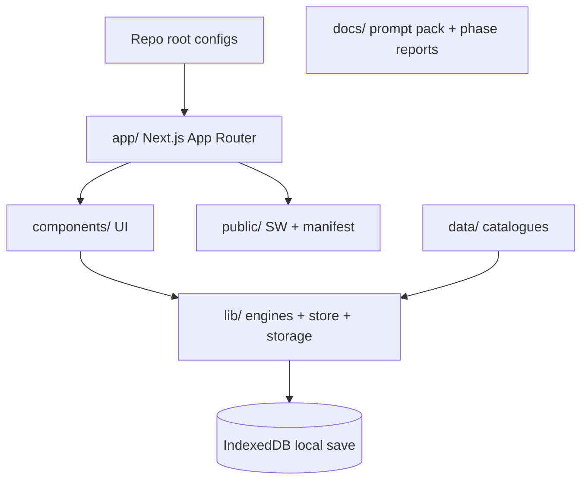

# Comprehensive Repository Inventory

## Audit Metadata

- Audit name: repo-deep-dive
- Run: 20261003-0018-master-99abf29
- Repository: `C:\temp\buddy`
- Branch: master
- Commit SHA: 99abf294dae0d9de8770dfde257bdef5fae9ae1b
- Generated at: 2026-10-03T04:18Z
- Auditor: repo-deep-dive subagent
- Area code: INV
- Output path: docs/audits/repo-deep-dive/20261003-0018-master-99abf29/01_repository_inventory.md
- Scope limitations: Read-only static review. `node_modules` is absent, so build/typecheck/test were not re-run. No production systems contacted.

## Scope

Reviewed the full git tree of `C:\temp\buddy` at commit `99abf29` (152 tracked files, ~14,274 lines): root configs, `app/`, `components/`, `lib/`, `data/`, `public/`, `docs/`, and `.gitignore`. Did not review git history contents beyond HEAD metadata, and did not review any host/deployment environment.

## Evidence Reviewed

- `inventory.json` (run folder, generated 2026-10-03T04:18:30Z)
- `package.json`, `package-lock.json`, `tsconfig.json`, `next.config.js`, `vitest.config.ts`, `.eslintrc.json`, `.gitignore`
- `app/`, `components/`, `lib/`, `data/`, `public/`, `docs/`
- `git log -1`, `git remote -v`, `git tag`

## Verification Performed

| Evidence | Type | Why relevant | Notes |
|---|---|---|---|
| `git ls-files` count = 152 | command | Confirms inventory totals | Matches `inventory.json` `files: 152` |
| Extension counts | command | Confirm stack | `.md` 98, `.ts` 31, `.tsx` 10, `.json` 6, `.js` 3 |
| `git remote -v` | command | Ownership | `https://github.com/MaineCyberTech/buddy.git` |
| `git tag` | command | Release state | single tag `v0.1.0-rc1` |
| `git status --short` | command | Cleanliness | clean working tree |
| `node -v` | command | Runtime | v24.19.0, npm 11.17.0; `node_modules` absent |

## Executive Summary

`buddy` is a small, cleanly-structured Next.js 14 App Router PWA: a single-page, offline-first virtual pet game with deterministic pet generation, a care loop, an adventure/loot loop, and an inventory. Source is compact (41 TS/TSX files) and well separated into `app/` (routing), `components/` (UI), `lib/` (engines), and `data/` (content catalogues). Strengths: a real unit-test suite (109 `it()` cases across 5 files), strict TypeScript, deterministic seeded generation, and a functioning IndexedDB + service-worker offline story.

Major risks are breadth/ownership and integration, not backend security: the repo has **no README, no LICENSE, no `.github/` CI, and no automated quality gate**; several advertised systems (achievements, lifecycle evolution, skills, item use/economy) are implemented as pure functions but never wired into gameplay; and the checked-in `docs/prompts/...` pack (98 markdown files) dominates the repository while adding no runnable code. The distributed `inventory.json` is also internally inconsistent with the real app (empty `routes`, `entry_points`, `workflows`, `ci`), so downstream machine scoring must not treat it as authoritative.

Recommended next actions: add README + LICENSE + CI (lint/typecheck/test/build), fix the save/identity and adventure state-sync bugs, wire or explicitly defer achievements/lifecycle/economy, and refresh dependencies.

## Inventory

| Item | Path / symbol | Purpose | Current state | Risk | Notes |
|---|---|---|---|---|---|
| Root configs | `package.json`, `tsconfig.json`, `next.config.js`, `tailwind.config.ts`, `postcss.config.js`, `.eslintrc.json` | Build/type/lint/theme config | Present, coherent | Low | `output: standalone` but no server code |
| App router | `app/page.tsx`, `app/layout.tsx`, `app/globals.css` | Single route + shell | Implemented | Low | No API routes |
| UI components | `components/device/*`, `components/hatch/*`, `components/ui/*` | Game UI | Implemented | Medium | Adventure/device state desync, see ARCH |
| Engines | `lib/generation/*`, `lib/actions/*`, `lib/locations/*`, `lib/progression/*`, `lib/stats/*`, `lib/personality/*` | Game logic | Partial | High | Several engines not wired to UI |
| Store | `lib/buddy/store.ts` | Zustand state | Implemented | Medium | guestId not restored |
| Storage | `lib/storage/indexeddb.ts`, `lib/storage/autosave.ts` | Persistence | Partial | High | version coercion bug; autosave unused |
| Offline | `public/sw.js`, `lib/offline/sw.ts` | Service worker | Implemented | Medium | static cache name |
| Data | `data/*.ts` | Content catalogues | Implemented | Low | one label typo; some exports unused |
| Tests | 5 `*.test.ts` | Unit tests | Implemented | Medium | no UI/E2E/CI |
| Docs (product) | `docs/buddy/reports/phases/*` | Phase/audit reports | Present | Medium | claim "None" P0/P1 |
| Docs (prompt pack) | `docs/prompts/...` | Build prompt pack | Vendored | Medium | 98 files, third-party refs |
| Public assets | `public/manifest.json`, `public/sw.js`, `public/icon-*.svg` | PWA | Implemented | Low | SVG-only icons |
| CI | (none) | Automation | Absent | High | no `.github/` |
| License | (none) | Legal | Absent | High | blocks distribution |
| `inventory.json` | run folder | Machine inventory | Inconsistent | Medium | empty routes/entry_points/ci |

## Domain Scorecard

| Category | Score | Evidence | Gap | Recommended action |
|---|---:|---|---|---|
| Root configs | 4 | coherent configs; strict TS | no env schema | add `lib/env.ts` if server appears |
| Package/workspace files | 3 | single package, lock v3 | no CI scripts | add quality-gate scripts |
| Applications | 3 | working SPA | integration gaps | wire engines |
| API services | 0 | none (`inventory.json` routes empty) | N/A today | document future API |
| Workers | 0 | none | N/A today | N/A |
| Shared packages | 0 | monorepo absent | N/A | N/A |
| Database/migrations | 0 | none (local IndexedDB only) | version drift | add save migration |
| GitHub metadata | 0 | no `.github/` | governance | add workflows + templates |
| Tests | 3 | 109 unit tests | no UI/E2E/CI | add RTL + Playwright + CI |
| Docs | 2 | phase reports claim near-complete; prompt pack | no README/index; stale claims | add README + reconcile |
| Assets/public files | 4 | manifest + SW + icons | SVG-only | add PNG icons |
| Generated artifacts | 2 | `inventory.json` inconsistent | no regeneration of docs | regenerate inventory |

## Detailed Review

### Item: Root configs
- Evidence: `package.json` (scripts dev/build/start/lint/typecheck/test/format), `tsconfig.json` (`strict: true`), `next.config.js` (`output: standalone`).
- What it does: standard Next.js 14 + TS + Tailwind + Vitest setup.
- Current controls: strict TS, Next core-web-vitals ESLint.
- Missing controls: no env validation, no security headers, no coverage thresholds.
- Risks: standalone output implies a server deploy but no server code/handler exists.
- Recommended improvement: document intended static vs server deployment; if server, configure headers.

### Item: Engines not wired to UI
- Evidence: `checkAchievements`/`createMemory` (`data/achievements.ts`), `checkEvolution`/`updateSkills` (`lib/progression/lifecycle.ts`), `startAutosave` (`lib/storage/autosave.ts`), `exportSave`/`importSave`/`getSaveMetadata` (`lib/storage/indexeddb.ts`) have no call sites outside tests.
- What it does: implements gameplay subsystems.
- Missing controls: no UI/logic integration.
- Risks: player-visible features (evolution, achievements, item use) advertised in docs never occur.

### Item: Prompt-pack docs
- Evidence: `docs/prompts/buddy_virtual_pet_v2_complete_prompt_pack/**` (98 md files) vs 41 source files.
- Risks: repository bloat, unclear provenance/licensing, third-party brand references (README line 17).

## Scenario / Control Matrix

| ID | Scenario or control | Evidence | Current control | Gap | Severity | Recommendation |
|---|---|---|---|---|---|---|
| INV-001 | Root docs | no root `README.md` | none | no onboarding | P2 | add README |
| INV-002 | Machine inventory | `inventory.json` empty routes/entry_points/ci | tool ran | inaccurate inputs | P2 | regenerate/fix |
| INV-003 | Docs footprint | 98 md files in `docs/` | none | bloat/provenance | P3 | index + prune |

## Findings

### Finding ID: INV-P2-001 - No root README or operator documentation

- Severity: P2
- Confidence: High
- Area: INV
- Evidence:
  - `C:\temp\buddy` (root) — no `README.md` (root `*.md` listing empty)
  - `docs/buddy/reports/phases/` — phase reports exist but no entry-point doc
- What is happening: There is no repository README, no setup/run instructions at the root, and no operator/developer index.
- Why it matters: New contributors and AI agents cannot quick-start the project from the repo root; the only narrative docs are phase reports buried under `docs/buddy/reports/phases/`.
- User / business impact: Slower onboarding, higher risk of incorrect setup, harder handoffs.
- Security / privacy / reliability impact: Indirect; missing run/verify instructions means validation steps are easily skipped.
- Recommended fix: Add root `README.md` with purpose, stack, commands (`npm ci`, `npm run dev`, `npm run test`, `npm run build`), architecture summary, and links to docs.
- Suggested validation: Fresh clone + follow README to green `npm run test` and `npm run build`.
- Owner suggestion: maintainer
- Effort estimate: S
- Dependencies: none
- Status: open

### Finding ID: INV-P2-002 - Provided inventory.json contradicts the actual application

- Severity: P2
- Confidence: High
- Area: INV
- Evidence:
  - `inventory.json` — `"entry_points": []`, `"routes": []`, `"workflows": []`, `"ci": []`, `"tests": { "dirs": [] }`
  - `app/page.tsx`, `app/layout.tsx` — real Next.js App Router entry points and route
  - 5 `*.test.ts` files under `lib/` and `data/`
- What is happening: The Wave-0 inventory records no entry points, routes, workflows, or CI, and an empty test dir list, even though the repo has a Next.js app and tests. `ci: []` is accurate, but the others are false negatives.
- Why it matters: The manifest/INDEX and any downstream scoring that starts from `inventory.json` will mis-score coverage and topology.
- User / business impact: Misleading audit inputs; wasted re-discovery effort.
- Security / privacy / reliability impact: Reliability of the audit pipeline itself.
- Recommended fix: Regenerate `inventory.json` with an updated inventory tool, or hand-correct `entry_points`/`routes`/`tests.dirs`; note `ci` empty is genuine.
- Suggested validation: Re-run inventory and diff against `app/` and test files.
- Owner suggestion: audit tooling owner
- Effort estimate: S
- Dependencies: inventory tooling
- Status: open

### Finding ID: INV-P3-001 - Committed prompt-pack docs dominate the repository with no index

- Severity: P3
- Confidence: High
- Area: INV
- Evidence:
  - `docs/prompts/buddy_virtual_pet_v2_complete_prompt_pack/**` — 98 markdown files (largest dir `docs`: 99 files of 152 total)
  - `docs/prompts/.../README.md` line 17 — "Do not copy Tamaweb, Tamagotchi, or any other copyrighted/proprietary project."
- What is happening: A full third-party prompt pack is checked in alongside the product; there is no `docs/README.md` index explaining what is product vs generator material.
- Why it matters: Repo bloat, ambiguous provenance/licensing, and confusion about which docs describe shipped behavior.
- User / business impact: Reviewers cannot quickly tell shipped docs from planning prompts.
- Security / privacy / reliability impact: Low direct; IP/licensing ambiguity.
- Recommended fix: Add `docs/README.md` classifying product vs prompt-pack material, and consider moving the pack to a separate repo or archive.
- Suggested validation: Docs index links resolve; `git ls-files docs` reviewed.
- Owner suggestion: maintainer / legal
- Effort estimate: S
- Dependencies: SUPPLY-P2-003
- Status: open

## Risks

| Risk | Severity | Likelihood | Impact | Evidence | Mitigation |
|---|---|---|---|---|---|
| Onboarding failure | P2 | High | Medium | no README | INV-P2-001 |
| Mis-scored audit inputs | P2 | High | Medium | `inventory.json` | INV-P2-002 |
| IP/provenance ambiguity | P3 | Medium | Medium | prompt pack | INV-P3-001, SUPPLY-P2-003 |

## Recommendations

### Immediate / Release Blocking
- Add `README.md` and `LICENSE` (see SUPPLY-P1-001).

### This Week
- Correct/regenerate `inventory.json`.
- Add a docs index.

### This Month
- Prune or relocate the prompt pack.

### Later / Platform Evolution
- Adopt a documentation structure (`docs/` with clear ownership).

## Quick Wins

| Quick win | Why it helps | Files likely involved | Validation |
|---|---|---|---|
| Add root README | onboarding | `README.md` | fresh-clone walkthrough |
| Fix inventory.json | accurate pipeline | run `inventory.json` | diff vs tree |
| Add docs index | clarity | `docs/README.md` | link check |

## Hardening Backlog

| Backlog item | Priority | Owner suggestion | Effort | Dependency |
|---|---|---|---|---|
| Root README + run/verify docs | P2 | maintainer | S | none |
| Regenerate inventory | P2 | tooling | S | inventory tool |
| Docs classification/index | P3 | maintainer | S | legal review |

## Suggested Tests

- Documentation link checker over `docs/`.
- A CI step that fails if `README.md`/`LICENSE` are missing.

## Suggested Documentation Updates

- Create `README.md`, `docs/README.md`, `LICENSE`, `CONTRIBUTING.md`.

## Open Questions

| Question | Why it matters | Evidence needed |
|---|---|---|
| Is `node_modules` intentionally not vendored? | reproducibility | `.gitignore` confirms ignored; lockfile present |
| Was `inventory.json` generated by an older tool? | pipeline trust | tool version in manifest |

## Appendix

