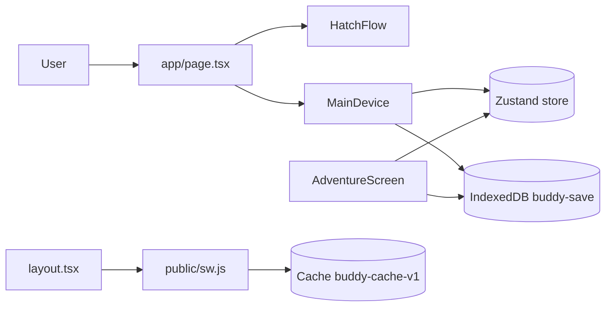

# Architecture and Runtime Topology Audit

## Audit Metadata

- Audit name: repo-deep-dive
- Run: 20261003-0018-master-99abf29
- Repository: `C:\temp\buddy`
- Branch: master
- Commit SHA: 99abf294dae0d9de8770dfde257bdef5fae9ae1b
- Generated at: 2026-10-03T04:18Z
- Auditor: repo-deep-dive subagent
- Area code: ARCH
- Output path: docs/audits/repo-deep-dive/20261003-0018-master-99abf29/02_architecture_runtime_topology.md
- Scope limitations: Client-only static analysis. No live deployment observed; all runtime behavior inferred from code. `node_modules` absent.

## Scope

Reviewed the runtime boundary of the app: `app/` router + layout, `components/`, `lib/buddy/store.ts`, `lib/storage/*`, `lib/offline/sw.ts`, `public/sw.js`, and `next.config.js`. Explicitly looked for server routes, workers, queues, webhooks, realtime, auth, and external integrations. Not reviewed: any hosting platform config (none present).

## Evidence Reviewed

- `app/page.tsx`, `app/layout.tsx`, `next.config.js`
- `lib/buddy/store.ts`, `lib/storage/indexeddb.ts`, `lib/storage/autosave.ts`
- `lib/offline/sw.ts`, `public/sw.js`, `public/manifest.json`
- `components/device/MainDevice.tsx`, `components/device/AdventureScreen.tsx`
- `lib/locations/adventure.ts`

## Verification Performed

| Evidence | Type | Why relevant | Notes |
|---|---|---|---|
| `next.config.js` | config | deploy shape | `output: "standalone"`, `images.unoptimized: true` |
| repo tree | static | API/worker presence | no `app/api/`, no `route.ts`, no workers |
| `inventory.json` | data | topology claim | `routes: []`, `workflows: []`, `ci: []` |
| `public/sw.js` lines 1–58 | code | offline topology | cache-first, static cache name |
| `lib/buddy/store.ts` line 9 | code | identity | `guestId: string` in memory only |

## Executive Summary

`buddy` is a **pure client-side, local-first SPA**. There is no backend, no API layer, no database, no queue, no webhook, no realtime, and no auth. All state lives in a Zustand store and is persisted to browser IndexedDB; the service worker caches the app shell. This is a legitimate and simple topology for a guest-only offline game, and the separation of concerns (engines vs UI vs storage) is clean.

The risks are structural: (1) the design is entirely **client-authoritative**, which the repo's own spec (`specs/security-economy-authority.md`) says is unacceptable for account mode — no account/server path exists; (2) there is a concrete **state-sync bug** between the store and the device component after adventures; (3) persistence identity (`guestId`) is weak and not restored after reload; and (4) the service worker uses a single static cache name, risking stale assets after deploys. `output: "standalone"` implies a Node server deployment, but no server entry exists, so deployment intent is undocumented.

## Inventory

| Item | Path / symbol | Purpose | Current state | Risk | Notes |
|---|---|---|---|---|---|
| Router | `app/page.tsx` | single route `/` | implemented | Low | client component |
| Shell | `app/layout.tsx` | metadata, SW, offline banner | implemented | Low | no error boundary |
| State | `lib/buddy/store.ts` | Zustand store | implemented | Medium | guestId not restored |
| Storage | `lib/storage/indexeddb.ts` | IndexedDB save | partial | High | version bug |
| Autosave | `lib/storage/autosave.ts` | periodic save | dead | Medium | never started |
| SW | `public/sw.js` + `lib/offline/sw.ts` | offline cache | implemented | Medium | static cache name |
| Server/API | (none) | backend | absent | High (for cloud) | N/A guest-only |
| Auth | (none) | identity | absent | High (for account) | guest-only |

## Domain Scorecard

| Category | Score | Evidence | Gap | Recommended action |
|---|---:|---|---|---|
| Monorepo structure | 0 | single package | N/A | N/A |
| Frontend/backend/worker boundaries | 2 | frontend only | no backend | document or add API |
| Auth/session flow | 0 | none | no auth | account phase required |
| Authorization and tenant boundaries | 0 | none | no tenancy | required for cloud |
| Request lifecycle | 1 | single page load | no server requests | N/A |
| Data flow | 3 | store → IndexedDB → SW cache | desync bug | fix ARCH-P1-002 |
| Background jobs | 0 | none | N/A | N/A |
| Queues | 0 | none | N/A | N/A |
| Webhooks | 0 | none | N/A | N/A |
| Realtime | 0 | none | N/A | N/A |
| Notifications | 0 | none | N/A | N/A |
| External integrations | 2 | Google Fonts | no fallback/privacy | self-host fonts |

## Detailed Review

### Item: Client-authoritative state
- Evidence: all mutations in `lib/actions/care.ts`, `lib/locations/adventure.ts` run in-browser; `lib/storage/indexeddb.ts` writes directly.
- What it does: computes rewards, levels, loot locally.
- Missing controls: server validation, rate limits, duplicate-reward rejection (required by `specs/security-economy-authority.md`).
- Risks: any save edit yields arbitrary coins/items (trivial cheat); fine for offline single-player, blocking for competitive/account mode.

### Item: Store vs component state
- Evidence: `components/device/MainDevice.tsx` keeps `currentBuddy` in local `useState` (line 30) while `AdventureScreen` calls store `setBuddy` (line 39) via `lib/buddy/store.ts`.
- What it does: care actions update both local and store; adventures update only the store.
- Risks: device LCD/stats do not reflect post-adventure energy/XP/inventory until remount.

### Item: Service worker
- Evidence: `public/sw.js` `CACHE_NAME = 'buddy-cache-v1'`; fetch handler caches any same-origin GET 200 `basic` response.
- Risks: no cache-version bump mechanism; stale HTML/assets can persist across releases; fonts (cross-origin, `cors`) are not cached → offline font fallback.

### Item: Identity
- Evidence: `components/hatch/HatchFlow.tsx` line 17 and `lib/storage/autosave.ts` line 12 create `guest-<base36 time><Math.random>`; `app/page.tsx` restores buddy/inventory but not `guestId`.
- Risks: after reload `guestId` is `''` and subsequent saves overwrite the stored id with empty.

## Scenario / Control Matrix

| ID | Scenario or control | Evidence | Current control | Gap | Severity | Recommendation |
|---|---|---|---|---|---|---|
| ARCH-001 | Server authority | no API; spec doc | none | all client-authoritative | P1 | document guest-only scope; add server for account mode |
| ARCH-002 | Post-adventure UI sync | `MainDevice.tsx`, `AdventureScreen.tsx` | local state | store diverges | P1 | single source of truth |
| ARCH-003 | SW cache freshness | `public/sw.js` | static cache name | stale assets | P2 | version cache / precache manifest |
| ARCH-004 | Guest identity | `HatchFlow.tsx`, `page.tsx` | weak RNG, not restored | identity loss | P2 | persist + crypto UUID |
| ARCH-005 | Autosave | `lib/storage/autosave.ts` | defined, never called | no periodic save | P2 | start it or delete |

## Findings

### Finding ID: ARCH-P1-001 - Entire game is client-authoritative with no server trust boundary

- Severity: P1
- Confidence: High
- Area: ARCH
- Evidence:
  - `lib/locations/adventure.ts` — `runAdventure` / `applyAdventureResult` compute coins, items, XP in-browser
  - `lib/actions/care.ts` — `applyAction` mutates needs/XP in-browser
  - `lib/storage/indexeddb.ts` — writes directly to IndexedDB
  - `docs/prompts/.../specs/security-economy-authority.md` — "client state is not authoritative for rare rewards, inventory mutations, cloud saves, or adventure completion"
- What is happening: There is no backend; every game-state transition and reward is computed and persisted on the client.
- Why it matters: The shipped product is intentionally guest/local-only, but the repository's own spec requires server authority for account mode, and none exists.
- User / business impact: Trivial cheating/economy manipulation if competitive or cloud features are added; blocks monetized/ranked features.
- Security / privacy / reliability impact: No server-side validation, rate limiting, or duplicate-reward rejection.
- Recommended fix: Explicitly document guest-only trust model in README; before account/cloud features, add an API/edge layer validating save envelopes and adventure completions per the spec.
- Suggested validation: Add tests asserting a tampered save is rejected once a server validator exists; for now, a doc test that the trust model is stated.
- Owner suggestion: backend + game
- Effort estimate: L
- Dependencies: none (documentation now; server work later)
- Status: open
- Attack path: none identified (no server/tenant data at this commit)

### Finding ID: ARCH-P1-002 - Adventure results update the store but not the device component's local state

- Severity: P1
- Confidence: High
- Area: ARCH
- Evidence:
  - `components/device/MainDevice.tsx` line 30 — `const [currentBuddy, setCurrentBuddy] = useState(initialBuddy)`
  - `components/device/AdventureScreen.tsx` lines 39–40 — `setBuddy(updatedBuddy); setInventory(updatedInv)` (store only)
  - `lib/buddy/store.ts` — `buddy`/`inventory` store fields
- What is happening: `MainDevice` renders from its own `currentBuddy` state; `AdventureScreen` mutates only the Zustand store. After an adventure, the device LCD, mood, HP, energy, and level do not update until the component remounts.
- Why it matters: The primary gameplay loop shows stale state, so players see wrong energy/XP after adventures.
- User / business impact: Confusing gameplay; apparent lost or duplicated progress.
- Security / privacy / reliability impact: Reliability/correctness defect; also risks inconsistent saves.
- Recommended fix: Make the store the single source of truth — have `MainDevice` subscribe to `useGameStore(s => s.buddy)` instead of holding a local copy, or have `AdventureScreen` invoke an `onBuddyUpdate` callback.
- Suggested validation: Component test: run adventure, assert rendered energy/XP/coins match the store immediately.
- Owner suggestion: frontend
- Effort estimate: M
- Dependencies: none
- Status: open

### Finding ID: ARCH-P2-001 - Service worker uses a static cache name and no cache versioning

- Severity: P2
- Confidence: High
- Area: ARCH
- Evidence:
  - `public/sw.js` line 1 — `var CACHE_NAME = 'buddy-cache-v1';`
  - `public/sw.js` lines 36–49 — cache-first for all same-origin GET 200 `basic`
- What is happening: The cache name is a hardcoded constant; activate deletes other names but this name never changes, so previously cached `/` and assets can be served indefinitely after a new deploy until the SW file itself changes.
- Why it matters: Users can get a stale app shell and mixed-version assets.
- User / business impact: Bugs appear fixed/deployed when they are not; support confusion.
- Security / privacy / reliability impact: Reliability; a stale cached response could serve outdated logic.
- Recommended fix: Inject a build-time cache hash (e.g., `buddy-cache-<buildid>`) and precache a hashed asset manifest; add `skipWaiting`/`clientsClaim` update flow (partially present).
- Suggested validation: Build twice with a changed asset and assert the cache name changes and old caches are purged.
- Owner suggestion: frontend/PWA
- Effort estimate: M
- Dependencies: build pipeline
- Status: open

### Finding ID: ARCH-P2-002 - Guest identity is weakly generated and not restored after reload

- Severity: P2
- Confidence: High
- Area: ARCH
- Evidence:
  - `components/hatch/HatchFlow.tsx` line 17 — `'guest-' + Date.now().toString(36) + Math.random().toString(36).slice(2, 6)`
  - `lib/storage/autosave.ts` line 12 — same pattern
  - `app/page.tsx` lines 15–22 — restores `buddy` and `inventory` but never calls `setGuestId`
  - `lib/buddy/store.ts` line 9 — `guestId: string`
- What is happening: `guestId` is generated with `Math.random` at hatch, but on reload the save's `guestId` is not restored into the store (stays `''`). Any subsequent save writes an empty `guestId`.
- Why it matters: Save identity is not stable across sessions; cloud-migration/ownership would break, and imported saves are keyed inconsistently.
- User / business impact: Future account linking/cloud sync would be unreliable; support burden.
- Security / privacy / reliability impact: Identity integrity; `Math.random` is not a secure identifier.
- Recommended fix: `app/page.tsx` should set `guestId` from `save.guestId` when present; generate new ids with `crypto.randomUUID()`; store the id in its own IndexedDB key.
- Suggested validation: Unit/integration test: save→reload→save preserves the same `guestId`.
- Owner suggestion: frontend
- Effort estimate: S
- Dependencies: none
- Status: open

### Finding ID: ARCH-P2-003 - Autosave module is dead code; persistence happens only on discrete actions

- Severity: P2
- Confidence: High
- Area: ARCH
- Evidence:
  - `lib/storage/autosave.ts` — `startAutosave`/`stopAutosave` exported, no call site outside the file
  - `components/device/MainDevice.tsx` lines 58–73 — saves after each care action
  - `docs/buddy/reports/phases/audit-03-pwa-offline-report.md` line 31 — "Autosave timer exists but isn't started"
- What it does: interval-based save every 10s was intended but never wired.
- Risks: Time-based state (offline decay, adventure completion) may not be persisted unless it flows through an action save; double maintenance surface.
- Recommended fix: Either start autosave on mount of the main game (`useEffect`) and stop on unmount, or delete the module and rely on action-driven saves; document the chosen persistence model.
- Suggested validation: Test that a state change without an explicit save is persisted within the interval (if autosave is adopted).
- Owner suggestion: frontend
- Effort estimate: S
- Dependencies: ARCH-P1-002
- Status: open

## Risks

| Risk | Severity | Likelihood | Impact | Evidence | Mitigation |
|---|---|---|---|---|---|
| Stale state after adventure | P1 | High | High | ARCH-P1-002 | single source of truth |
| Client-authoritative rewards | P1 | High (in account mode) | High | ARCH-P1-001 | server validation |
| Stale SW assets | P2 | Medium | Medium | ARCH-P2-001 | cache versioning |
| Identity loss | P2 | High | Medium | ARCH-P2-002 | restore/persist guestId |

## Recommendations

### Immediate / Release Blocking
- Fix ARCH-P1-002 (state desync) before advertising adventure progress.

### This Week
- Restore `guestId` on load and use `crypto.randomUUID`.
- Decide autosave: wire or remove.
- Version the SW cache.

### This Month
- Document trust model and deployment shape (static vs standalone server).

### Later / Platform Evolution
- Add server/edge authority before account mode.

## Quick Wins

| Quick win | Why it helps | Files likely involved | Validation |
|---|---|---|---|
| Restore guestId on load | identity integrity | `app/page.tsx` | reload test |
| Use store as source of truth in device | fixes desync | `MainDevice.tsx` | component test |
| Version cache name | freshness | `public/sw.js` | two-build test |

## Hardening Backlog

| Backlog item | Priority | Owner suggestion | Effort | Dependency |
|---|---|---|---|---|
| Store-as-source-of-truth refactor | P1 | frontend | M | none |
| Server trust boundary (account mode) | P1 (future) | backend | L | product decision |
| SW build-time cache versioning | P2 | frontend | M | build |
| Guest id hardening | P2 | frontend | S | none |

## Suggested Tests

- Component test for post-adventure render vs store.
- Integration test for save/reload guestId persistence and version.
- SW test asserting cache name changes when the build id changes.
- Offline test asserting navigation fallback and font fallback.

## Suggested Documentation Updates

- `README.md` — deployment shape and trust model.
- `docs/architecture.md` — context/container diagrams, no-backend statement.

## Open Questions

| Question | Why it matters | Evidence needed |
|---|---|---|
| Static export or Node server? | `output: standalone` with no server code | deployment config |
| Is account/Supabase still planned? | drives P1 server work | product roadmap |
| Is autosave intended? | dead vs missing wiring | design decision |

## Appendix

