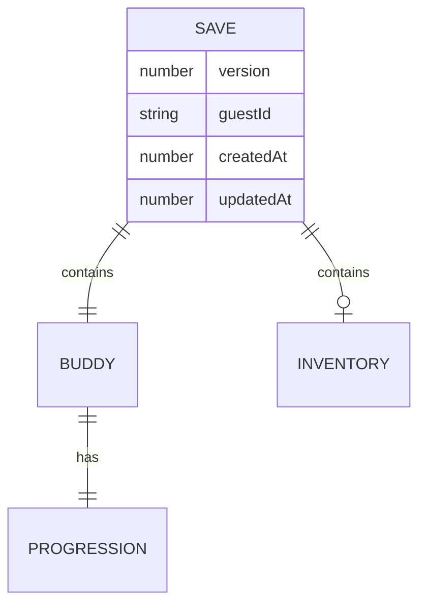

# Data, Schema, Migration, and Runtime Validation Audit

## Audit Metadata

- Audit name: repo-deep-dive
- Run: 20261003-0018-master-99abf29
- Repository: `C:\temp\buddy`
- Branch: master
- Commit SHA: 99abf294dae0d9de8770dfde257bdef5fae9ae1b
- Generated at: 2026-10-03T04:18Z
- Auditor: repo-deep-dive subagent
- Area code: DATA
- Output path: docs/audits/repo-deep-dive/20261003-0018-master-99abf29/07_data_schema_migration_runtime_validation.md
- Scope limitations: No SQL database; persistence is browser IndexedDB. Static review only.

## Scope

Reviewed the persistence model: `lib/storage/indexeddb.ts` (schema/versioning), `lib/storage/autosave.ts`, the `GameSave`/`BuddyState`/`InventoryState` types (`lib/generation/types.ts`), and runtime validation. Databases/RLS/foreign keys/soft deletes are **not applicable** (no server DB). Not reviewed: browser IndexedDB internals beyond the library API.

## Evidence Reviewed

- `lib/storage/indexeddb.ts` (`DB_NAME`/`DB_VERSION`/`upgrade`/`loadGame`/`importSave`)
- `lib/generation/types.ts` (`GameSave`, `version`, `inventory?`)
- `lib/storage/autosave.ts`, `components/device/MainDevice.tsx`, `components/hatch/HatchFlow.tsx`, `components/device/AdventureScreen.tsx` (writers)
- `package.json` (`zod` unused)

## Verification Performed

| Evidence | Type | Why relevant | Notes |
|---|---|---|---|
| `indexeddb.ts` lines 49–51 | code | version handling | `if (save.version !== 1) save.version = 1` |
| writers grep `version:` | command | version written | `MainDevice`/`AdventureScreen`/`HatchFlow` write `version: 2`; `autosave` writes `version: 1` |
| `upgrade` callback | code | migration | v1→v2 does not alter records |
| zod grep | command | validation | 0 imports |
| test files | code | coverage | no storage/DB tests |

## Executive Summary

Persistence is a single IndexedDB object store (`buddy-save` → `saves`, key `buddy-current-save`) behind `idb`. The data model is typed in TS but **not validated at runtime**, and the `version` field is internally inconsistent: writers persist `version: 2` (and `1` from autosave), while `loadGame` unconditionally rewrites any loaded save to `version: 1` (lines 49–51). There is no real migration: the `upgrade` callback only ensures the store exists. Combined with the untrusted `importSave` path, the save layer is the most fragile part of the app: corrupt or version-skewed saves can silently lose data or crash code that assumes `progression` exists. This is a data-integrity P1 set.

## Inventory

| Item | Path / symbol | Purpose | Current state | Risk | Notes |
|---|---|---|---|---|---|
| DB | `indexeddb.ts` `buddy-save` | local store | Implemented | Medium | v2 |
| Store | `saves`, keyPath `key` | save slot | Implemented | Low | single key |
| Save model | `GameSave` | envelope | Partial | Medium | `inventory?` optional |
| Versioning | `DB_VERSION=2`, `GameSave.version` | schema | Inconsistent | High | load downgrades to 1 |
| Migration | `upgrade` | schema evolution | Cosmetic | High | no data transform |
| Validation | (none) | integrity | Absent | High | zod unused |
| Export/import | `exportSave`/`importSave` | portability | Present, no UI | Medium | unvalidated |
| Metadata | `getSaveMetadata` | status | Present, unused | Low | reports wrong version |
| Seeds/fixtures | test `createInitialBuddyState` | tests | Present | Low | no fixture module |

## Domain Scorecard

| Category | Score | Evidence | Gap | Recommended action |
|---|---:|---|---|---|
| Database schema | 2 | one store | no typed schema | define zod schema |
| Migrations | 1 | existence check only | no data migration | add versioned migrations |
| Constraints | 1 | TS types only | no runtime checks | validate on read |
| Indexes | 0 | key only | N/A | — |
| Foreign keys/cascades | 0 | none | N/A | — |
| RLS | 0 | no DB | N/A future | supabase plan |
| Tenant columns | 0 | no DB | N/A future | add when cloud |
| Soft deletes | 0 | hard delete | N/A | — |
| Audit fields | 1 | `createdAt`/`updatedAt` | no event log | add |
| Retention | 0 | none | N/A | — |
| Seeds/fixtures | 2 | test helpers inline | no shared fixtures | extract |
| Runtime validators | 0 | none | zod unused | implement |
| Env/config validation | 0 | none | N/A client | — |
| Migration CI | 0 | none | no CI | covered by CI area |
| Rollback/drift/backup | 0 | none | no backup | export UI |

## Detailed Review

### Item: Save version handling
- Evidence: `lib/storage/indexeddb.ts` line 49–51; writers at `HatchFlow.tsx` line 33, `MainDevice.tsx` line 61, `AdventureScreen.tsx` line 46 (`version: 2`), `autosave.ts` line 20 (`version: 1`).
- Risks: `loadGame` mutates in-memory `version` to 1; `getSaveMetadata` always returns 1; a future migration keyed on `version` would misbehave. This is drift between writer and reader.

### Item: Runtime validation
- Evidence: `GameSave` type has optional `inventory`; `app/page.tsx` guards `save?.buddy` but nothing validates nested shapes. `zod` is declared but unused.
- Risks: `buddy.progression` is optional on old saves but `AdventureScreen` writes `updatedBuddy.progression.totalAdventures` after a `?` guard — safe there, but `MainDevice`/`Achievement` code assumes fields.

### Item: Untrusted import
- Evidence: `importSave` accepts any `{version, guestId}` JSON and persists it (also SEC-P2-001).
- Risks: corruption/cheat; no size cap.

## Scenario / Control Matrix

| ID | Scenario or control | Evidence | Current control | Gap | Severity | Recommendation |
|---|---|---|---|---|---|---|
| DATA-001 | Save version fidelity | `indexeddb.ts` 49–51 vs writers | none | reader downgrades | P1 | align version |
| DATA-002 | Runtime schema validation | types only | TypeScript | none at runtime | P1 | zod on load/import |
| DATA-003 | Migration path | `upgrade` | store check | no transform | P2 | versioned migrations |

## Findings

### Finding ID: DATA-P1-001 - loadGame silently downgrades every save to version 1, contradicting writers

- Severity: P1
- Confidence: High
- Area: DATA
- Evidence:
  - `lib/storage/indexeddb.ts` lines 49–51 — `if (save.version !== 1) { save.version = 1; }`
  - `components/hatch/HatchFlow.tsx` line 33, `components/device/MainDevice.tsx` line 61, `components/device/AdventureScreen.tsx` line 46 — write `version: 2`
  - `lib/storage/autosave.ts` line 20 — writes `version: 1`
  - `lib/storage/indexeddb.ts` lines 111–116 — `getSaveMetadata().version`
- What is happening: Three code paths persist `version: 2`; `loadGame` rewrites any non-1 version to 1; autosave persists `version: 1`. The persisted and reported version are therefore unstable and meaningless.
- Why it matters: Any future schema migration keyed on `save.version` will run the wrong branch; `getSaveMetadata` misreports; the v1→v2 upgrade is a no-op despite the field.
- User / business impact: Risk of silent data loss/mis-migration when the save shape changes.
- Security / privacy / reliability impact: Data integrity/reliability.
- Recommended fix: Define the current `SAVE_VERSION` constant (e.g., 2), write it everywhere, and implement an explicit `migrate(save)` that upgrades old versions and validates the result; never mutate version on read without migrating.
- Suggested validation: Tests loading v1 and v2 fixtures, asserting correct migration and that `getSaveMetadata().version` equals the persisted version.
- Owner suggestion: frontend/data
- Effort estimate: S
- Dependencies: DATA-P1-002
- Status: open

### Finding ID: DATA-P1-002 - No runtime schema validation for loaded or imported saves (zod unused)

- Severity: P1
- Confidence: High
- Area: DATA
- Evidence:
  - `lib/generation/types.ts` — `GameSave` (line 79), `inventory?` optional
  - `lib/storage/indexeddb.ts` — `loadGame` casts `entry.value as GameSave`; `importSave` only checks `version`/`guestId`
  - grep `from 'zod'` = 0 matches while `zod` is in `package.json`
- What is happening: TS types provide no runtime guarantees; IndexedDB contents (user-editable) and imported base64 are trusted after a cast.
- Why it matters: A malformed save can produce runtime exceptions or impossible state (negative/NaN stats, missing `progression`, oversized inventory).
- User / business impact: Crashes or corrupted games that cannot be diagnosed.
- Security / privacy / reliability impact: Integrity; supports the import cheat vector.
- Recommended fix: Add zod schemas for `GameSave`, `BuddyState`, `InventoryState`, `ProgressionState`; parse on load/import; clamp numeric ranges; return a typed error and recoverable state on failure.
- Suggested validation: Fuzz tests with missing fields, wrong types, out-of-range values, and oversized payloads.
- Owner suggestion: frontend
- Effort estimate: M
- Dependencies: none
- Status: open

### Finding ID: DATA-P2-001 - No real save migration strategy despite a version field

- Severity: P2
- Confidence: High
- Area: DATA
- Evidence:
  - `lib/storage/indexeddb.ts` lines 13–24 — `upgrade` only creates the store if absent; no record transforms
  - `GameSave.version` — present but not used for migration
- What is happening: There is no code that transforms older save shapes to the current shape.
- Why it matters: When fields are added/renamed (e.g., `progression`), old saves adopted by existing users may break.
- User / business impact: Existing players could lose progress on upgrade.
- Security / privacy / reliability impact: Reliability/data lifecycle.
- Recommended fix: Introduce a migration registry (`1 → 2 → …`) applied on load, with tests per version.
- Suggested validation: Migration unit tests against captured fixtures.
- Owner suggestion: frontend/data
- Effort estimate: M
- Dependencies: DATA-P1-001
- Status: open

## Risks

| Risk | Severity | Likelihood | Impact | Evidence | Mitigation |
|---|---|---|---|---|---|
| Silent save migration errors | P1 | Medium | High | DATA-P1-001 | version alignment + migrations |
| Corrupt/hostile save breaks game | P1 | Medium | High | DATA-P1-002 | zod validation |
| No upgrade path for old saves | P2 | Medium | Medium | DATA-P2-001 | migration registry |

## Recommendations

### Immediate / Release Blocking
- Align `SAVE_VERSION` and add load/import validation (DATA-P1-001/002).

### This Week
- Add migration registry and fixtures.
- Add export/import UI backed by validation.

### This Month
- Add a lightweight event/audit log for save changes.

### Later / Platform Evolution
- When Supabase lands, mirror these constraints in SQL + RLS.

## Quick Wins

| Quick win | Why it helps | Files likely involved | Validation |
|---|---|---|---|
| Constant `SAVE_VERSION=2` everywhere | consistency | `indexeddb.ts`, writers | unit test |
| zod parse on load | integrity | `lib/storage/*` | fuzz tests |
| Restore guestId (ARCH) | identity | `app/page.tsx` | reload test |

## Hardening Backlog

| Backlog item | Priority | Owner suggestion | Effort | Dependency |
|---|---|---|---|---|
| Save version + migration | P1 | frontend/data | M | none |
| Runtime validation | P1 | frontend | M | none |
| Export/import UI | P2 | frontend | S | validation |

## Suggested Tests

- Round-trip save/load preserves all fields and version.
- v1→current migration fixtures.
- Malformed/oversized import rejected.
- `getSaveMetadata` matches persisted version.

## Suggested Documentation Updates

- `docs/data-model.md` describing `GameSave` versions and migration policy.

## Open Questions

| Question | Why it matters | Evidence needed |
|---|---|---|
| Was v2 intended to add `inventory`? | migration target | commit history |
| Is autosave being adopted? | version writer divergence | ARCH-P2-003 decision |

## Appendix

