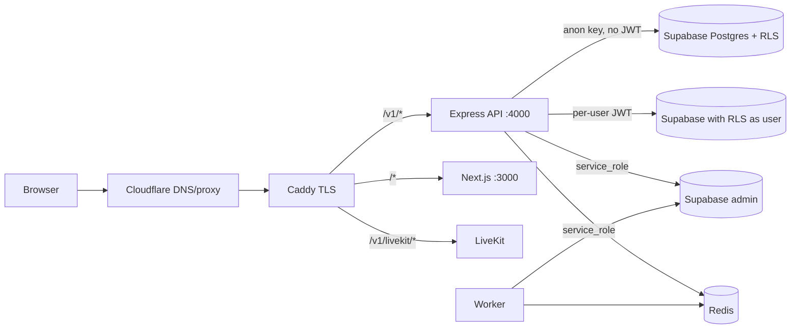

# 02 — Architecture & Runtime Topology

## Audit Metadata

- Run: 20261003-0018-develop-a72b8cc
- Target: `C:\temp\chat` @ `a72b8cc`

## Scope

Runtime topology, service boundaries, request path, real-time path, and data-access pattern (Supabase client selection).

## Evidence Reviewed

- `apps/api/src/app.ts`, `apps/api/src/server.ts`, `apps/api/src/route-registry.ts`
- `apps/api/src/lib/supabase.ts`, `apps/api/src/lib/socket.ts`
- `apps/api/src/modules/*/service.ts` (client selection)
- `infra/docker/docker-compose.prod.yml`, `docker-compose.devremote.yml`, `Caddyfile.prod`
- `infra/terraform/main.tf`, `variables.tf`
- `apps/worker/src/main.ts`, `packages/config/env-schema.ts`

## Verification Performed

- Traced the HTTP request path from Caddy → API → Supabase client selection.
- Traced the Socket.io path (handshake auth, channel join, presence).
- Compared prod vs dev compose service sets and secret injection.
- Cross-checked Supabase RLS policies (`supabase/policies/09_webhooks.sql`, `.../20260626000022_apply_rls_policies.sql`) against client role used by services.

## Executive Summary

The topology is a single DigitalOcean droplet running Caddy, Next.js, Express+Socket.io, a BullMQ worker, Redis, and LiveKit, backed by hosted Supabase. It is simple but single-node (no HA). The most important architectural defect is a **Supabase client-role mismatch**: several backend code paths use the anonymous client (`getSupabase()`) with no user JWT, so RLS policies written `TO authenticated` deny them. This silently breaks webhooks, push subscriptions, and Socket.io channel/presence features and, worse, means some real-time authorization checks cannot succeed or can be bypassed.

## Inventory

## Findings

### Finding ID: ARCH-P1-001 - Webhook service uses the anonymous Supabase client, so RLS denies all operations

- Severity: P1
- Confidence: High
- Area: ARCH
- Evidence:
  - `apps/api/src/modules/webhooks/service.ts:1,96,106,116,137,162,174,180,383` — `getSupabase()` for list/get/create/update/delete/trigger
  - `apps/api/src/lib/supabase.ts:158-163` — `getSupabase()` returns the anon client with `persistSession:false` and no `Authorization` header
  - `supabase/policies/09_webhooks.sql:4-33` — policies are `TO authenticated`
- What is happening: All webhook endpoint CRUD and lookup run as the `anon` Postgres role. No policy grants `anon`, so RLS returns empty/denied. `create` returns null → route 500; `list` returns empty; `triggerEvent` finds no endpoints.
- Why it matters: the entire webhook integration feature is non-functional under RLS; HMAC signing, SSRF validation, and DLQ are unreachable.
- User / business impact: integrations silently do not work.
- Security / privacy / reliability impact: high (feature outage). Also means webhook secret encryption path is effectively dead in production.
- Recommended fix: thread the per-request user client (`req.supabase`) into `WebhookService`, or use `getSupabaseAdmin()` only after explicit workspace-admin authorization. Do not use the bare anon client for tenant data.
- Suggested validation: unit test creates a webhook via a user-scoped client and lists it back; integration test asserts 201 then 200.
- Owner suggestion: API lead
- Effort estimate: M
- Dependencies: None
- Status: open
- Endpoint / data path: `POST /v1/webhooks` → `requireWorkspaceAccess` (user client) → `webhookService.create` (anon client) → `webhook_endpoints` (RLS deny)

### Finding ID: ARCH-P1-002 - Socket.io authorization and presence use the anonymous client; membership checks fail/bypass

- Severity: P1
- Confidence: High
- Area: ARCH
- Evidence:
  - `apps/api/src/lib/socket.ts:114-124` — validates token with `getSupabase()` but keeps only `data.user.id`
  - `apps/api/src/lib/socket.ts:155-194` — `channel:join` reads `channels` / `workspace_members` via `getSupabase()` (anon)
  - `apps/api/src/lib/socket.ts:139-153,224-246,261-285` — presence upsert via `getSupabase()`
  - `supabase/migrations/20260626000022_apply_rls_policies.sql:28-42` — channel policies `TO authenticated`
- What is happening: The socket handshake verifies identity but never builds a user-JWT Postgres client; downstream queries run as `anon`. Channel/workspace checks therefore cannot see rows, and presence writes are denied.
- Why it matters: real-time channel joins fail; presence is unreliable; the app's headline real-time feature is compromised.
- User / business impact: users cannot reliably join channels or see presence.
- Security / privacy / reliability impact: high reliability; authz checks operate on an unauthenticated role (defense-in-depth lost).
- Recommended fix: after handshake, create and store a per-socket Supabase client via `getSupabaseForUser(token)`; run membership and presence queries through it.
- Suggested validation: integration test connects a socket with a valid JWT and successfully joins a channel it is a member of and is rejected for a channel it is not.
- Owner suggestion: Real-time lead
- Effort estimate: M
- Dependencies: None
- Status: open

### Finding ID: ARCH-P2-003 - Single-node, no-high-availability topology

- Severity: P2
- Confidence: High
- Area: ARCH
- Evidence:
  - `infra/terraform/main.tf:12-30` — one `digitalocean_droplet` `chat-${environment}`
  - `infra/docker/docker-compose.prod.yml` — all services on one host; `mem_limit` 64–256 MB
  - `infra/terraform/variables.tf:23-27` — `droplet_size` default `s-1vcpu-512mb-10gb`
- What is happening: web, api, worker, redis, caddy, livekit share one droplet; Redis persisted locally; no replicas.
- Why it matters: any host failure is a full outage; memory limits (~1GB total) are near the droplet size; Redis is a single point of failure for queues/idempotency/presence.
- User / business impact: downtime and degraded real-time under load.
- Security / privacy / reliability impact: medium-high.
- Recommended fix: document RTO/RPO; move Redis to managed/HA; at minimum run nightly off-host backups and a tested restore.
- Suggested validation: restore drill on a fresh droplet.
- Owner suggestion: Infra
- Effort estimate: L
- Dependencies: DATA-P1-002
- Status: open

### Finding ID: ARCH-P2-004 - Worker `/metrics` and health endpoints are unauthenticated

- Severity: P2
- Confidence: High
- Area: ARCH
- Evidence:
  - `apps/worker/src/main.ts:60-86` — plain HTTP server, `/metrics` returns queue counts without auth
  - `infra/docker/docker-compose.prod.yml` — worker has no published ports in prod (mitigating)
  - `infra/docker/docker-compose.devremote.yml` — worker also not published
- What is happening: Operational metrics are served without authentication.
- Why it matters: if network exposure changes or a sidecar is added, queue/operation data leaks.
- User / business impact: low today; latent risk.
- Security / privacy / reliability impact: medium (information disclosure) if exposed.
- Recommended fix: bind to `127.0.0.1` or require a token; document the network boundary.
- Suggested validation: `curl` from outside the compose network is refused.
- Owner suggestion: Infra/API
- Effort estimate: S
- Dependencies: None
- Status: open

### Finding ID: ARCH-P3-005 - Duplicated `requireAdmin` implementations

- Severity: P3
- Confidence: High
- Area: ARCH
- Evidence:
  - `apps/api/src/middleware/require-admin.ts:4-36`
  - `apps/api/src/modules/admin/routes.ts:14-37` (local copy)
- What is happening: Two divergent admin checks; the middleware variant supports a workspace param, the route-local one is tenant-wide.
- Why it matters: security logic drift; audits must inspect both.
- User / business impact: subtle privilege differences.
- Security / privacy / reliability impact: medium maintainability.
- Recommended fix: keep one implementation in `middleware/require-admin.ts` and import everywhere.
- Suggested validation: grep shows a single definition.
- Owner suggestion: API lead
- Effort estimate: S
- Dependencies: None
- Status: open

## Risks

- Backend features silently depend on anon-role DB access that RLS denies.
- Single point of failure host.

## Recommendations

1. Standardize client selection: per-user clients for tenant reads/writes, admin client only behind explicit authorization.
2. Add an integration test tier that exercises real RLS with a real Supabase instance.

## Quick Wins

- Fix `WebhookService` and `socket.ts` to use user-scoped clients.

## Hardening Backlog

- HA topology plan; managed Redis; restore drill.

## Suggested Tests

- RLS matrix test (anon vs member vs admin per table).
- Socket authz tests for private vs public channels.

## Suggested Documentation Updates

- Correct `AGENTS.md`/`README.md` real-time and webhook status.

## Open Questions

- Are webhooks/presence actually exercised in the hosted environments, or is breakage masked by a service-role key being supplied as `SUPABASE_ANON_KEY`? Unknown — verify secret values out of band (do not print).

## Appendix

- Dev remote compose publishes `7880` and `7882-7892/udp` for LiveKit; prod maps `7880` and `127.0.0.1:7881`.
