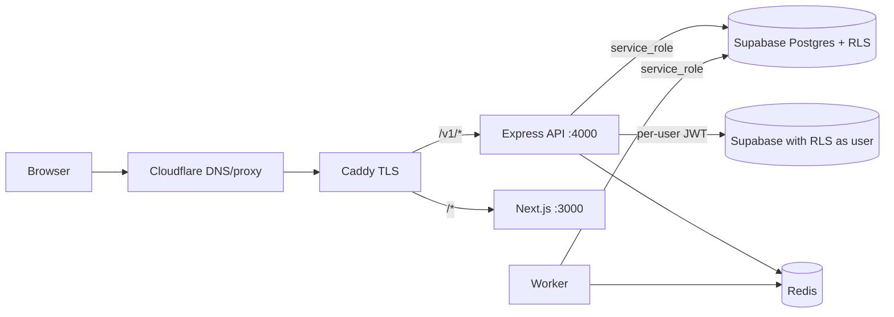

# 02 — Architecture & Runtime Topology

## Audit Metadata

- Run: `chat-20261004-full-develop-0695894`
- Target: `C:\temp\chat` @ `0695894`

## Scope

Runtime topology, service boundaries, request path, real-time path, Supabase client selection, and operational alerting wiring.

## Evidence Reviewed

- `apps/api/src/app.ts`, `apps/api/src/server.ts`, `apps/api/src/route-registry.ts`
- `apps/api/src/lib/supabase.ts`, `apps/api/src/lib/socket.ts`, `apps/api/src/lib/webhook-queue.ts`
- `apps/api/src/modules/webhooks/service.ts`, `apps/api/src/modules/notifications/push-subscription-service.ts`
- `apps/worker/src/main.ts`, `apps/worker/src/health.ts`
- `infra/terraform/main.tf`, `infra/terraform/variables.tf`, `infra/docker/docker-compose.prod.yml`

## Verification Performed

- Traced the HTTP path Caddy → API → Supabase client selection.
- Re-verified the previously reported "anonymous client" defects against HEAD (see reconciliation below).
- Confirmed the worker health/metrics server binding and token controls.
- Checked Terraform alert resources and the `alert_email` default.
- Compared the prod compose service set and secret injection.

## Executive Summary

The topology is unchanged: a single DigitalOcean droplet running Caddy, Next.js, Express+Socket.io, a BullMQ worker, Redis, and LiveKit, backed by hosted Supabase. The most serious architecture defects from the prior run are now fixed: webhook CRUD/delivery and Socket.io authorization/presence use the correct Supabase clients, and the worker health server is loopback-bound behind a token. What remains is structural (single-node, no HA) plus two hygiene-level issues (divergent admin authorization helpers, default-off alerting).

## Inventory

## Reconciliation of prior architecture findings

| Prior ID | Verdict at HEAD | Evidence |
|---|---|---|
| ARCH-P1-001 (webhooks use anon client) | `verified-fixed` | `apps/api/src/modules/webhooks/service.ts:99-193,398-462` now uses `getSupabaseAdmin()`; retries are durable via `apps/api/src/lib/webhook-queue.ts:46-82`. |
| ARCH-P1-002 (socket anon client) | `verified-fixed` | `apps/api/src/lib/socket.ts:140` sets `socket.supabase = getSupabaseForUser(token)`; joins/presence (lines 157-296) use it. |
| ARCH-P2-004 (worker metrics unauthenticated) | `partially-fixed` | `apps/worker/src/main.ts` uses `createHealthServer` and `HEALTH_HOST`/`HEALTH_TOKEN`; prod compose passes `METRICS_TOKEN` (`docker-compose.prod.yml:53`). |

## Findings

### Finding ID: ARCH-P2-001 - Single-node topology: one droplet hosts all services and local Redis

- Severity: P2
- Confidence: High
- Area: ARCH
- Evidence:
  - `infra/terraform/main.tf` defines one `digitalocean_droplet` for the environment.
  - `infra/docker/docker-compose.prod.yml` runs caddy, web, api, worker, redis, livekit on the same host with `mem_limit` 64–256 MB per service.
  - Redis uses a local named volume with `--appendonly yes`; it is a single point of failure for queues, idempotency, and presence.
- What is happening: All runtime services share one host and one local Redis; there are no replicas or managed dependencies.
- Why it matters: A host failure or OOM is a full outage, and queued/retry state can be lost.
- User / business impact: Downtime and degraded real-time under load.
- Security / privacy / reliability impact: Medium-high availability risk.
- Recommended fix: Document RTO/RPO; move Redis to managed/HA or run an off-host replica; at minimum automate and test off-host backups/restore.
- Suggested validation: Restore drill on a fresh droplet (`32_backup_restore_drill`).
- Owner suggestion: Infra
- Effort estimate: L
- Dependencies: None
- Status: open

### Finding ID: ARCH-P3-002 - Divergent admin authorization helpers (platform vs workspace scope)

- Severity: P3
- Confidence: Medium
- Area: ARCH
- Evidence:
  - `apps/api/src/middleware/require-admin.ts:12` exports the shared `requireAdmin` middleware (supports a workspace discriminator).
  - `apps/api/src/modules/workspaces/routes.ts:169-175` defines a second, local `requireAdmin` that trusts `req.workspaceRole`.
  - `apps/api/src/modules/admin/routes.ts:23` derives a tenant-wide admin guard from the shared middleware.
- What is happening: Admin authorization exists in more than one form, with different scope semantics.
- Why it matters: Security logic can drift; an audit must inspect every copy, and a future edit may weaken one path.
- User / business impact: Subtle privilege differences are hard to reason about.
- Security / privacy / reliability impact: Medium maintainability / defense-in-depth.
- Recommended fix: Keep one implementation and import it everywhere; document platform-admin vs workspace-admin semantics in one place.
- Suggested validation: `rg "function requireAdmin|const requireAdmin ="` returns a single definition.
- Owner suggestion: API lead
- Effort estimate: S
- Dependencies: None
- Status: open

### Finding ID: OBS-P1-001 - No alerting is wired by default despite metrics and a tracked TODO

- Severity: P1
- Confidence: High
- Area: OBS
- Evidence:
  - `apps/api/src/lib/metrics.ts:7` — `TODO(OBS-P1-001): Configure alerting channels`.
  - `infra/terraform/main.tf:101-142` — CPU/memory/disk alert resources are created only when `alert_email != ""`.
  - `infra/terraform/variables.tf:45-49` — `alert_email` default is `""`, so no alerts are created by default.
- What is happening: Metrics exist and Sentry is optional, but no alerting pipeline is configured by default.
- Why it matters: Incidents are detected by users rather than operators.
- User / business impact: Longer outages and slower recovery.
- Security / privacy / reliability impact: High operational risk.
- Recommended fix: Set `alert_email` per environment and add Alertmanager/Sentry alerts for 5xx rate, worker queue backlog/failed counts, open circuit breakers, and health-check failures.
- Suggested validation: A forced 5xx triggers a notification.
- Owner suggestion: Ops
- Effort estimate: M
- Dependencies: None
- Status: open

## Risks

- Single-host outage; undetected incidents; authorization drift.

## Recommendations

1. Configure alerting and set `alert_email`.
2. Consolidate the admin authorization helper.
3. Plan HA/managed Redis with a tested restore.

## Quick Wins

- Set `alert_email`; remove duplicate `requireAdmin`.

## Hardening Backlog

- HA topology plan; managed Redis; off-host backups.

## Suggested Tests

- Restore drill; synthetic login/message check.

## Suggested Documentation Updates

- Incident response runbook; SLOs; admin-role model.

## Open Questions

- Is there an external uptime monitor for the production host? Not visible in-repo — Unknown.

## Appendix

- Prod compose publishes LiveKit `7880` and `127.0.0.1:7881`.
