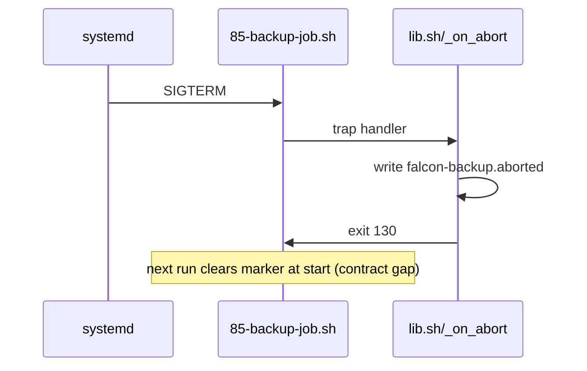

# Architecture and Runtime Topology Audit

## Audit Metadata

- Audit name: repo-deep-dive
- Run: 20261003-0018-fix-backup-abort-markers-20b5e57
- Repository: `falcon` (`C:\temp\falcon`)
- Branch: fix/backup-abort-markers
- Commit SHA: 20b5e57
- Generated at: 2026-10-03
- Auditor: repo-deep-dive subagent (DeepSeek V4.1 Flash)
- Area code: ARCH
- Output path: docs/audits/{name}/{run}/02_architecture_runtime_topology.md
- Scope limitations: static review of compose/config/systemd/bootstrap; no live host. Live-dependent rows are `unverified`.

## Scope

Reviewed runtime topology (single central host + probe + separate edge repo), compose services, systemd timers, background jobs, and the new interrupt-safety mechanism introduced by `20b5e57` (`bootstrap/lib.sh`, `bootstrap/85-backup-job.sh`, `automation/validation/tests/abort_marker_test.sh`). Did not connect to the lab host.

## Evidence Reviewed

- `compose/central/docker-compose.yml`, `compose/probe/*`, `compose/mct/*`.
- `config/systemd/*.service`, `*.timer`.
- `bootstrap/lib.sh`, `bootstrap/85-backup-job.sh`, `bootstrap/80-offsite-backup.sh`, `automation/validation/r2_cold_copy.sh`, `automation/validation/wazuh_indexer_backup.sh`.
- `README.md` (data path), `docs/CURRENT_STATE.md`.
- `git show 20b5e57` (the abort-marker commit).

## Verification Performed

| Evidence | Type | Why relevant | Notes |
|---|---|---|---|
| `git show 20b5e57` | Diff | Fix under audit | 3 files, +94 lines |
| `bootstrap/lib.sh` lines 57-93 | Source | Trap/marker contract | inspected |
| `bootstrap/85-backup-job.sh` lines 12-20, 61-62 | Source | Marker install/clear order | inspected |
| `config/systemd/falcon-backup.service` | Config | Kill semantics | TimeoutStopSec=900, KillSignal=SIGTERM |
| `automation/validation/tests/abort_marker_test.sh` | Test | Regression guard | auto-run by `ci/validate.py` shell-tests |
| `compose/central/docker-compose.yml` | Config | Topology/hardening | single node |

## Executive Summary

The stack is a well-documented, deliberately single-node lab: one central Ubuntu host running OpenSearch/Grafana/Traefik/Vector/ntfy plus a probe and an external edge repo. Strengths: explicit trust boundaries, pinned images, evidence discipline, and a working static CI gate. The commit under audit adds an abort trap that writes a durable marker on SIGTERM/SIGINT and a regression test that `ci/validate.py` auto-discovers. That is a real improvement, but the implementation does not match its own stated contract and covers only one of several long-running jobs. Host loss remains total pipeline loss.

## Inventory

| Item | Path / symbol | Purpose | Current state | Risk | Notes |
|---|---|---|---|---|---|
| Central stack | `compose/central/docker-compose.yml` | OpenSearch/Grafana/Traefik/Vector/ntfy | Functional | High | single node |
| Probe stack | `compose/probe/` | Suricata/Vector edge | Functional | Medium | — |
| Backup job | `bootstrap/85-backup-job.sh` | nightly snapshot/config/offsite | Functional | High | trap now installed |
| Offsite uploader | `bootstrap/80-offsite-backup.sh` | offsite copy | Functional | High | no trap |
| Cold-copy job | `automation/validation/r2_cold_copy.sh` | R2 tiering | Functional | Medium | EXIT trap only |
| Wazuh backup | `automation/validation/wazuh_indexer_backup.sh` | indexer snapshot | Functional | Medium | EXIT trap only |
| Abort library | `bootstrap/lib.sh` `install_abort_trap`/`_on_abort` | interrupt safety | New | Medium | contract gap |

## Domain Scorecard

| Category | Score | Evidence | Gap | Recommended action |
|---|---:|---|---|---|
| Monorepo structure | 4 | tree layout | generated-heavy | classify trees |
| Frontend/backend/worker boundaries | 4 | compose services | — | — |
| Auth/session flow | 3 | Traefik + Cloudflare Access | origin auth | SEC report |
| Authorization and tenant boundaries | 3 | lab, no tenancy | edge trust ladder | edge repo |
| Request lifecycle | 3 | Traefik → services | — | — |
| Data flow | 4 | README data path | — | — |
| Background jobs | 2 | systemd timers | graceful-stop gaps | ARCH-P1-002/005 |
| Queues | 3 | Vector buffers, DLQ | syslog/NetFlow at edge | — |
| Webhooks | 2 | none first-party | n/a | — |
| Realtime | 2 | dashboards polling | n/a | — |
| Notifications | 3 | ntfy + relay | relay metrics | OBS |
| External integrations | 3 | Cloudflare/R2/edge | pairing contract | API |
| Deployment topology | 4 | bootstrap stages | single host | ARCH-P1-001 |

## Findings

### Finding ID: ARCH-P1-001 - Single-host concentration: host loss is total pipeline loss

- Severity: P1
- Confidence: High
- Area: ARCH
- Evidence:
  - `compose/central/docker-compose.yml` — all central services on one Compose project
  - `README.md` lines 25-36 — single `falcon` host data path
  - `docs/CURRENT_STATE.md` — recovery/dead-man latency ~26 h
- What is happening: OpenSearch storage, Grafana, alerting, Traefik and ntfy all run on one host with no warm standby.
- Why it matters: Any host loss removes monitoring and its own alerting simultaneously.
- User / business impact: Blind during the incident that matters most.
- Security / privacy / reliability impact: Single point of failure; no independent failure domain for central.
- Recommended fix: Document/execute a restore SLA and keep the independent ntfy path physically separate; add an external dead-man with a short window.
- Suggested validation: Tabletop + restore rehearsal into a fresh host.
- Owner suggestion: owner/ops
- Effort estimate: L
- Dependencies: capacity (PERF)
- Status: open

### Finding ID: ARCH-P1-002 - Abort-marker contract is self-contradictory and normal failure exits leave no marker

- Severity: P1
- Confidence: High
- Area: ARCH
- Evidence:
  - `bootstrap/85-backup-job.sh` lines 12-20 — comment says "cleared only at a clean completion" but `clear_abort_marker` is called immediately after the warning in the same block
  - `bootstrap/85-backup-job.sh` line 33 — `exit 1` on snapshot failure writes no marker
  - `bootstrap/lib.sh` lines 75-83 — markers are written only from the TERM/INT trap
  - `bootstrap/85-backup-job.sh` lines 17-19 — marker presence only logs; it triggers no re-verification or fail-closed path
- What is happening: A prior run's marker is deleted at the start of the next run (before that run completes). A run that fails via a normal non-zero exit leaves no marker at all. The presence of a marker does not change behavior beyond a log line.
- Why it matters: The stated guarantee ("nothing is stamped complete while the marker exists"; "next run re-verifies") is not what the code does. A half-finished run that was killed with SIGKILL, or that exited on a failed snapshot, is indistinguishable from a clean state next time.
- User / business impact: Operators may trust an incomplete backup/offsite state.
- Security / privacy / reliability impact: Weakens crash-safety and recovery assurance; the P0 it claims to close is only partially closed.
- Recommended fix: Clear the marker only on a genuine clean completion (move/remove the early clear), and write the marker on all failure exits (e.g. an EXIT trap that writes unless a success flag is set). Either act on marker presence (force a re-verify / fail closed) or stop claiming it does.
- Suggested validation: Extend `automation/validation/tests/abort_marker_test.sh`: simulate a snapshot-failure `exit 1` and assert a marker remains; simulate a stale marker and assert re-verification runs.
- Owner suggestion: ops/resilience
- Effort estimate: S
- Dependencies: None
- Status: open

### Finding ID: ARCH-P2-005 - Only the backup job installs the abort trap; other long-running jobs lack it

- Severity: P2
- Confidence: High
- Area: ARCH
- Evidence:
  - `bootstrap/85-backup-job.sh` line 16 — `install_abort_trap "falcon-backup"` (only caller)
  - `bootstrap/80-offsite-backup.sh`, `automation/validation/r2_cold_copy.sh`, `automation/validation/wazuh_indexer_backup.sh`, `automation/validation/restore_rehearsal.sh` — no `install_abort_trap`
  - `grep install_abort_trap` — single call site
- What is happening: The prior P0 was about graceful shutdown for any long-running job; only the nightly backup script got the trap.
- Why it matters: Offsite upload, cold-copy, indexer snapshot and restore can still be interrupted mid-step without a durable marker.
- User / business impact: Silent partial states on other backup legs.
- Security / privacy / reliability impact: Reliability gap.
- Recommended fix: Install the trap in each long-running stage (offsite/upload/restore/snapshot), or centralize it in `run-all-deploy.sh`/the service wrapper.
- Suggested validation: `grep -L install_abort_trap` over long-running scripts should be empty.
- Owner suggestion: ops/resilience
- Effort estimate: S
- Dependencies: ARCH-P1-002
- Status: open

### Finding ID: ARCH-P2-001 - Declared container hardening lags the running containers

- Severity: P2
- Confidence: Medium
- Area: ARCH
- Evidence:
  - `compose/central/docker-compose.yml` lines 130-138 — comment: hardening "Declared only - applies at the next `docker compose up -d` (the running container is unchanged until then)"
- What is happening: `cap_drop`, `no-new-privileges` and non-root users are declared for several services, but the running containers are unchanged until a redeploy.
- Why it matters: The hardening claim is not true for the currently running fleet.
- User / business impact: False sense of hardening.
- Security / privacy / reliability impact: Privilege-escalation surface persists until redeploy.
- Recommended fix: Redeploy at a maintenance window and capture a drift-check artifact.
- Suggested validation: `automation/validation/container_drift_check.sh` scheduled (`falcon-container-drift.timer`).
- Owner suggestion: container/ops
- Effort estimate: S
- Dependencies: redeploy window
- Status: open

### Finding ID: ARCH-P2-002 - Wazuh and vendored MCT stacks run tag-only images outside pin/SBOM scope

- Severity: P2
- Confidence: High
- Area: ARCH
- Evidence:
  - `compose/mct/docker-compose.opencanary.yml` line 23 — `thinkst/opencanary@sha256:...` (pinned) but `compose/mct/iris-web/` and `automation/wazuh/**` are outside `pins/images.lock`
  - `pins/images.lock` — 26 entries; `sbom/vuln-summary.csv` names `ntop/ntopng:latest`
- What is happening: The imported/vendored stacks are not under the central pin and SBOM gates.
- Why it matters: Supply-chain coverage is incomplete for services that face the internet.
- User / business impact: Unscanned drift.
- Security / privacy / reliability impact: CVE exposure without detection.
- Recommended fix: Extend `pins/images.lock` and the SBOM coverage checker to the vendored compose files, or explicitly classify them as out-of-scope with owner sign-off.
- Suggested validation: `automation/validation/sbom_coverage_check.sh` coverage ratio.
- Owner suggestion: supply-chain
- Effort estimate: M
- Dependencies: SUPPLY-P1-001
- Status: open

### Finding ID: ARCH-P2-003 - Live ingest authentication is a shared secret header, not mTLS

- Severity: P2
- Confidence: Medium
- Area: ARCH
- Evidence:
  - `README.md` lines 27-28 — "Vector aggregator (HTTP + basic auth, validation, DLQ)"; ingest contract
  - `config/vector/*` — shared-secret header contract
- What is happening: Edge-to-central ingest authenticates with a shared secret rather than client certificates.
- Why it matters: A leaked secret allows forged telemetry; no per-sender identity.
- User / business impact: Telemetry integrity risk.
- Security / privacy / reliability impact: Spoofing/pollution of the monitoring store.
- Recommended fix: Move to mTLS with the existing edge PKI, or add request signing + idempotency keys.
- Suggested validation: Negative test — unsigned/foreign-cert request rejected.
- Owner suggestion: owner/ops
- Effort estimate: M
- Dependencies: edge PKI
- Status: open

## Risks

| Risk | Severity | Likelihood | Impact | Evidence | Mitigation |
|---|---|---|---|---|---|
| Incomplete run trusted as clean | P1 | Medium | High | 85-backup-job.sh | ARCH-P1-002 |
| Total host loss blinds monitoring | P1 | Medium | High | compose | ARCH-P1-001 |
| Unscanned internet-facing image | P2 | Medium | High | pins/sbom | ARCH-P2-002 |

## Recommendations

### Immediate / Release Blocking
- Fix the abort-marker contract (ARCH-P1-002).

### This Week
- Extend the trap to all long-running jobs (ARCH-P2-005).
- Redeploy declared container hardening (ARCH-P2-001).

### This Month
- Extend pin/SBOM coverage to vendored stacks (ARCH-P2-002).

### Later / Platform Evolution
- Warm standby / shorter dead-man window (ARCH-P1-001).

## Quick Wins

| Quick win | Why it helps | Files likely involved | Validation |
|---|---|---|---|
| Fix early marker clear | Restores crash-safety intent | `bootstrap/85-backup-job.sh` | extend abort test |
| Stale comment cleanup in service | Avoids false doc | `config/systemd/falcon-backup.service` | review |

## Hardening Backlog

| Backlog item | Priority | Owner suggestion | Effort | Dependency |
|---|---|---|---|---|
| Failure-exit marker | P1 | ops | S | — |
| Trap on all jobs | P2 | ops | S | ARCH-P1-002 |
| mTLS ingest | P2 | owner | M | PKI |

## Suggested Tests

- Abort test: snapshot-failure leaves a marker; stale marker forces re-verify.
- Trap-presence grep test over long-running scripts.
- Unsigned ingest rejected.

## Suggested Documentation Updates

- `docs/architecture/` — document the marker lifecycle and failure semantics accurately.

## Open Questions

| Question | Why it matters | Evidence needed |
|---|---|---|
| Does systemd deliver SIGTERM to child `docker exec`/`tar` processes? | Trap completeness | live `systemctl stop` capture |
| Is the marker dir on a persistent volume? | Durability across reboot | host `mount` output |

## Appendix

