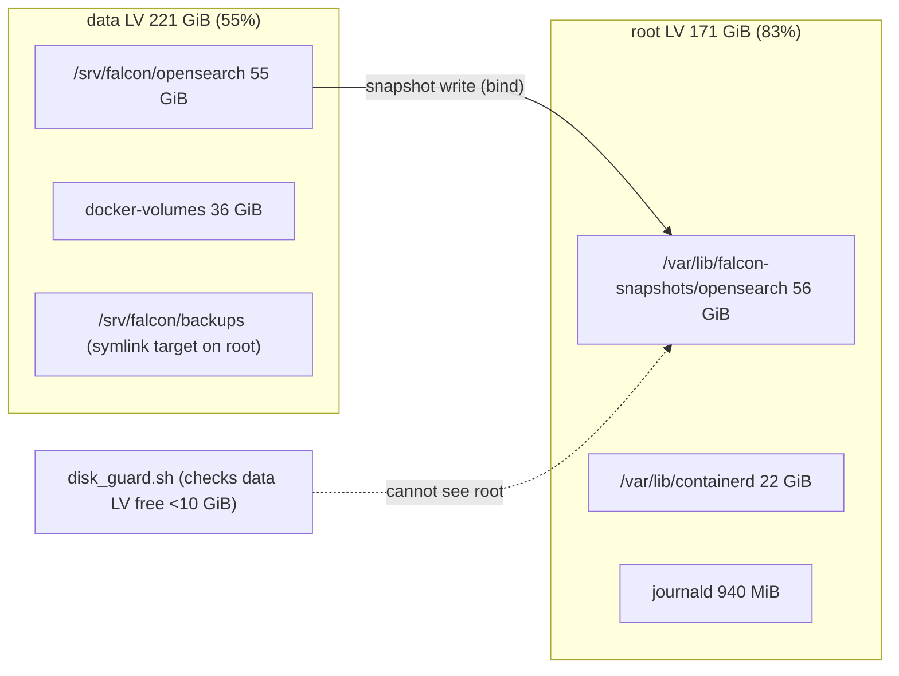

# 15_performance_scalability_cost — Prompt 15 - Performance, Scalability, and Cost Audit

- Run: `falcon-20261009-2117-full-08e20d1`
- Target: `falcon` @ `08e20d1` (branch `main`)
- Domain: `15_performance_scalability_cost.md` (area PERF, prompt)

## Verification Performed

# Performance, Scalability, and Cost Audit

## Audit Metadata

- Audit name: `repo-deep-dive`
- Run: `falcon-20261009-2117-full-08e20d1`
- Repository: `falcon` (single-host monitoring lab, KVM guest `falcon`)
- Branch: `main` (audited checkout detached at `08e20d1`; the live host runs `main` @ `6e4fccd` + dirty worktree — see Scope limitations)
- Commit SHA: `08e20d1a77900dcc0c0a8a3fd16ae8d203d9d65d`
- Generated at: `2026-10-09T22:05:00Z`
- Auditor: subagent (area PERF), read-only repo + read-only live host checks
- Area code: PERF
- Output path (repo convention): `docs/audits/repo-deep-dive/falcon-20261009-2117-full-08e20d1/15_performance_scalability_cost.md`
- Scope limitations:
  - No frontend application exists in this repository: bundle size, SSR/client hot spots, pagination and N+1 categories are **not applicable** (Grafana/OpenSearch Dashboards are third-party UIs provisioned from JSON; see `config/dashboards/`).
  - The audited checkout (`08e20d1`) and live `main` (`6e4fccd`) have diverged: `08e20d1` contains the two self-hosted-runner CI commits; `6e4fccd` contains the 2026-10-09 capacity ops commit (C7 volume retirement + OpenSearch snapshot-repo relocation, falcon PR #49). Live-host evidence therefore includes state introduced after the audited SHA; this is called out per finding.
  - Measurements were taken 2026-10-09 21:20–22:05Z while the host was concurrently draining the 2026-10-08/09 ingest backlog and while the audit harness itself ran on the same host; load figures include that noise, swap/retention/capacity figures do not.
  - Cost unit prices require provider invoices (owner-owned); only measured quantities and the billing basis are auditable here.

## Scope

Reviewed: storage capacity model and its live realisation (root LV, data LV, snapshot repository), disk guard and alert thresholds, OpenSearch index growth/retention/watermarks, Vector aggregator/edge throughput and buffers, Prometheus scrape topology, container resource limits, CI cost/time, cost register, and the 2026-10-08/09 capacity incident evidence. Not reviewed: third-party UI performance (Grafana/OSD/ntopng rendering), provider invoices, network-level throughput outside the lab, and any load testing beyond live observation.

## Evidence Reviewed

| Evidence | Type | Why relevant | Notes |
|---|---|---|---|
| `README.md:3-7,22-29` | Source | Single-host topology and component list | Confirms one 6 vCPU/12 GiB KVM host runs the whole stack |
| `docs/phase5/PERFORMANCE_ENVELOPE.md:10-11,23-43` | Doc | Measured envelope and real-feed rates | 4 vCPU / 11.7 GiB / 4.7 GiB used measured 2026-09-21/22 |
| `docs/architecture/STORAGE_CAPACITY_MODEL.md:7-8,14-21,36-40` | Doc | Planned allocation and budgets | Phase-0 plan: 74 GiB root / 60 GiB data LV / <=9 GiB service memory |
| `docs/runbooks/CAPACITY_AND_TELEMETRY.md:6-22,36-62,64-79` | Doc | Growth measurements, disk guard, retention classes, cost register | Steady state ~52 GB for `falcon-eve-*` at 14 d |
| `docs/runbooks/SCHEMA_AND_RETENTION.md:48-67` | Doc | Retention coverage matrix | Local snapshots: "newest 3 kept under pressure"; no age policy |
| `automation/validation/disk_guard.sh:20-27,111-127` | Source | Guard threshold and reclaim order | Free-space check is `df /srv/falcon`; snapshot prune fires only below 10 GiB there |
| `bootstrap/85-backup-job.sh:29-35,46-47` | Source | Nightly snapshot job | Adds one full `falcon-*` snapshot/day; no retention logic |
| `bootstrap/90-alerting.sh:342-348,359-361,510-512,522-531,269-280` | Source | Capacity/memory/feed alert rules | Root 85/90 %, projections, data-LV 15 GiB, swap 75 %, per-feed staleness |
| `config/vector/aggregator.yaml:116-131` | Source | OpenSearch sink definition | No `buffer`/`request` tuning; default in-memory buffer |
| `config/vector/edge.yaml:249-258` | Source | Edge retry + disk buffer | 10 retries, 2 GiB disk buffer, `when_full: block` |
| `compose/central/docker-compose.yml:125-159` | Source | Aggregator limits/healthcheck | `memory: 512M`; no OOM/restart alerting |
| `config/prometheus/prometheus.yml` | Source | Scrape topology | 15 s scrape interval; 5 jobs |
| `automation/validation/export_monitor_metrics.sh:62-77,147-190,472-489` | Source | Pipeline/feed metrics | Only the OpenSearch **sink** discard counter is exported |
| `evidence/raw/REVIEW-FIX/20261009T16*.out` (falcon-build@6e4fccd, PR #49) | Evidence | 2026-10-09 capacity incident/recovery | LV at 90 %, cluster red, snapshots deleted, repo relocated |
| Live host (2026-10-09 21:20–22:05Z) | Live checks | Current state | `df`, `free`, `nproc`, `docker stats/inspect`, `journalctl -k`, Prometheus/Grafana APIs, OpenSearch API, textfiles |

## Verification Performed

| Evidence | Type | Why relevant | Notes |
|---|---|---|---|
| `df -h / /srv/falcon` | Live | Capacity state | root 136/171 GiB (83 %, 28 GiB free); data 115/221 GiB (55 %, 96 GiB free); /boot 11 % |
| `du -x -d1 /var/lib` | Live | Root consumer | `/var/lib/falcon-snapshots` 56 GiB + `/var/lib/containerd` 22 GiB + `/var/lib/docker` 1.6 GiB |
| `find /var/lib/falcon-snapshots/opensearch -newermt '2026-10-09 16:41'` | Live | Snapshot delta | 217 files / 4.28 GiB added by the last snapshot (4.8–7.9 min job) |
| `docker inspect falcon-central-opensearch-1` mounts | Live | Relocation binding | `/var/lib/falcon-snapshots/opensearch -> /srv/falcon/backups/opensearch` (bind) |
| `docker stats --no-stream` | Live | Container resources | aggregator 508–512 MiB / 512 MiB (99.3–99.95 %); OpenSearch 3.3–3.4 GiB / 4 GiB (83–86 %); Grafana 70 % |
| `journalctl -k \| grep oom` | Live | OOM kills | vector OOM-killed 20:45:08, 21:09:16, 21:19:12Z (memcg docker-48cb806a19b8…) |
| `curl 127.0.0.1:9598/metrics` | Live | Pipeline counters | `vector_component_discarded_events_total{component_id="edge_ingest",intentional="false"}` = 900,521 (21:59Z) → 975,176 (22:02Z) |
| `docker logs falcon-central-vector-aggregator-1` | Live | Failure mode | "Events dropped … count=11938 … Source send interrupted mid-flight"; sink "Request timed out" |
| Prometheus `query_range` (7 d) | Live | Pressure history | SwapFree min 2.20 GiB / avg 3.30 GiB; MemAvailable min 1.40 GiB / avg 4.50 GiB; load1 avg 1.95 max 42.6 |
| Prometheus `predict_linear` + Grafana alerts API | Live | First signal | "Root disk projected full within 7 days" firing since 20:49:10Z; flow/syslog feed-stale firing; Wazuh feed-stale pending |
| OpenSearch `_cluster/settings`, `_cat/indices` | Live | Watermarks/retention | watermarks low 93 % / high 96 % / flood 98 % (persistent); 13 live `falcon-eve-*` indices, 118.5 M docs / 59.2 GB |
| Replication of exporter feed query | Live | Ingest lag | feeds ~52 min behind at 21:53Z (draining); syslog_514 13 min; wazuh 18 h |
| `systemctl status falcon-backup.service` | Live | Backup state | failed since 2026-10-09 03:30:16Z; last success snapshot 16:41:50Z (manual recovery run) |

## Executive Summary

The lab is a single 6 vCPU / 12 GiB host carrying the entire monitoring stack plus a Wazuh multi-node cluster and IRIS, and it is currently recovering from a ~40-hour ingest stop (2026-10-08 00:00Z → 2026-10-09 16:40Z) caused by capacity exhaustion on the data volume. The operator response on 2026-10-09 (delete old snapshots, retire C7 volumes, relocate the 56 GiB OpenSearch snapshot repository to the root LV) restored the pipeline, and index retention for `falcon-eve-*` is working; but it moved the growth pressure onto the root LV, which now has 28 GiB free (83 %) and gains ~4.3 GiB per nightly snapshot with **no root-side automatic reclaim**. The root projection alert is already firing.

While draining the backlog, the Vector aggregator is pinned at 99–100 % of its 512 MiB container limit, has been OOM-killed three times in 75 minutes (23 restarts total), and has discarded ~1.0 M events at its ingest source since 21:19Z (the source discards are not exported to Prometheus, so the loss is invisible to the existing "Pipeline sink write failures or dropped events" rule). Host swap usage has been persistently 3.9–5.8 GiB over the last 7 days and the documented performance envelope (4 vCPU / 11.7 GiB / 4.7 GiB used) predates the Wazuh/IRIS consolidation and is stale.

Recommended next actions: (1) restore headroom and automatic retention for the root-resident snapshot repository before the next backup wave; (2) raise/tune the aggregator limit and export source-side discards with an alert; (3) refresh the capacity/envelope docs and set performance budgets against the live footprint; (4) right-size or bound the Wazuh stack, which is the largest memory consumer on the host.

## Inventory

| Item | Path / symbol | Purpose | Current state | Risk | Notes |
|---|---|---|---|---|---|
| Root LV | `/dev/mapper/ubuntu--vg-ubuntu--lv` | OS, docker/containerd, snapshot repo, journals | 136/171 GiB (83 %), 28 GiB free | **High** | Grows ~4.3 GiB/night from snapshots |
| Data LV | `/dev/mapper/ubuntu--vg-falcon--data` | OpenSearch data, probe buffers, backups | 115/221 GiB (55 %), 96 GiB free | Medium | Was 90 % during the incident |
| Snapshot repo | `/var/lib/falcon-snapshots/opensearch` (bind → `/srv/falcon/backups/opensearch`) | Local OpenSearch snapshots | 56 GiB, 1,684 files, 2 snapshots | **High** | Relocated 2026-10-09; no age retention |
| Snapshot job | `bootstrap/85-backup-job.sh:29-35` | Nightly `falcon-*` snapshot | 1/day; latest success 16:41:50Z; unit failed 03:30Z | Medium | Adds full snapshot; prunes only via disk guard |
| Disk guard | `automation/validation/disk_guard.sh` | Reclaim + alert below threshold | Threshold 10 GiB on `/srv/falcon` only | **High** | Cannot trigger from root pressure |
| OpenSearch | `falcon-central-opensearch-1` | Event store/search | yellow (44 replica shards unassigned = expected), 118.5 M docs | Medium | 2 GiB heap; watermarks 93/96/98 % |
| Vector aggregator | `falcon-central-vector-aggregator-1` | Validate/enrich/route to OpenSearch | 99.3–99.95 % of 512 MiB; 23 restarts | **High** | OOM loop; source drops ~0.9–1.0 M |
| Vector edge | `falcon-probe-vector-edge-1` | Buffer/forward probe events | 2 GiB disk buffer, block when full; ~0.4–0.6 GiB held | Medium | Retries 10×/300 s max |
| Prometheus | `falcon-central-prometheus-1` | Metrics TSDB | 30 d retention, 559 MB, 15 s scrape | Low | All 5 targets up |
| Wazuh stack | `multi-node-*` containers | SIEM (indexers/managers/dashboard) | 3 indexers ~1 GB each, dashboard 728 MB, no memory limits | Medium | Largest host memory consumer |
| Cost register | `docs/runbooks/CAPACITY_AND_TELEMETRY.md:64-79` | Billing basis + measured quantities | Unit costs/budgets owner-side, blank | Low | No thresholds enforced |

## Domain Scorecard

| Category | Score | Evidence | Gap | Recommended action |
|---|---:|---|---|---|
| Bundle size indicators | 0 | No frontend bundle; `config/dashboards/*.json` only | N/A | None |
| SSR/client hot spots | 0 | No web app | N/A | None |
| Heavy dependencies | 2 | `docker system df` ~23 GB images; Wazuh/IRIS stacks outside envelope; digests pinned | Wazuh images tag-only/outside pin scope (ARCH-P2-002) | Extend pin/SBOM scope; image GC policy |
| Images/caching | 3 | Digest-pinned compose; no dangling images; no CDN needed | No registry cache policy for self-hosted runners | Document image update/GC cadence |
| Pagination | 0 | No application API lists | N/A | None |
| N+1 risks | 0 | No ORM/app query layer | N/A | None |
| Indexes/query patterns | 3 | 1 shard/0 replicas by design; ISM live; `dynamic:false` pinned; drift runner | Whole-cluster feed aggregations every minute; legacy pre-10.01 mappings | Cache/limit exporter queries; owner-gated reindex |
| Worker throughput | 1 | Aggregator OOM loop under catch-up; 0.9–1.0 M source discards; sink timeouts | No capacity margin, no source-discard metric | Raise/tune limits; export + alert on discards |
| Queue concurrency | 2 | Edge disk buffer 2 GiB `block`; aggregator default memory buffer | No end-to-end acknowledgement; sink has no explicit buffer/request tuning | Enable acks / tune sink buffer + timeout |
| Realtime scaling | 2 | ntfy single + independent instance; webhook relay | No load proof beyond storm test | Keep; no change |
| Webhook volume | 3 | Alert storm drill: 32 instances → 1 grouped notification | Relay single process | Monitor relay latency |
| Rate limiting | 1 | `edge_ingest` basic auth only; overload → mid-flight drops | No backpressure signal (429/retry contract) to the edge | Return retryable errors / enable acks |
| Container resources (extra) | 2 | `compose/central/docker-compose.yml:150-152` 512 M aggregator; Wazuh unlimited | Aggregator limit too small; Wazuh unbounded | Right-size limits; add OOM/restart alerting |
| Build/test times (extra) | 3 | `ci/validate.py` ~3.9 s; self-hosted runners (70292a0) | No explicit dependency caching found | Add cache; keep jobs off the data host if possible |
| Storage/log growth (extra) | 1 | Root 83 % +4.3 GiB/night; journald 940 MB; `falcon-eve-*` retention works | Root-side retention/reclaim absent | Add root-aware retention and bands |
| Third-party API cost (extra) | 2 | Cost register with measured quantities; owner unit costs blank | No budgets/thresholds | Fill owner costs; set monthly review |

## Detailed Review

### Item: Storage capacity and retention

- Evidence: `docs/architecture/STORAGE_CAPACITY_MODEL.md:7-8,14-21`; `docs/runbooks/SCHEMA_AND_RETENTION.md:48-67`; `automation/validation/disk_guard.sh:20-27,111-127`; live `df`/`du`; `evidence/raw/REVIEW-FIX/20261009T16*.out`.
- What it does: `falcon-eve-*` indices are deleted at 14 d by ISM; local snapshots are pruned by the disk guard only when `/srv/falcon` free < 10 GiB, keeping the newest 3; offsite Spaces and R2 provide the cold tiers.
- How it appears to work: index retention is healthy (13 live indices, 09.21–09.25 already deleted). The snapshot repository was relocated off the data LV on 2026-10-09 to `/var/lib/falcon-snapshots/opensearch` on the root LV, bound back to `/srv/falcon/backups/opensearch` inside the OpenSearch container.
- Dependencies: OpenSearch snapshot API, `falcon-backup` role, disk guard timer, nightly `falcon-backup.timer`.
- Current controls: root alert bands 85 %/90 % + 7-day projection; data-LV alert < 15 GiB and projection; guard reclaim < 10 GiB (data LV only); snapshot job freshness state.
- Missing controls: age/count retention for local snapshots independent of disk pressure; any reclaim/guard for the root LV; percentage-scaled thresholds; explicit budget for snapshot repo growth.
- Risks: root LV fills (~6–7 days at current delta) → snapshot failures, docker/containerd write failures, journald pressure, and a second outage; the guard will not prune the now root-resident repo.
- Recommended improvement: prune snapshots by age (e.g. keep 7 daily + 4 weekly) in `85-backup-job.sh`; make the guard evaluate the filesystem holding the repo (`df -P /var/lib/falcon-snapshots`); add a root reclaim step for old snapshots/config archives; keep the offsite copy as the authority.
- Suggested tests: offline unit test for the prune selection logic; a sanctioned drill that fills a scratch mount and asserts the guard reclaims the repo's filesystem; a check that fails if snapshot count × measured delta exceeds 50 % of free root space.
- Suggested docs: update `SCHEMA_AND_RETENTION.md` and `CAPACITY_AND_TELEMETRY.md` with the post-relocation topology and the new retention rules.

### Item: Vector pipeline throughput and buffering

- Evidence: `config/vector/aggregator.yaml:116-131`; `config/vector/edge.yaml:249-258`; `compose/central/docker-compose.yml:150-152`; live OOM kills, restart count, drop counter, sink timeouts.
- What it does: the edge validates/buffers probe events (2 GiB disk, `when_full: block`, 10 retries) and posts them to the aggregator's `edge_ingest` HTTP source; the aggregator validates/enriches and bulk-writes to OpenSearch with the `falcon-vector-writer` identity; invalid records go to the DLQ.
- How it appears to work: under catch-up (a ~2 GiB backlog draining at thousands of events/s) the aggregator's 512 MiB cgroup limit is exhausted (in-memory buffer + batches + retries), the kernel OOM-kills the process, in-flight edge requests are interrupted, and Vector logs `Events dropped … Source send interrupted mid-flight`; the OpenSearch sink concurrently logs request timeouts.
- Dependencies: OpenSearch write latency (same host, memory/CPU starved), cgroup limit, default memory buffer, no end-to-end acknowledgement.
- Current controls: container restart policy (`unless-stopped`), healthcheck (TCP connect only), DLQ for pre-sink rejects, sink retry (Vector default), edge-side retries + disk buffer.
- Missing controls: memory limit sized for catch-up; explicit sink `buffer`/`request` tuning; end-to-end acknowledgements (edge should not treat dropped mid-flight requests as delivered); alerting on `RestartCount`/`OOMKilled` and on source-side discards.
- Risks: silent event loss during any future catch-up; aggregator restart loop amplifies lag; OpenSearch at 83–86 % of its own limit is the next OOM candidate.
- Recommended improvement: raise the aggregator limit to ≥1 GiB (and/or add a disk buffer to the sink with a bounded `max_size`), set `request.timeout_secs`/batch sizes explicitly, enable `acknowledgements` end-to-end (edge sink ↔ aggregator source) or verify edge retry semantics for interrupted requests, and export `vector_component_discarded_events_total` for `edge_ingest`.
- Suggested tests: a backlog-replay drill (inject ≥1 GiB backlog) asserting zero container restarts and zero unintentional discards; a chaos test killing the aggregator mid-request and asserting the edge re-sends (no loss).
- Suggested docs: `docs/runbooks/RUNTIME_AND_SCHEDULE.md`/pipeline runbook update with the ack contract and buffer sizing.

### Item: Host resource envelope

- Evidence: `docs/phase5/PERFORMANCE_ENVELOPE.md:10-11`; `docs/architecture/STORAGE_CAPACITY_MODEL.md:36`; live `nproc`/`free`/`docker stats`; Prometheus 7-day history; OOM log.
- What it does: the envelope documents 4 vCPU / 11.7 GiB RAM / 4.7 GiB used and a ≤9 GiB service-memory budget; the live host is 6 vCPU / 12 GiB with ~10 GiB used, 2.2–2.4 GiB available and 3.9–5.8 GiB swap used.
- How it appears to work: Wazuh (3 indexers, 2 managers, dashboard) and IRIS were consolidated onto the host after the envelope measurement (2026-09-27 per `CAPACITY_AND_TELEMETRY.md:132-150`); swap absorbs the steady oversubscription.
- Current controls: `falcon-host-memory-low` (<20 % available, 15 m) and `falcon-swap-high` (>75 %, 30 m) alerts; per-container limits for falcon services (not Wazuh).
- Missing controls: updated envelope/budget; memory limits or sizing review for the Wazuh/IRIS stacks; swap-specific saturation alert tuned to observed baseline (63 % used now).
- Risks: swap thrash (max ~2,170 pages/s out observed) slows OpenSearch writes → sink timeouts → drops; next OOM target is OpenSearch (4 GiB limit).
- Recommended improvement: right-size/move the Wazuh stack (or cap its containers), refresh the envelope with measured post-consolidation values, and set a memory budget that includes swap headroom.
- Suggested tests: steady-state 1 h and catch-up 1 h resource captures with the stack at rest; assert MemAvailable ≥ 25 % and swap used stable.
- Suggested docs: append the measured 2026-10-09 footprint to `PERFORMANCE_ENVELOPE.md`; update the storage model's host section.

### Item: Monitoring/scrape and query patterns

- Evidence: `config/prometheus/prometheus.yml` (15 s scrape); `automation/validation/export_monitor_metrics.sh:147-190`; live Prometheus targets all up; measured `_search` took ~2 s.
- What it does: Prometheus scrapes 5 targets; the metrics exporter runs per-minute OpenSearch aggregations (per-feed max over the whole index, duplicate sample ≤2,000 docs, mapping drift, ISM retention metrics).
- How it appears to work: the per-minute whole-cluster aggregations are cheap at rest but run against 118 M docs during catch-up, adding query load to a CPU-starved node.
- Current controls: `size:0` aggregations, bounded samples, `-1` sentinel on query failure; textfile freshness rules.
- Missing controls: no budget for exporter query time; whole-index `max(timestamp)` per feed could use a bounded window plus a periodic full check.
- Risks: exporter latency during incidents delays detection; minor CPU contention.
- Recommended improvement: track exporter runtime as a metric; move whole-index freshness checks to a 5-minute cadence or bounded look-back with periodic full validation.
- Suggested tests: exporter runtime budget test (<5 s p95) in CI against a fixture cluster; alert on exporter duration growth.
- Suggested docs: note the query cost model in `MONITORING_SCRAPE_AND_FRESHNESS.md`.

## Findings

### PERF-P1-001 - Vector aggregator OOM-kill loop under catch-up load discards events at the ingest source

- Severity: P1
- Confidence: High
- Area: PERF (worker throughput / queue concurrency / container resources)
- Evidence:
  - `journalctl -k`: `Memory cgroup out of memory: Killed process … (vector) … oom_memcg=/system.slice/docker-48cb806a19b849e334a21ee4e90dbb3fa6d628ab46cd5217da28eda30efa05da.scope` at 20:45:08Z, 21:09:16Z, 21:19:12Z (container `falcon-central-vector-aggregator-1` = id `48cb806a19b8`)
  - `docker inspect falcon-central-vector-aggregator-1`: `restarts=23`; `docker stats`: `508.4–511.8 MiB / 512 MiB (99.3–99.95 %)` at 21:56–22:02Z
  - `curl 127.0.0.1:9598/metrics`: `vector_component_discarded_events_total{component_id="edge_ingest",component_kind="source",intentional="false"} 900521` (21:59Z) → `975176` (22:02Z)
  - `docker logs falcon-central-vector-aggregator-1`: `Events dropped intentional=false count=11938 reason="Source send interrupted mid-flight; pipeline may be overloaded or shutting down."`; sink warnings `Request timed out. … try decreasing batch.max_bytes and/or using compression … request.timeout_secs can be increased`
  - `compose/central/docker-compose.yml:150-152` (`memory: 512M`); `config/vector/aggregator.yaml:116-131` (sink without `buffer`/`request` tuning); `config/vector/edge.yaml:249-258` (edge retry/disk buffer)
  - Symbol / route / workflow: `edge_ingest` HTTP source → `normalize`/`enrich`/`route_valid` transforms → `opensearch` sink (`falcon-eve-%Y.%m.%d`)
- What is happening: while the edge replays the ~2 GiB outage backlog, the aggregator's cgroup memory limit (512 MiB) is exhausted; the kernel OOM-kills the process, interrupting in-flight edge requests, and Vector records the interrupted batches as unintentionally discarded at the source. The container restarts and repeats (23 restarts; 3 kills in 75 minutes). The OpenSearch sink simultaneously times out against the memory/CPU-starved OpenSearch container.
- Why it matters: a catch-up that should be a controlled drain becomes a restart loop with a high discard rate (~0.9–1.0 M events in ~45 min). Whether the edge's retries recover every discarded batch is not proven because the pipeline has no end-to-end acknowledgement contract; the DLQ only records pre-sink validation rejects, so any permanent loss is not visible.
- User / business impact: telemetry gaps during recovery windows; alerts/flow records can be missing exactly when an incident is being investigated.
- Security / privacy / reliability impact: reliability (ingest integrity); no direct security impact.
- Recommended fix: raise the aggregator memory limit (≥1 GiB) and/or add an explicit disk-backed sink buffer with bounded size; set explicit sink `request.timeout_secs` and batch limits; enable end-to-end acknowledgements between the edge sink and the aggregator source (or verify and document retry semantics for interrupted requests); export and alert on source-side discards and container restarts/OOM kills.
- Suggested validation: sanctioned backlog-replay drill (inject ≥1 GiB) asserting `restarts == 0`, `edge_ingest` discards == 0, and no sink timeout growth; kill -9 the aggregator mid-request and assert the edge re-delivers.
- Owner suggestion: pipeline owner
- Effort estimate: S–M
- Dependencies: none (config change + redeploy); alerting change belongs to the alerting wave
- Status: open
- Endpoint / data path: edge `http` sink → `POST http://vector-aggregator:6000/` (basic auth) → transforms → `https://opensearch:9200/_bulk` → `falcon-eve-*`
- Attack path: none identified

### PERF-P1-002 - Root LV carries the relocated snapshot repository with no root-side retention or reclaim

- Severity: P1
- Confidence: High
- Area: PERF (storage growth / cost-risk hotspot)
- Evidence:
  - Live `df`: root `171G 136G 28G 83% /`; `du -x -d1 /var/lib`: `/var/lib/falcon-snapshots 56G`
  - `docker inspect falcon-central-opensearch-1`: bind `/var/lib/falcon-snapshots/opensearch -> /srv/falcon/backups/opensearch`
  - `find … -newermt '2026-10-09 16:41'`: 217 files, 4.28 GiB added by the last snapshot; snapshot job duration 4.8–7.9 min
  - `automation/validation/disk_guard.sh:20,27,111-127`: reclaim (including snapshot prune to newest 3) triggers only when `df /srv/falcon` < 10 GiB free; data LV currently has 96 GiB free → never triggers
  - `bootstrap/85-backup-job.sh:29-35`: adds one `falcon-*` snapshot per run; no age/count retention
  - `docs/runbooks/SCHEMA_AND_RETENTION.md:53` documents "newest 3 kept under pressure" as the only local-snapshot bound
  - Grafana rule state: `Root disk projected full within 7 days` = firing since 2026-10-09T20:49:10Z (healthy rule, `predict_linear` over the 6 h window after the 56 GiB relocation step)
  - `evidence/raw/REVIEW-FIX/20261009T200936Z_os-snapshot-repo-relocate.out` (falcon-build@6e4fccd): relocation left root at 83 % / data at 60 %
- What is happening: the 56 GiB local OpenSearch snapshot repository was moved from the data LV to the root LV to relieve the data volume. Root now has 28 GiB free and grows ~4.3 GiB per nightly snapshot; the only automatic prune path is keyed to data-LV pressure and therefore cannot fire. The 85 % warning threshold is ~2.3 GiB away; the 90 % critical threshold ~2–3 nights away; full disk ~6–7 nights away at the current delta.
- Why it matters: if root fills, OpenSearch snapshot writes, docker/containerd layer writes and journald all fail on the same filesystem that runs the platform — a strictly worse failure mode than the data-LV incident being remediated.
- User / business impact: risk of a second outage and loss of the local snapshot tier during a restore window.
- Security / privacy / reliability impact: reliability and recovery posture; no direct security impact.
- Recommended fix: add snapshot retention by age/count in `85-backup-job.sh` (e.g. keep 7 daily + 4 weekly, offsite authoritative) and make the disk guard evaluate the filesystem that actually holds the repository (`df -P /var/lib/falcon-snapshots`), reclaiming old snapshots/config archives there; keep the 85/90 % bands and consider a dedicated budget for the repository (e.g. ≤40 % of root).
- Suggested validation: offline unit test for prune selection; sanctioned fill drill on a scratch mount asserting the guard reclaims the repository filesystem; CI check that `snapshot_count × measured_delta ≤ 50 %` of free root space.
- Owner suggestion: platform owner
- Effort estimate: S
- Dependencies: snapshot API access; offsite copy verification (already rehearsed)
- Status: open
- Endpoint / data path: `PUT /_snapshot/falcon-backup/<snap>` → `/var/lib/falcon-snapshots/opensearch` (root LV)
- Attack path: none identified

### PERF-P2-003 - Persistent host memory/swap pressure; capacity envelope and memory budget are stale relative to the live stack

- Severity: P2
- Confidence: High
- Area: PERF (container resources / scalability)
- Evidence:
  - Live `free -h` (21:21Z): 12 GiB total, 10 GiB used, 2.4 GiB available; swap 4.3 GiB used of 8 GiB; `falcon_metrics.prom`: `falcon_host_memory_available_percent 27.11`, `falcon_host_swap_used_percent 63.53`
  - Prometheus 7-day range: `node_memory_SwapFree_bytes` min 2.20 GiB / avg 3.30 GiB; `node_memory_MemAvailable_bytes` min 1.40 GiB / avg 4.50 GiB; `rate(node_vmstat_pswpout[1h])` max ~2,170 pages/s
  - `docker stats`: Wazuh 3 indexers ~1.0 GiB each + dashboard 728 MiB + 2 managers; OpenSearch 3.3–3.4 GiB; aggregator 512 MiB; Grafana 359 MiB — 26 running containers
  - `docs/phase5/PERFORMANCE_ENVELOPE.md:10-11` (4 vCPU, 11.7 GiB RAM, 4.7 GiB used) and `docs/architecture/STORAGE_CAPACITY_MODEL.md:36` (≤9 GiB service-memory target)
  - `bootstrap/90-alerting.sh:359-361,510-512` (`falcon-host-memory-low` <20 % for 15 m; `falcon-swap-high` >75 % for 30 m) — neither firing at 27 %/63.5 %
- What is happening: the Wazuh multi-node cluster and IRIS were consolidated onto the host after the envelope was measured; steady-state memory use exceeds the documented budget and swap absorbs 3.9–5.8 GiB persistently. Alerts exist but the swap threshold (75 %) sits above the observed steady baseline (63 %), and the memory tier fires only below 20 % available.
- Why it matters: swap I/O and memory pressure degrade OpenSearch write latency (observed sink timeouts) and raise the chance of further cgroup OOM kills; the documented budget no longer describes the system.
- User / business impact: slower ingest and query responses during load; recurrence risk for the pipeline instability.
- Security / privacy / reliability impact: reliability.
- Recommended fix: decide the host's memory contract for Wazuh/IRIS (right-size, cap with `mem_limit`, or move off-host), append the measured footprint to the envelope, and tune the swap alert to the observed baseline (e.g. >70 % for 1 h) while keeping the 75 % tier.
- Suggested validation: 1 h steady-state + 1 h catch-up captures asserting MemAvailable ≥25 % and stable swap; document results in the envelope.
- Owner suggestion: platform owner
- Effort estimate: M
- Dependencies: owner decision on Wazuh/IRIS placement
- Status: open
- Endpoint / data path: host-level (no route)
- Attack path: none identified

### Finding ID: PERF-P2-004 - Data-LV warning/reclaim thresholds are GiB constants that coincide with OpenSearch's own watermarks on a 221 GiB volume

- Severity: P2
- Confidence: High (thresholds); Medium (incident causality)
- Area: PERF (storage growth / first-signal design)
- Evidence:
  - `bootstrap/90-alerting.sh:522-523`: `falcon-data-lv-low` fires below 15 GiB free; on a 221 GiB volume that is 93.2 % used
  - `automation/validation/disk_guard.sh:20`: reclaim threshold 10 GiB free = 95.5 % used
  - Live OpenSearch persistent settings: `cluster.routing.allocation.disk.watermark.low 93%`, `high 96%`, `flood_stage 98%`
  - `docs/runbooks/CAPACITY_AND_TELEMETRY.md:36-49`: guard warns below 15 GiB, reclaims below 10 GiB; watermarks were relaxed to 93/96/98 during the 2026-10-09 recovery
  - `evidence/raw/REVIEW-FIX/20261009T163321Z_data-volume-watermark-recovery.out`: recovery started at data LV 189/221 GiB (90 %, 23 GiB free) with the cluster red and a `cluster create-index blocked (api)` block; snapshots were deleted manually and the repo later relocated
- What is happening: the operator's first capacity signal on the data LV (15 GiB free) is numerically the same point at which OpenSearch stops allocating shards (93 %), and the automatic reclaim point (10 GiB) is between the high and flood watermarks. There is effectively no early-warning band between "healthy" and "storage engine starts refusing allocations", and the guard cannot prevent the read-only/flood stage.
- Why it matters: the 2026-10-08/09 event shows the failure mode (index creation blocked, ingest stopped, ~40 h to full recovery). Even with the repository relocated, the same threshold design leaves no margin for the next growth surprise.
- User / business impact: potential repeat of the ingest outage with its data-loss window.
- Security / privacy / reliability impact: reliability.
- Recommended fix: express thresholds as percentages with an early band (e.g. warn 80 %, project-and-act 85 %, reclaim 90 %) or compute GiB thresholds from the volume size; verify `falcon-data-projection` fires before 93 %; add a CI check that keeps guard/alert thresholds strictly below the OpenSearch low watermark.
- Suggested validation: unit test computing thresholds for 221 GiB; a sanctioned drill that drives the LV to the warn/act bands and asserts alerts + reclaim fire before 93 %.
- Owner suggestion: platform owner
- Effort estimate: S
- Dependencies: none; coordinate with the alerting wave
- Status: open
- Endpoint / data path: `/srv/falcon` (data LV) ↔ OpenSearch watermarks
- Attack path: none identified

### Finding ID: PERF-P2-005 - Pipeline-loss metrics track only the sink; ~1 M source-side discards are invisible to alerting

- Severity: P2
- Confidence: High
- Area: PERF (worker throughput observability)
- Evidence:
  - `automation/validation/export_monitor_metrics.sh:70-77,472-489`: only `component_id="opensearch"` sink counters are exported as `falcon_pipeline_sink_*`
  - `/srv/falcon/textfile/falcon_metrics.prom` at 21:55Z: `falcon_pipeline_sink_discarded_events_total 0` while `curl 127.0.0.1:9598/metrics` reports `vector_component_discarded_events_total{component_id="edge_ingest",intentional="false"} 900521` (21:59Z)
  - Grafana provisioned rule "Pipeline sink write failures or dropped events" exists (sink scope only)
  - Transient: the 21:49Z export wrote all-zero pipeline metrics because the endpoint was unreachable during an aggregator restart window (readable again at 21:55Z)
- What is happening: events dropped at the aggregator's ingest source (the largest loss class during catch-up) are not exported, so dashboards and the drop alert read zero while ~1 M events were discarded. The exporter's momentary failures during restarts also write zeros without a freshness/error signal for the pipeline block specifically.
- Why it matters: data loss during recovery is exactly the event operators must see; a zero on the "dropped events" rule is actively misleading.
- User / business impact: silent telemetry gaps.
- Security / privacy / reliability impact: reliability/observability.
- Recommended fix: export `vector_component_discarded_events_total` and `vector_component_errors_total` for every source/transform/sink (at least `edge_ingest`), add `increase(...) > 0` alerting, and write a sentinel/`metric_ok` gauge for the pipeline block when the endpoint is unreachable.
- Suggested validation: drill injecting a known drop count and asserting the exported metric and alert fire; unit test for the sentinel path.
- Owner suggestion: observability owner
- Effort estimate: S
- Dependencies: none
- Status: open
- Endpoint / data path: `http://127.0.0.1:9598/metrics` → textfile collector → Prometheus → Grafana
- Attack path: none identified

### Finding ID: PERF-P3-006 - Measured performance envelope and capacity model are stale; no performance budgets exist

- Severity: P3
- Confidence: High
- Area: PERF (documentation/cost-risk hotspot)
- Evidence:
  - `docs/phase5/PERFORMANCE_ENVELOPE.md:10-11` (4 vCPU / 11.7 GiB / 4.7 GiB used, measured 2026-09-21/22) vs live `nproc` = 6, 12 GiB total / ~10 GiB used / 2.2–2.4 GiB available
  - `docs/architecture/STORAGE_CAPACITY_MODEL.md:7-8,14-21` (74 GiB root, 60 GiB data planned) vs live 171 GiB root / 221 GiB data LVs
  - `docs/runbooks/CAPACITY_AND_TELEMETRY.md:64-79`: cost register exists but unit costs/budgets are owner-side and blank
  - No ingest-latency, feed-lag, snapshot-duration or exporter-runtime SLO/budget found in `docs/` (grep for budget/SLO returns the cost register only)
- What is happening: the envelope predates the Wazuh/IRIS consolidation; the storage model still describes the Phase-0 plan; budgets are not set for the quantities the lab now measures (feed lag, snapshot duration, exporter runtime).
- Why it matters: capacity decisions (retention windows, thresholds, host sizing) are being made against numbers that no longer describe the system.
- User / business impact: slower, more incident-prone planning.
- Security / privacy / reliability impact: none directly.
- Recommended fix: append the 2026-10-09 measured footprint to the envelope; replace the storage model's planned allocation with the live layout; define budgets (feed lag <15 min steady state, snapshot <15 min, exporter <5 s, root free ≥25 %) and reference them from the alert rules.
- Suggested validation: docs review; CI check that budget constants referenced in `90-alerting.sh` match the doc table.
- Owner suggestion: maintainer
- Effort estimate: S
- Dependencies: none
- Status: open
- Endpoint / data path: none
- Attack path: none identified

### Finding ID: PERF-P3-007 - Per-minute whole-cluster monitoring queries add avoidable load to the single-node cluster

- Severity: P3
- Confidence: Medium
- Area: PERF (indexes/query patterns)
- Evidence:
  - `automation/validation/export_monitor_metrics.sh:147-190`: per-feed `filters` aggregation with `max(timestamp)` over the whole `falcon-eve-*` set every minute (plus duplicate sample ≤2,000 docs, mapping drift, ISM retention metrics)
  - Live: `falcon-eve-*` = 14 indices / 118.5 M docs / 59.2 GB; a single date-histogram `_search` measured `"took": 1998` ms during the catch-up window
  - `config/prometheus/prometheus.yml`: 15 s scrape interval
- What is happening: monitoring reads scale with the entire index set; during catch-up they compete with ingestion on the same 6 vCPU node.
- Why it matters: exporter latency can delay detection exactly during incidents; load is avoidable with bounded look-backs.
- User / business impact: marginal ingest slowdown; slower alert evaluation.
- Security / privacy / reliability impact: none directly.
- Recommended fix: bound the freshness aggregation to a recent window (e.g. 24 h) with a periodic full-index validation, and export the exporter's own runtime as a metric with a budget alert.
- Suggested validation: measure exporter p95 runtime at rest and during a replay; assert <5 s.
- Owner suggestion: observability owner
- Effort estimate: S
- Dependencies: none
- Status: open
- Endpoint / data path: `_search` on `falcon-eve-*` → textfile → Prometheus
- Attack path: none identified

## Risks

| Risk | Severity | Likelihood | Impact | Evidence | Mitigation |
|---|---|---|---|---|---|
| Root LV fills from snapshot growth; second outage | P1 | High (no reclaim, +4.3 GiB/night) | Snapshot/docker/journal failures | df/du; disk_guard.sh:20,27; projection alert firing | Root-aware retention + reclaim (PERF-P1-002) |
| Catch-up event loss / restart loop recurs | P1 | High (already occurring) | Telemetry gaps | OOM log; restartcount 23; 975 k discards | Raise/tune limits; acks; alert on discards (PERF-P1-001/005) |
| OpenSearch OOM (4 GiB limit at 83–86 %) | P2 | Medium | Full pipeline stop | docker stats; OOM history | Right-size limits; reduce host pressure (PERF-P2-003) |
| Data-LV watermark surprise repeats | P2 | Medium | Ingest stop | thresholds vs watermarks; incident evidence | Percentage bands (PERF-P2-004) |
| Silent loss invisible to alerting | P2 | High (current) | Unseen gaps | sink-only metrics; textfile 0 | Export source discards (PERF-P2-005) |
| Cost growth unbounded (Spaces/R2/DO) | P3 | Medium | Budget surprise | cost register blank unit costs | Owner fills costs; monthly review |

## Recommendations

### Immediate / Release Blocking

1. Add snapshot retention + root-side reclaim before the next nightly backup wave (PERF-P1-002). Target: root free ≥25 % after each run.
2. Raise the aggregator memory limit and add source-discard metrics/alerting (PERF-P1-001, PERF-P2-005).

### This Week

3. Decide the Wazuh/IRIS memory contract; cap containers or move the stack; update the envelope (PERF-P2-003).
4. Re-express disk thresholds as percentages with an early band and verify the data-LV projection fires before the OpenSearch low watermark (PERF-P2-004).
5. Add restart/OOM alerting for the falcon containers (RestartCount/OOMKilled via the container-drift exporter or a new textfile metric).

### This Month

6. Refresh `PERFORMANCE_ENVELOPE.md` / `STORAGE_CAPACITY_MODEL.md` and define performance budgets (feed lag, snapshot duration, exporter runtime, root/data free bands) (PERF-P3-006).
7. Bound the per-minute whole-cluster monitoring queries and add an exporter-runtime metric (PERF-P3-007).
8. Fill the cost register unit costs and set budget thresholds; review monthly (P3).

### Later / Platform Evolution

9. Evaluate splitting the Wazuh stack onto its own host or PVE node; re-run the envelope and storage model after any placement change.
10. Benchmark plan: quarterly catch-up replay drill (≥1 GiB backlog), disk-band drill, and a 1-hour steady-state resource capture; record evidence under `evidence/raw/`.

## Quick Wins

| Quick win | Why it helps | Files likely involved | Validation |
|---|---|---|---|
| Raise aggregator memory to 1 GiB | Stops the OOM loop immediately | `compose/central/docker-compose.yml:150-152` | `docker stats` stays <70 %; no restarts during a replay |
| Export `edge_ingest` discards + alert | Makes current loss visible | `automation/validation/export_monitor_metrics.sh:70-77`; `bootstrap/90-alerting.sh` | Metric matches Vector counter; test alert fires |
| Snapshot prune by age in the backup job | Bounds root growth | `bootstrap/85-backup-job.sh:29-35` | Repo delta stable; root free ≥25 % |
| Point the guard's free check at the repo's filesystem | Makes reclaim possible | `automation/validation/disk_guard.sh:20-27` | Drill: fill scratch mount, snapshots pruned |
| Set `request.timeout_secs`/batch limits on the sink | Reduces timeout retries | `config/vector/aggregator.yaml:116-131` | Sink timeout warnings drop to zero |

## Hardening Backlog

| Backlog item | Priority | Owner suggestion | Effort | Dependency |
|---|---|---|---|---|
| Root-aware snapshot/config retention + reclaim | P1 | Platform | S | Offsite copy verified |
| Aggregator sizing + end-to-end acks | P1 | Pipeline | S–M | Edge redeploy |
| Source discard/error metrics + alert | P2 | Observability | S | None |
| Wazuh/IRIS memory contract | P2 | Platform | M | Owner decision |
| Percentage-based disk bands | P2 | Platform | S | Alerting wave |
| Envelope/budget refresh | P3 | Maintainer | S | None |
| Monitoring query budget | P3 | Observability | S | None |
| Cost thresholds filled + monthly review | P3 | Owner | S | Invoices |

## Suggested Tests

- Unit: snapshot prune selection (age/count), threshold computation for 221 GiB, exporter sentinel path.
- Integration: backlog-replay drill (≥1 GiB) asserting zero restarts, zero source discards, sink timeouts flat; aggregator kill mid-request asserting edge redelivery.
- CI: budget-constant check (guard/alert thresholds < OpenSearch low watermark); exporter runtime budget against a fixture.
- Manual: disk-band drill to 80/85/90 % on a scratch mount asserting warn → act → reclaim order.
- Regression: re-run after any compose/vector change: `docker stats` limits, restart counts, discard counters.
- Security-adjacent: verify no new monitoring path exposes secrets (not in scope here).

## Suggested Documentation Updates

- `docs/runbooks/SCHEMA_AND_RETENTION.md`: post-relocation snapshot topology and the new age/count retention.
- `docs/runbooks/CAPACITY_AND_TELEMETRY.md`: guard/reclaim behaviour on the root LV; budget table; incident timeline cross-reference.
- `docs/phase5/PERFORMANCE_ENVELOPE.md`: append the 2026-10-09 measured footprint (6 vCPU / 12 GiB / 10 GiB used / swap 63 %).
- `docs/architecture/STORAGE_CAPACITY_MODEL.md`: replace the Phase-0 plan with the live LV layout and thresholds.
- New: `docs/runbooks/PIPELINE_THROUGHPUT_AND_BUFFERS.md` describing buffer/limit sizing and the ack contract.

## Open Questions

| Question | Why it matters | Evidence needed |
|---|---|---|
| Were the ~1 M source discards recovered by edge retries, or permanently lost? | Determines whether the loss window is still growing | Compare edge sink retry counters vs aggregator receives vs indexed docs for the window |
| What exactly blocked index creation on 2026-10-08 (watermark vs manual block)? | Confirms the threshold design risk | OpenSearch logs from Oct 8 03:15–03:30 (container restarted; persisted logs may not exist) and the security-auditlog entries |
| Which events are missing from the 2026-10-08 00:00–03:15 window (no 10.08 index)? | Data-loss scope for the incident | Edge buffer inventory/rotations and DLQ contents for Oct 8 |
| Why has the Wazuh alert feed produced no event since 03:50Z? | Could be a quiet manager or a broken forwarder | `docker logs falcon-wazuh-forwarder`; Wazuh manager alerts.json |
| Was the snapshot failure on Oct 8/9 03:30 caused by the same capacity event? | Root cause of the failed backup unit | OpenSearch logs at 03:30:05/16Z; backup script API response (not captured) |
| Who owns the Wazuh/IRIS memory contract? | Needed for PERF-P2-003 remediation | Owner decision |

## Appendix

### Live command snapshots (2026-10-09, UTC)

```
21:21Z  df: / 171G 136G 28G 83% | /srv/falcon 221G 115G 96G 55%
21:21Z  free: 12Gi total, 10Gi used, 2.4Gi avail; swap 4.3Gi/8Gi used
21:21Z  loadavg 24.76 20.50 18.97 (6 vCPU; audit + drain + remediation window)
21:56Z  docker stats: falcon-central-vector-aggregator-1 511.8MiB/512MiB 99.95%
22:02Z  docker stats: aggregator 508.4MiB/512MiB 99.29%
21:59Z  vector edge_ingest unintentional discards: 900,521
22:02Z  vector edge_ingest unintentional discards: 975,176
```

### Growth trajectory table (first signal → failure)

| Resource | Current | First signal | Distance to first signal | Failure point | Distance to failure |
|---|---|---|---|---|---|
| Root LV (171 GiB) | 83 % (28 GiB free) | `falcon-disk-space-warning` 85 % / projection (firing) | ~2.3 GiB (<1 nightly snapshot) | Disk full (~100 %) | ~6–7 days at +4.3 GiB/day |
| Data LV (221 GiB) | 55 % (96 GiB free) | `falcon-data-lv-low` <15 GiB (93.2 %) | ~81 GiB at steady state (no near-term signal) | OpenSearch flood 98 % (read-only) | Far at steady state; 0 warning band before 93 % |
| Aggregator memory (512 MiB) | 99.3–99.95 % | none (no restart/OOM alert) | already past | OOM kill (occurred 3×) | occurring |
| Host swap (8 GiB) | 63.5 % used | `falcon-swap-high` >75 % | ~0.9 GiB | Swap exhaustion / OOM storms | Unknown; watch |
| Snapshot repo (root) | 56 GiB, 2 snapshots | none dedicated | already alerting via root projection | Root full | ~6–7 days |

### Mermaid: capacity topology after the 2026-10-09 relocation



## Findings

| ID | Severity | Title |
|---|---|---|
| PERF-P1-001 | P1 | Vector aggregator OOM-kill loop under catch-up load discards events at the ingest source |
| PERF-P1-002 | P1 | Root LV carries the relocated 56 GiB snapshot repository with no root-side retention or reclaim |
| PERF-P2-001 | P2 | Persistent host memory/swap pressure; capacity envelope and memory budget stale after Wazuh/IRIS consolidation |
| PERF-P2-002 | P2 | Data-LV warning/reclaim thresholds are GiB constants that coincide with OpenSearch's own watermarks on a 221 GiB volume |
| PERF-P2-003 | P2 | Pipeline-loss metrics track only the sink; ~1M source-side discards are invisible to alerting |
| PERF-P3-001 | P3 | Measured performance envelope and capacity model are stale; no performance budgets exist |
| PERF-P3-002 | P3 | Per-minute whole-cluster monitoring queries add avoidable load to the single-node cluster |
