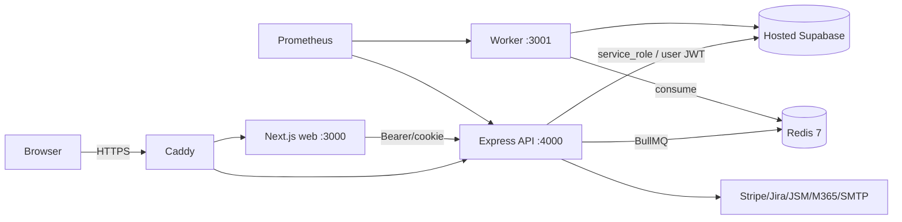

# Architecture and Runtime Topology Audit

## Audit Metadata

- Audit name: repo-deep-dive
- Run: 20261003-0018-fix-p2-batch-31-2295958d
- Repository: C:\temp\mainecybertech
- Branch: fix/p2-batch-31
- Commit SHA: 2295958d
- Generated at: 2026-10-03
- Auditor: repo-deep-dive subagent (base profile)
- Area code: ARCH
- Output path: docs/audits/repo-deep-dive/20261003-0018-fix-p2-batch-31-2295958d/02_architecture_runtime_topology.md
- Scope limitations: Static review; hosted Supabase/DO/runtime not observed. Topology rows sourced from compose/terraform/workflows and marked accordingly.

## Scope

Monorepo structure, frontend/backend/worker boundaries, request/auth lifecycle, tenant boundaries, background jobs/queues, webhooks/realtime, notifications, external integrations, deployment topology, environment parity, error handling.

## Evidence Reviewed

- `apps/api/src/app.ts`, `main.ts`, `config/env.ts`, `services/supabase.ts`, `middleware/org-access.ts`, `middleware/auth.ts`.
- `apps/worker/src/main.ts`, `consumer-bullmq.ts`, `consumer-sqs.ts`, `task-registry.ts`, `schedule-config.ts`.
- `infra/digitalocean/docker-compose.yml`, `Caddyfile*`, `prometheus.yml`, `prometheus.rules.yml`.
- `infra/terraform/digitalocean/{droplet,firewall,dns}.tf`, `cloud-init.yml`.
- `.github/workflows/deploy-do.yml`.

## Verification Performed

| Evidence | Type | Why relevant | Notes |
|---|---|---|---|
| read `app.ts` | source | request pipeline | helmet→cors→json→cookie→securityHeaders→inputSanitizer→rateLimit→requestId→logger→idempotency→csrf→timeout |
| read `docker-compose.yml` | infra | runtime topology | api/web/worker/caddy/redis/prometheus on one droplet |
| read `prometheus.yml` | infra | alerting | `rule_files` present, **no `alerting:` block** |
| read `deploy-do.yml` | CI | deploy topology | SSH deploy, health-gated rollback |
| `git log`, inventory | command | commit/branch | fix/p2-batch-31 @2295958d |

## Executive Summary

The platform is a well-structured 3-app Turborepo behind Caddy on a single DigitalOcean droplet, with Redis/BullMQ for jobs, hosted Supabase for data/auth, and Prometheus for internal metrics. Boundaries are clean (`apps/api` does all DB/Privileged work; web talks only to the API; worker consumes the queue). The dominant architectural risks are (1) single-host, single-instance runtime (every service plus Redis on one droplet = SPOF), (2) the API's default data path is the **service-role** client (RLS bypassed) with RLS rollout opt-in via `RLS_READS_ENABLED`/`RLS_WRITES_ENABLED`, and (3) monitoring rules are loaded with no alert routing configured.

## Inventory

| Item | Path / symbol | Purpose | Current state | Risk | Notes |
|---|---|---|---|---|---|
| API | `apps/api/src/main.ts` | Express 4000 | running | Medium | trust proxy=1 |
| Web | `apps/web` | Next.js 3000 | running | Medium | middleware CSP/nonce |
| Worker | `apps/worker/src/main.ts` | BullMQ/SQS consumer 3001 | running | High | orphan-cleanup |
| Queue | Redis 7 (`docker-compose.yml`) | BullMQ backend | running | High | single instance, mem_limit 48m |
| DB/Auth | hosted Supabase | Postgres+GoTrue | external | Medium | service-role default |
| Proxy | Caddy | TLS/reverse proxy | running | Low | |
| Metrics | Prometheus | /metrics scrape | running | Medium | no alerting target |
| Deploy | `deploy-do.yml` | SSH+docker compose | implemented | Medium | rollback on health fail |

## Domain Scorecard

| Category | Score | Evidence | Gap | Recommended action |
|---|---:|---|---|---|
| Monorepo structure | 4 | `apps/`, `packages/` | — | keep |
| Frontend/backend/worker boundaries | 4 | web→API only | — | keep |
| Auth/session flow | 4 | `routes/auth.ts`, `middleware/auth.ts` | cookie JWT exp only in web | ARCH-P3-001 |
| Authorization and tenant boundaries | 3 | `org-access.ts`, `permissions.ts` | service-role default | ARCH-P2-002 |
| Request lifecycle | 4 | `app.ts` | idempotency/CSRF ordering | keep |
| Data flow | 3 | `services/supabase.ts` | RLS opt-in | ramp RLS |
| Background jobs | 3 | `worker/tasks/*` | orphan-cleanup bug | DATA-P0-001 |
| Queues | 3 | BullMQ/Redis | single Redis | ARCH-P2-001 |
| Webhooks | 3 | `routes/webhooks.ts` | signature/JSM ok | keep |
| Realtime | 3 | notifications SSE `/stream` | single instance | ARCH-P2-001 |
| Notifications | 3 | worker + SMTP | silent fail without SMTP | main.ts warns only |
| External integrations | 3 | Stripe/Jira/JSM/M365 | config-gated | keep |

## Detailed Review

### Item: Request lifecycle

- Evidence: `apps/api/src/app.ts:82-151`.
- What it does: `helmet()` → CORS reflect → `express.json({verify rawBody})` → cookieParser → securityHeaders → inputSanitizer → global limiter → per-user limiter → requestId/logger → idempotency → CSRF → timeout(30s) → routers.
- Missing controls: no `alerting` in observability (below); no distributed rate-limit store (uses default in-memory store, so limits reset per replica — single replica today).
- Risks: with >1 API replica, per-user/IP limits become per-replica.

### Item: Tenant resolution

- Evidence: `middleware/org-access.ts:20-324`, `lib/tenant.ts`, `services/supabase.ts`.
- What it does: resolves org from query/body/X-Active-Org/cookie, verifies approved membership, allows platform admins cross-tenant (audited via `logImpersonation`).
- Missing controls: default DB client is service-role, so handler-level scoping must be correct; see SEC/API.

### Item: Observability topology

- Evidence: `infra/digitalocean/prometheus.yml:8-9` loads `rules.yml`; file has no `alerting:` block and compose defines no Alertmanager service.
- Risks: rules evaluate but alerts are silently dropped.

## Findings

### Finding ID: ARCH-P2-001 - Single-droplet, single-instance runtime is a hard SPOF

- Severity: P2
- Confidence: High
- Area: ARCH
- Evidence:
  - `infra/digitalocean/docker-compose.yml` — api, web, worker, caddy, redis, prometheus on one host
  - `infra/terraform/digitalocean/droplet.tf` — single droplet `s-2vcpu-2gb`
  - `apps/api/src/app.ts:125-146` — rate limiting uses the in-memory default store
  - `apps/worker/src/consumer-bullmq.ts` — single BullMQ consumer
- What is happening: every runtime component shares one droplet; Redis is a single non-replicated instance with a 48 MB cap.
- Why it matters: host loss or Redis OOM takes down API, web, jobs, and realtime together; no horizontal scale.
- User / business impact: full outage from one failure; memory pressure on Redis/worker can crash jobs.
- Security / privacy / reliability impact: reliability.
- Recommended fix: at minimum document a recovery runbook and droplet snapshot/restore path; longer term split Redis (managed) and add a second API replica with an external rate-limit store.
- Suggested validation: chaos test stopping redis and measuring `/health`; load test under memory cap.
- Owner suggestion: infra/ops
- Effort estimate: L
- Dependencies: Terraform/budget
- Status: open
- Attack path: none identified

### Finding ID: ARCH-P2-002 - API defaults to the service-role DB client (RLS bypass)

- Severity: P2
- Confidence: High
- Area: ARCH
- Evidence:
  - `apps/api/src/config/env.ts:50-55` — `RLS_READS_ENABLED` / `RLS_WRITES_ENABLED` “Empty = service-role (default)”
  - `apps/api/src/services/supabase.ts` — `getScopedClient(req, module, mode)` chooses admin vs user client
  - `AGENTS.md`/`review.md` Known Debt — “RLS bypassed because `getScopedClient` defaults to the service role… documented incremental rollout”
- What is happening: unless a module is explicitly allow-listed, all reads/writes run as `service_role`, so Postgres RLS is not the enforcement layer — the Express handlers are.
- Why it matters: any handler that forgets an org predicate exposes cross-tenant data; defense-in-depth is absent by default.
- User / business impact: latent tenant-leak risk proportional to handler coverage.
- Security / privacy / reliability impact: high if a handler regresses.
- Recommended fix: continue the documented rollout (flip high-risk modules to user-scoped) and add a startup assertion that fails closed for tenant-scoped tables; keep service-role for genuinely cross-tenant jobs only.
- Suggested validation: `RLS_READS_ENABLED=* pnpm --filter=api test`; targeted cross-tenant integration tests.
- Owner suggestion: API/data
- Effort estimate: L
- Dependencies: RLS policy completeness
- Status: open
- Endpoint / data path: all `/api/v1/*` handlers via `getScopedClient`

### Finding ID: ARCH-P2-003 - Prometheus loads rules but has no alert routing

- Severity: P2
- Confidence: High
- Area: ARCH
- Evidence:
  - `infra/digitalocean/prometheus.yml:8-9` — `rule_files: [/etc/prometheus/rules.yml]`
  - `infra/digitalocean/prometheus.yml` — no `alerting:` section; `docker-compose.yml` defines no Alertmanager
  - `infra/digitalocean/prometheus.rules.yml` — alert rules exist
- What is happening: alert rules are evaluated in-process but no Alertmanager/target receives firing alerts.
- Why it matters: operators get no notification on Redis down, error spikes, disk, etc.
- User / business impact: longer MTTR, silent degradation.
- Security / privacy / reliability impact: reliability/incident readiness.
- Recommended fix: add Alertmanager (or a webhook receiver) and an `alerting:` block; wire to the operator channel.
- Suggested validation: trigger a synthetic alert and confirm delivery.
- Owner suggestion: infra/ops
- Effort estimate: M
- Dependencies: notification channel/secret
- Status: open

### Finding ID: ARCH-P3-001 - Web middleware gates routes on an unverified JWT `exp`

- Severity: P3
- Confidence: High
- Area: ARCH
- Evidence:
  - `apps/web/middleware.ts:5-14` — `isTokenExpired` base64-decodes the payload and checks `exp` with no signature verification
  - `apps/web/middleware.ts:122-126` — redirects unauthenticated portal/admin routes
- What is happening: route gating trusts a client-presented cookie payload; real authorization happens later in the API.
- Why it matters: the middleware is only a UX gate, but treating it as a control would be wrong; a forged-but-unexpired cookie reaches the page shell.
- User / business impact: low (no data exposed without API authz).
- Security / privacy / reliability impact: low / defense-in-depth.
- Recommended fix: document the middleware as non-authoritative and ensure every server component/action re-checks session via the API; optionally verify signature server-side.
- Suggested validation: E2E with a forged `mct_session` and assert portal data calls 401.
- Owner suggestion: web
- Effort estimate: S
- Dependencies: none
- Status: open

## Risks

| Risk | Severity | Likelihood | Impact | Evidence | Mitigation |
|---|---|---|---|---|---|
| Single host/Redis outage | P2 | Medium | Full outage | ARCH-P2-001 | snapshots + split |
| Handler forgets org predicate | P2 | Medium | Tenant leak | ARCH-P2-002 | RLS rollout |
| Alerts never delivered | P2 | High | Long MTTR | ARCH-P2-003 | Alertmanager |

## Recommendations

### Immediate / Release Blocking
None solely architectural.

### This Week
- Wire Prometheus alerting (ARCH-P2-003).
- Add a recovery runbook for the single droplet (ARCH-P2-001).

### This Month
- Continue RLS rollout for high-risk modules (ARCH-P2-002).

### Later / Platform Evolution
- Managed Redis + second API replica + distributed rate limiting.

## Quick Wins

| Quick win | Why it helps | Files likely involved | Validation |
|---|---|---|---|
| Alertmanager block | alerts actually fire | `prometheus.yml`, compose | synthetic alert |

## Hardening Backlog

| Backlog item | Priority | Owner suggestion | Effort | Dependency |
|---|---|---|---|---|
| RLS rollout | P2 | API/data | L | policies |
| Split Redis/managed | P2 | infra | L | budget |
| Recovery runbook | P2 | ops | S | none |

## Suggested Tests

- Chaos: stop redis; assert `/health` still 200 (by design) and cache fallback.
- Integration: cross-tenant access matrix with RLS enabled.
- Alert: synthetic rule fires to receiver.

## Suggested Documentation Updates

- `docs/RUNBOOK.md` single-host recovery; architecture diagram refresh.

## Open Questions

| Question | Why it matters | Evidence needed |
|---|---|---|
| Is Redis persistence/backup configured? | job durability | compose/DO volumes |
| Any hosted Alertmanager already? | avoid duplicate | DO config |

## Appendix

