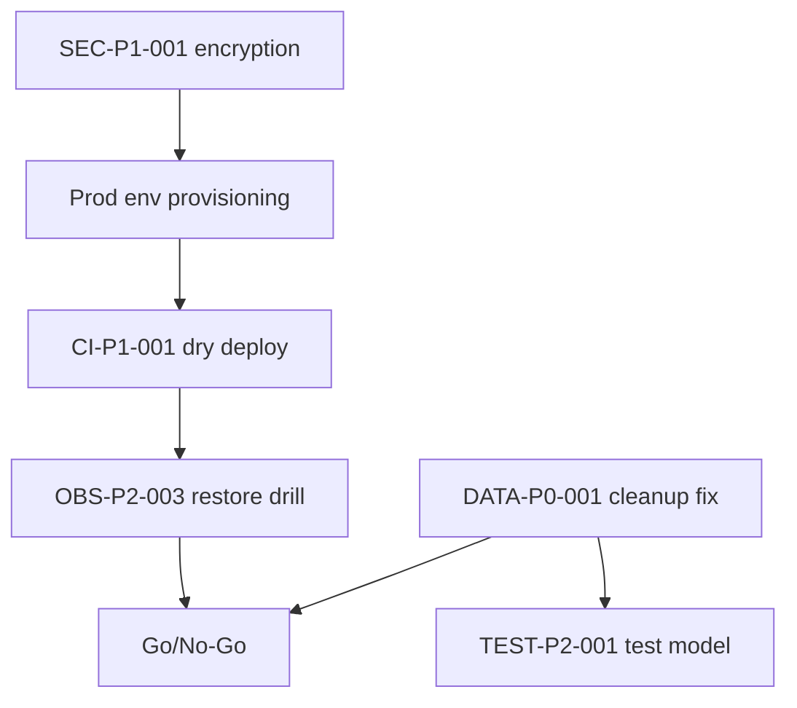

# Final Risk Register, Roadmap, and Patch Plan

## Audit Metadata

- Audit name: repo-deep-dive
- Run: 20261003-0018-fix-p2-batch-31-2295958d
- Repository: C:\temp\mainecybertech
- Branch: fix/p2-batch-31
- Commit SHA: 2295958d
- Generated at: 2026-10-03
- Auditor: repo-deep-dive subagent (base profile)
- Area code: FINAL
- Output path: docs/audits/repo-deep-dive/20261003-0018-fix-p2-batch-31-2295958d/22_final_risk_register_roadmap.md
- Scope limitations: Consolidates the base-profile domain reports in this run folder; no live verification.

## Scope

Consolidate findings from reports 01, 02, 03, 06, 07, 08, 09, 10, 11, 14, 21 into a prioritized risk register, roadmap, and patch plan. Source of the consolidated counts is each report's findings.

## Evidence Reviewed

- All `NN_*.md` reports produced in this run folder (AREA: INV, ARCH, FEAT, SEC, DATA, API, TEST, CI, SUPPLY, OBS, HYG).
- `audit_manifest.json` findings aggregate.

## Verification Performed

| Evidence | Type | Why relevant | Notes |
|---|---|---|---|
| per-report findings | artifact | aggregation | IDs parsed from `### Finding ID:` lines |
| severity totals | artifact | gate input | see §Findings summary |
| `review.md` remediation claims | doc | reconciliation | prior RLS/anon issues verified-fixed statically |

## Executive Summary

The audited commit is a hardened, well-tested engineering baseline with no reproduced P0 *security* exploit, but it contains **one P0-class data-loss path** (`orphanCleanup`), two P1s (unencrypted-PII fallback, production deploy path not runnable), and a set of P2 governance/monitoring/hygiene gaps. Because there is no production environment yet (per `review.md`), the practical question is whether the branch is fit to become the first deployable baseline; the P0 data-loss bug must be fixed and the P1s addressed or explicitly accepted before that.

## Findings

This report defines the consolidated register. Per-domain findings are authoritative in their own reports.

### Finding ID: FINAL-P1-001 - P0 data-loss path and unverified "fixed" claim block a clean release

- Severity: P1
- Confidence: High
- Area: FINAL
- Evidence:
  - `07_data_schema_migration_runtime_validation.md` — DATA-P0-001 (orphan cleanup recursive bucket delete)
  - `09_testing_quality_release_confidence.md` — TEST-P2-001 (tests model `list` incorrectly)
  - `review.md` — PR #32 claims DATA-P2-003 fixed
- What is happening: the branch's own data-loss remediation is incomplete, and the tests written for it would not catch the residual bug.
- Why it matters: releasing with a scheduled task that can delete all documents/avatars is unacceptable.
- Recommended fix: patch DATA-P0-001, add the folder-aware test, then re-run the audit for DATA/TEST.
- Suggested validation: integration test with nested storage keys proving only true orphans are removed.
- Owner suggestion: worker/data
- Effort estimate: M
- Dependencies: none
- Status: open

### Finding ID: FINAL-P2-001 - Governance and observability gaps mean the platform cannot yet detect or control production failure

- Severity: P2
- Confidence: High
- Area: FINAL
- Evidence:
  - `10_github_actions_cicd_governance.md` — CI-P1-001, CI-P2-001
  - `14_observability_monitoring_incident_readiness.md` — OBS-P2-001, OBS-P2-003
  - `02_architecture_runtime_topology.md` — ARCH-P2-001
- What is happening: prod env not provisioned, alerts unrouted, backups unverified, single host.
- Why it matters: even a correct application cannot be operated safely.
- Recommended fix: execute the pre-go-live checklist in §Patch Plan.
- Owner suggestion: ops/release
- Effort estimate: L
- Dependencies: credentials
- Status: open

### Finding ID: FINAL-P2-002 - Residual authorization/secret defaults need explicit decisions

- Severity: P2
- Confidence: High
- Area: FINAL
- Evidence:
  - `06_security_authz_tenancy_audit.md` — SEC-P1-001, SEC-P2-002
  - `08_api_contracts_realtime_integrations.md` — API-P2-001
  - `07_data_schema_migration_runtime_validation.md` — FEAT-P2-002/FEAT-P2-001 cross-refs
- What is happening: field encryption, CAPTCHA, search scoping, demo data, and API keys all default to permissive/broken states.
- Why it matters: fail-open defaults accumulate into real exposure.
- Recommended fix: make each fail closed or explicitly accepted with an owner.
- Owner suggestion: security/API
- Effort estimate: M
- Dependencies: env provisioning
- Status: open

## Risks

| ID | Risk | Severity | Likelihood | Impact | Evidence | Mitigation |
|---|---|---|---|---|---|---|
| R1 | Bucket-wide deletion | P0 | Medium | Catastrophic | DATA-P0-001 | folder-aware cleanup |
| R2 | PII stored plaintext | P1 | Medium | Breach/compliance | SEC-P1-001 | require key |
| R3 | No runnable prod deploy | P1 | High | Go-live blocked | CI-P1-001 | provision env |
| R4 | Alerts not delivered | P2 | High | Long MTTR | OBS-P2-001 | Alertmanager |
| R5 | Cross-tenant search | P2 | Low | Tenant leak | API-P2-001 | fail closed |
| R6 | Demo creds in prod | P2 | Medium | Compromise | FEAT-P2-002 | seed-only |
| R7 | Authz regression untested | P2 | Medium | Tenant leak | TEST-P2-002 | route tests |
| R8 | Gate bypass (admins) | P2 | Medium | Unsafe merge | CI-P2-001 | enforce admins |
| R9 | API keys dead | P2 | High | Failed integrations | FEAT-P2-001 | implement/hide |
| R10 | Single-host SPOF | P2 | Medium | Full outage | ARCH-P2-001 | snapshots/split |
| R11 | Unverified backups | P2 | Medium | Data loss | OBS-P2-003 | restore drill |
| R12 | Public schema/metrics | P2/P3 | High | Recon | API-P2-002, API-P3-001 | gate |
| R13 | License non-compliance | P2 | Medium | Legal | SUPPLY-P2-001 | policy |
| R14 | Repo bloat/catalog drift | P2 | High | Review errors | HYG-P2-001/002 | externalize/dedupe |

## Recommendations

### Immediate / Release Blocking
1. Fix DATA-P0-001 + TEST-P2-001.
2. Require `FIELD_ENCRYPTION_KEY` and Turnstile in prod (SEC-P1-001, SEC-P2-002).
3. Provision `prod` env + protection and one dry deploy (CI-P1-001).
4. Complete a restore drill (OBS-P2-003).

### This Week
- Alert routing (OBS-P2-001); search fail-closed (API-P2-001); docs/SPA gate (API-P2-002/FEAT-P3-001); branch protection (CI-P2-001).

### This Month
- RLS rollout (ARCH-P2-002), API-key decision (FEAT-P2-001), demo-data isolation (FEAT-P2-002), license policy (SUPPLY-P2-001), hygiene (HYG).

### Later / Platform Evolution
- Split Redis/managed, second API replica, dashboards/SLOs, corpus externalization.

## Quick Wins

| Quick win | Why it helps | Files likely involved | Validation |
|---|---|---|---|
| Fix orphan tests + ignore folders | closes P0 | `orphan-cleanup.ts`, test | red→green |
| Prod env assertions | fail closed | `config/env.ts` | unit |
| `enforce_admins` | stops bypass | branch protection | API |
| Trim `/health` | removes recon | `routes/health.ts` | unit |

## Hardening Backlog

| Backlog item | Priority | Owner suggestion | Effort | Dependency |
|---|---|---|---|---|
| Orphan cleanup fix + test | P0 | worker/QA | M | none |
| Prod env/secret provisioning | P1 | ops | M | admin |
| Encryption/CAPTCHA fail-closed | P1 | sec/API | S | keys |
| Alert routing | P2 | infra | M | channel |
| RLS rollout | P2 | API/data | L | policies |
| API-key auth | P2 | API | M | permissions |
| License policy | P2 | DevEx | M | tooling |
| Repo hygiene | P2/P3 | DevEx | M | — |

## Suggested Tests

- Storage-semantics cleanup test (P0 regression).
- Route-mount authorization matrix.
- Prod-config boot assertions.
- Backup restore drill with row assertions.
- Synthetic alert delivery.

## Suggested Documentation Updates

- `RELEASE_GATE.md`, `docs/RELEASE.md`, `docs/RUNBOOK_*.md`, `docs/SLO.md`, `docs/LICENSE_POLICY.md`.

## Open Questions

| Question | Why it matters | Evidence needed |
|---|---|---|
| Is `orphanCleanup` scheduled in prod? | likelihood of R1 | worker schedule/config |
| Is the hosted DB already holding demo data? | live risk | read-only query |
| Is `FIELD_ENCRYPTION_KEY` set in prod? | live PII risk | environment config |

## Appendix

- Roadmap and patch plan are also emitted as `roadmap.md` and `patch_plan.md`; the executive view is `EXECUTIVE_SUMMARY.md` and the gate is `RELEASE_GATE.md`.

### Mermaid dependency of fixes

