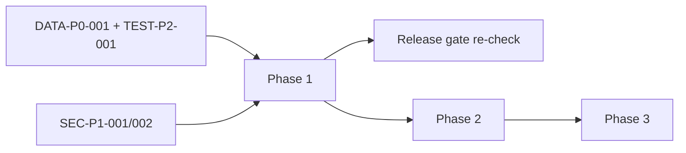

# Roadmap

- Repository: `mainecybertech` @ `2295958d`
- Run: `20261003-0018-fix-p2-batch-31-2295958d`
- Horizon: pre-go-live through 90 days.

## Guiding principle

There is no production environment yet. Sequence the work as **correctness → fail-closed security → operable release → scale/hygiene**.

## Phase 0 — Immediate (0–2 days): correctness gate

| Item | Finding | Owner | Effort | Done when |
|---|---|---|---|---|
| Fix orphan cleanup list semantics | DATA-P0-001 | worker/data | M | folder-aware listing; no folder passed to `remove` |
| Fix cleanup test model | TEST-P2-001 | worker QA | S | test reproduces and passes nested keys |
| Disable cleanup schedule until fixed | DATA-P0-001 | ops | S | schedule disabled/guarded |

Exit: no P0 open.

## Phase 1 — This week (3–7 days): fail-closed + operable

| Item | Finding | Owner | Effort |
|---|---|---|---|
| Require `FIELD_ENCRYPTION_KEY` in prod | SEC-P1-001 | security/API | S |
| Require Turnstile in prod | SEC-P2-002 | API | S |
| Provision `prod` env + protection; dry deploy | CI-P1-001 | ops/release | M |
| Wire alert routing + watchdog | OBS-P2-001 | infra | M |
| Restore drill with evidence | OBS-P2-003 | ops/data | M |
| Fail-closed search | API-P2-001 | API | S |
| Harden branch protection | CI-P2-001 | repo admin | S |
| Trim `/health` | SEC-P2-003 | API | S |
| Gate OpenAPI/docs | API-P2-002 | API | S |

Exit: GO WITH CONDITIONS possible.

## Phase 2 — This month (2–4 weeks): depth

| Item | Finding | Owner | Effort |
|---|---|---|---|
| Route-stack authorization tests | TEST-P2-002 | API QA | M |
| Demo-data isolation / seed-only | FEAT-P2-002 | data | M |
| API-key auth implement/hide | FEAT-P2-001 | API | M |
| License policy + CI check | SUPPLY-P2-001 | DevEx | M |
| Self-host/SRI Swagger assets | SUPPLY-P2-002 | API | S |
| SBOM release attestation | SUPPLY-P3-001 | release | S |
| Dashboards + SLOs | OBS-P2-002 | ops | M |
| Runbooks/tabletop | OBS-P3-001 | ops | M |
| Externalize prompt/audit corpus | HYG-P2-001 | DevEx | M |
| Canonicalize product catalog | HYG-P2-002 | store | M |
| Generated-artifact freshness checks | INV-P2-001 | DevEx | S |
| Verify RLS rollout on high-risk modules | ARCH-P2-002 | API/data | L |

Exit: P1/P2 security and governance findings closed or accepted with owners.

## Phase 3 — 60–90 days: resilience & scale

| Item | Finding | Owner | Effort |
|---|---|---|---|
| Managed Redis + second API replica + distributed rate limits | ARCH-P2-001 | infra | L |
| Terraform scheduled plan/drift | CI-P2-002 | infra | S |
| Promote `main`; stabilize scheduled jobs | CI-P3-001 | release | S |
| Raise coverage thresholds; stabilize E2E | TEST-P3-001 | QA | M |
| Access-control matrix & tenant-isolation attack testing | ARCH/API | security | L |

## Sequencing dependencies

## Metrics of success

- 0 P0/P1 open at gate re-check.
- Synthetic alert delivered < 5 min.
- One documented restore drill (RPO/RTO).
- All public/anon data surfaces fail closed by default.
- CI required checks cannot be bypassed by admins.
