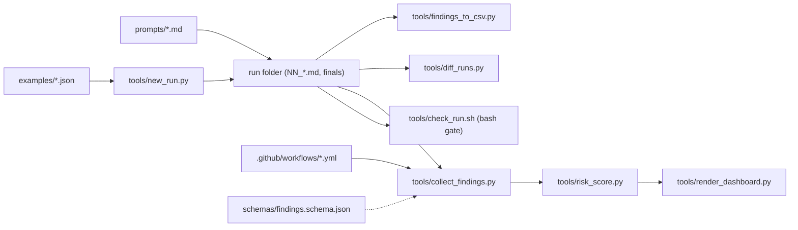

# Architecture and Runtime Topology

## Audit Metadata

- Audit name: repo-deep-dive
- Run: 20261003-0018-main-7bac320
- Repository: C:\temp\repo-deep-dive
- Branch: main
- Commit SHA: 6cada03 (worktree)
- Generated at: 2026-10-03
- Auditor: audit subagent
- Area code: ARCH
- Output path: docs/audits/repo-deep-dive/20261003-0018-main-7bac320/02_architecture_runtime_topology.md
- Scope limitations: static read of the tree; no deployed instances.

## Scope

Architecture of the pack as a system: prompt program, run-folder artifacts, Python/shell toolchain, CI workflows, and archived runs. There is no running service, database, queue, or network API in scope.

## Evidence Reviewed

- `README.md` run-flow Mermaid, `prompts/MASTER_RUNNER_FULL_HARDENING.md`, `profiles/falcon-lab.md`
- `tools/run_toolchain.py`, `tools/new_run.py`, `tools/check_run.sh`, `tools/lib_findings.py`
- `examples/audit_manifest.example.json`, `profiles/falcon-lab.manifest.json`, `.github/workflows/deep-dive-deterministic.yml`

## Verification Performed

| Evidence | Type | Why relevant | Notes |
|---|---|---|---|
| `run_toolchain.py` read | code | chain ordering/abort semantics | `step(strict=True)` aborts first failure |
| `run_toolchain.py` lines 65-76 | code | check bypass | check step is skipped when no `bash` and not `--strict` |
| `git diff 7bac320 6cada03` | command | topology delta | adds workflow + 2 tools |

## Executive Summary

The pack has a clean, portable topology: prompts define the process, a run folder holds artifacts, and a stdlib-only toolchain validates/normalizes/scores. Two structural weaknesses: orchestration truth is duplicated across several files with no drift check, and the primary validation gate (`check_run.sh`) is bash-only and silently skipped on Windows. A Mermaid view of the system is below.

## Inventory

| Component | Path | Purpose | State |
|---|---|---|---|
| Prompt program | `prompts/` | rules + domain prompts | present |
| Run scaffold | `tools/new_run.py` | create valid run | present |
| Gate | `tools/check_run.sh` | validate run | present, bash-only |
| Chain | `tools/run_toolchain.py` | check→collect→score→dashboard→diff→CSV | present |
| Contract | `schemas/findings.schema.json` | findings.json shape | present, drifted |

## Findings

### Finding ID: ARCH-P2-001 - Orchestration truth is duplicated across four artifacts with no drift check

- Severity: P2
- Confidence: High
- Area: ARCH
- Evidence:
  - `prompts/MASTER_RUNNER_FULL_HARDENING.md` — "Run these prompts in order" list
  - `examples/audit_manifest.example.json` — `executionOrder` (42 entries)
  - `profiles/falcon-lab.manifest.json` — `waves`, `promptStatus`, `addedPrompts`
  - `examples/audit_manifest.falcon-lab.example.json` — second `executionOrder`
  - `tools/lint_pack.sh` §5 — only cross-checks `promptCount`, not order membership
- What is happening: The canonical execution order is copied, not generated, and only the count is validated.
- Why it matters: Adding/moving a prompt requires four synchronized edits; a missed edit silently changes audit coverage.
- User / business impact: Audits can skip or duplicate prompts without any gate firing.
- Security / privacy / reliability impact: Coverage drift reduces assurance.
- Recommended fix: Generate the manifest `executionOrder` from one source (or lint it for set-equality with `prompts/[0-9][0-9]_*.md`).
- Suggested validation: Add a lint check asserting manifest order set == prompt file number set.
- Owner suggestion: pack maintainer
- Effort estimate: M
- Dependencies: none
- Status: open

### Finding ID: ARCH-P2-002 - The primary run gate is silently skipped when bash is unavailable

- Severity: P2
- Confidence: High
- Area: ARCH
- Evidence:
  - `tools/run_toolchain.py` lines 65-76 — if `shutil.which("bash")` is falsy and `--strict` not set, prints "skipped" and continues
  - `tools/check_run.sh` — the gate that must print `PASS` before a run is complete
  - Environment: Windows (`win32`) maintainer host
- What is happening: `run_toolchain.py` treats the authoritative validation step as optional; without `bash` it degrades to a warning and still reports `TOOLCHAIN: PASS`.
- Why it matters: A run can be announced as toolchain-PASS while never passing `check_run.sh`.
- User / business impact: False confidence in run completeness.
- Security / privacy / reliability impact: The gate is bypassable by environment, not by intent.
- Recommended fix: Port `check_run.sh` validation to Python (`check_run.py`) or make `--strict` the default; require explicit `--no-check` to skip.
- Suggested validation: On a host without bash, run `run_toolchain.py <run>` and confirm it fails unless `--no-check` is passed.
- Owner suggestion: pack maintainer
- Effort estimate: M
- Dependencies: none
- Status: open

## Risks

| Risk | Severity | Likelihood | Impact | Evidence | Mitigation |
|---|---|---|---|---|---|
| Coverage drift between duplicated order lists | P2 | Medium | High | ARCH-P2-001 | single source + lint |
| Gate bypassed without bash | P2 | High on Windows | Medium | ARCH-P2-002 | Python gate / strict default |

## Recommendations

### This Week
- Add set-equality lint for execution order.
- Default `run_toolchain.py` to strict check.

## Quick Wins

| Quick win | Why it helps | Files likely involved | Validation |
|---|---|---|---|
| Make `--strict` default | restores gate meaning | `tools/run_toolchain.py` | run without bash |

## Hardening Backlog

| Backlog item | Priority | Owner suggestion | Effort | Dependency |
|---|---|---|---|---|
| Python port of `check_run.sh` | P2 | maintainer | M | none |

## Suggested Tests

- Lint test: manifest order set equals prompt-number set.
- Integration test: toolchain fails on invalid run without `--no-check`.

## Suggested Documentation Updates

- `README.md` — state the gate is mandatory and how Windows users run it.

## Open Questions

| Question | Why it matters | Evidence needed |
|---|---|---|
| Is `ci/audit.yml` the intended required check? | determines gate wiring | maintainer intent |

## Appendix

Not applicable.
